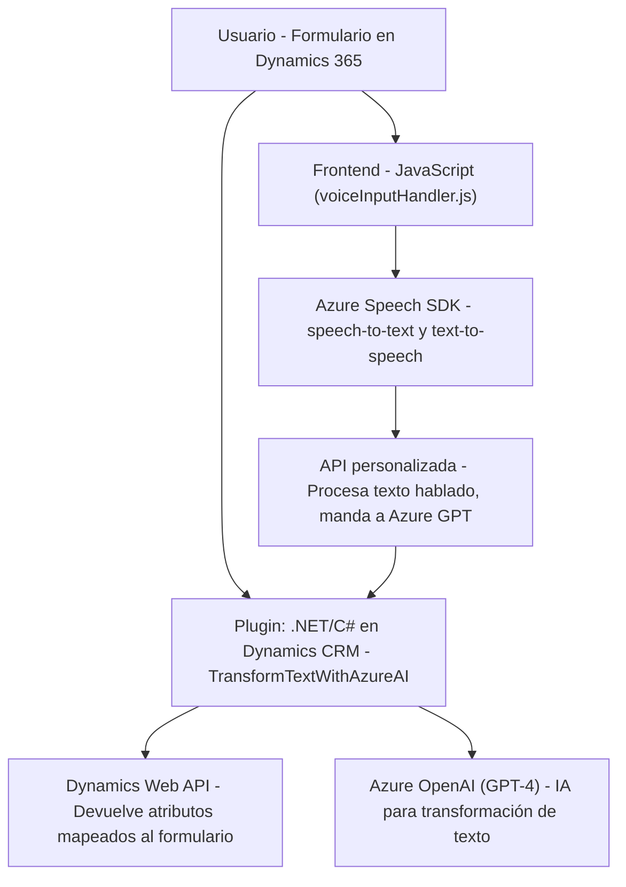

### Breve resumen técnico

Este repositorio describe una solución tecnológica que integra tres componentes principales:

1. **Frontend** (basado en JavaScript) para interactuar con formularios en Dynamics 365 y habilitar el uso de los servicios de síntesis y reconocimiento de voz de Azure Speech SDK.  
2. **VoiceInputHandler.js**: Permite la entrada de datos en formularios mediante reconocimiento de voz con funcionalidad adicional para enviar texto hablado a API externas para procesamiento con inteligencia artificial.  
3. **Plugin C#**: Un backend con un plugin que se ejecuta dentro de Dynamics CRM, encargado de transformar texto utilizando el servicio de Azure OpenAI GPT-4 y devolver respuestas en formato JSON según reglas de validación.  

En conjunto, se observa una solución orientada a conectar un "frontend integrado" de Dynamics 365 con la potencia de servicios basados en inteligencia artificial en la nube de Azure.

---

### Descripción de arquitectura

La arquitectura puede clasificarse como **híbrida basada en microservicios**. El sistema emplea un modelo cliente-servidor donde:

1. **Frontend**: Se integra directamente con Dynamics 365 como parte del cliente del sistema.
   - Modularizado en funciones específicas para manejo de datos y flujo de trabajo.
   - Utilización de APIs y SDK externos, como el Azure Speech SDK, para añadir capacidades avanzadas, como síntesis de voz y reconocimiento de texto hablado.

2. **Backend**: Extiende Dynamics CRM mediante el diseño de **plugins** que se ejecutan como código server-side. Estos plugins interactúan con:
   - La API de Dynamics para obtener y procesar datos.
   - Azure OpenAI (GPT) para procesamiento de texto según normas establecidas.

### Tecnologías usadas

#### **Frontend**
- **Azure Speech SDK**: Para conversión de texto a voz y reconocimiento de voz.
- **JavaScript**: Desarrollo dinámico en el cliente basado en eventos (utilizando la API de Dynamics).
- **Dynamics 365 SDK**: Interacción con datos del formulario.

#### **Backend**
- **Microsoft Dynamics CRM SDK**: Extensión funcional mediante plugins (`TransformTextWithAzureAI.cs`).
- **Azure OpenAI GPT-4**: Implementación de IA para transformar texto y devolverlo en formato JSON.
- **C#**: Para desarrollo de plugins.
- **System.Net.Http**: Comunicación HTTP para integración de servicios.
- **System.Text.Json y Newtonsoft.Json**: Para serialización/deserialización de datos.

### Patrones arquitectónicos

- **Event-driven architecture**:
  - Funciones del frontend y plugins del backend trabajan bajo eventos generados por el usuario (acción sobre el formulario, ingreso de voz) o el sistema (ejecución de plugins en Dynamics).
  
- **Microservicio externo**:
  - Uso del servicio Azure OpenAI GPT-4 como un componente para el procesamiento avanzado.

- **Single Responsibility Principle**:
  - Fragmentación del código en módulos y clases que implementan funcionalidades específicas, como lectura de datos visibles, entrada de voz, y procesamiento API.

---

### Diagrama Mermaid válido para GitHub

---

### Conclusión final

Esta solución software combina un **frontend basado en Dynamics 365 y JavaScript** con un robusto proceso backend que utiliza el **SDK de Azure Speech y la API de Azure OpenAI GPT-4** como servicios externos. La arquitectura presenta una separación clara de responsabilidades a través de patrones como Adapter y Facade. La implementación asegura el procesamiento eficiente con una estructura modular.

La arquitectura del sistema puede considerarse híbrida basada en microservicios, dado el uso de un servicio externo de IA centralizado (Azure OpenAI) para delegar la lógica compleja. Mientras tanto, el plugin realizado en C# constituye una modalidad válida dentro del esquema `IPlugin` de Microsoft Dynamics CRM. Esto garantiza la extensibilidad inherente del sistema y su compatibilidad con el entorno Dynamics. 

Esta solución destaca particularmente por su integración con tecnologías enfocadas en inteligencia artificial, síntesis de voz y reconocimiento de lenguaje natural. Sin embargo, su dependencia de Azure OpenAI y otros servicios en la nube la hace dependiente de una conexión activa y adecuada gestión de costos asociados.