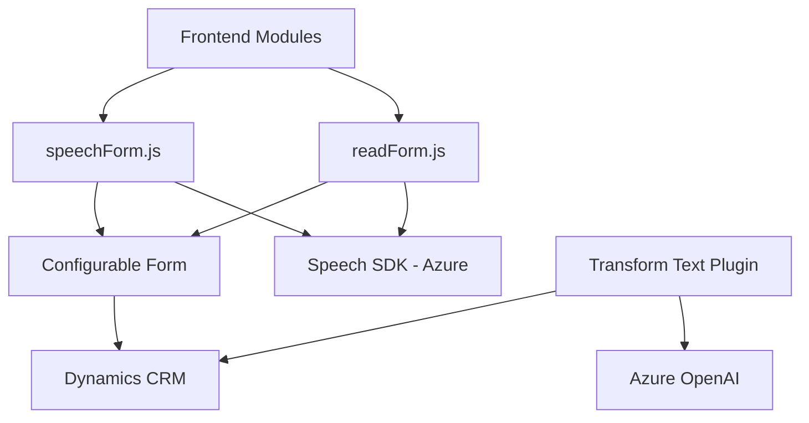

### Breve resumen técnico
El repositorio presenta un conjunto de archivos orientados al manejo de formularios integrados en Dynamics CRM, con capacidades de voz (síntesis y reconocimiento) y transformación de texto utilizando Azure AI. Los archivos **readForm.js** y **speechForm.js** se enfocan en funcionalidades del frontend basadas en Azure Speech SDK, mientras que **TransformTextWithAzureAI.cs** implementa un plugin para consumo del servicio Azure OpenAI.

### Descripción de arquitectura
El proyecto utiliza arquitectura **n-capas**, combinando:
1. **Frontend**: Procesos de interacción directa con formularios mediante eventos (API de Dynamics CRM) y Azure Speech SDK.
2. **Backend**: Un plugin para Dynamics CRM que extiende su funcionalidad mediante la integración de Azure OpenAI.
3. **Servicios externos**: Uso del SDK de Azure Speech y APIs de Dynamics y Azure OpenAI.

### Tecnologías usadas
1. **Frontend**:
   - **Librerías JavaScript**:
     - Dependencia de Azure Speech SDK y manipulación DOM/form contextual (Dynamics CRM).
   - **Patrones**:
     - Modularidad en funciones específicas.
     - Integración asincrónica de servicios externos.
2. **Backend**:
   - **Microsoft Dynamics SDK** (API y servicios del CRM).
   - **Azure OpenAI** para transformación de texto.
   - **NuGet Packages**:
     - `Newtonsoft.Json`
     - `System.Net.Http`
     - `System.Text.Json`
   - **C# y .NET Framework**, aprovechando el patrón basado en servicios y plugins.

### Diagrama Mermaid válido para GitHub Markdown

### Conclusión final
El repositorio presenta una solución **n-capas**, con un frontend dinámico para interacción de voz en formularios (API de Dynamics CRM y Azure Speech SDK), complementado con un backend extensible que interactúa con Azure OpenAI. 

Esta arquitectura es ideal para escenarios en los que se requiere:
- **Interacción en tiempo real** usando SDKs externos.
- **Ampliación de capacidades de CRM** mediante el plugin basado en servicios.
- **Escalabilidad y modularidad**, manteniendo cada componente desacoplado.

Algunos puntos de mejora incluyen:
1. Revisión del manejo de errores en SDKs y APIs.
2. Consolidación de patrones para reducir redundancia en funcionalidades del frontend.