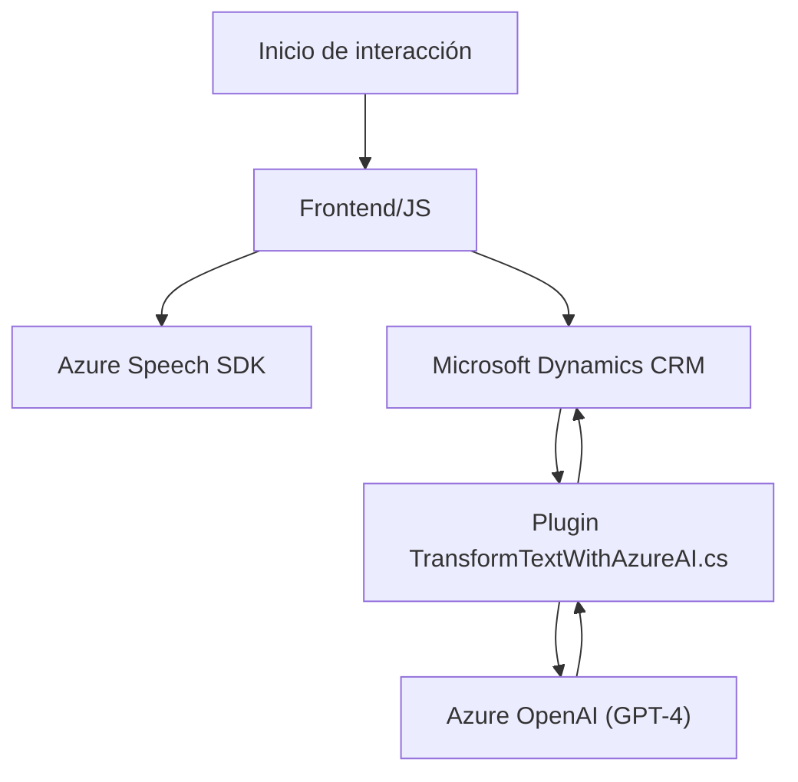

### Breve resumen técnico:
La solución presentada está diseñada para integrar servicios de interacción por voz y procesamiento avanzado de texto mediante inteligencia artificial en el contexto de formularios dinámicos. Se compone de dos módulos principales: un **frontend basado en JavaScript** para procesamiento de voz y actualización de formularios, y un **plugin en C# para Dynamics CRM** que ejecuta transformaciones de texto con Azure OpenAI. Ambos módulos dependen de APIs y SDKs externos, como **Azure Speech SDK** y **Azure OpenAI**.

---

### **1. Descripción de arquitectura:**
La solución tiene una **arquitectura de cliente-servidor** con integración de servicios externos y se puede categorizar como un sistema de **n capas**:

- **Frontend:** Implementado en JavaScript, con funciones que procesan información (voz y texto). Conecta directamente con Azure Speech SDK para síntesis y reconocimiento de voz.
- **Servidor (Backend):** Un plugin en C# para Dynamics CRM, que actúa como una extensión del sistema y utiliza Azure OpenAI para procesamiento avanzado de texto.
- **Externo:** APIs de terceros como Azure Speech SDK y OpenAI son fundamentales en este diseño y operan como microservicios independientes para tareas específicas (Text-to-Speech, Speech Recognition, AI processing).

### **2. Tecnologías usadas:**
#### Frontend:
- **JavaScript:** Lógica principal para interacción y manipulación de datos del formulario.
- **Azure Speech SDK:** Servicio externo para síntesis y reconocimiento de voz.

#### Backend:
- **Microsoft Dynamics CRM SDK:** Integración con el sistema CRM para extender la funcionalidad y trabajar con formularios.
- **Azure OpenAI Service (GPT-4):** Procesamiento avanzado de texto mediante llamadas HTTP POST.
- **JSON Libraries:** Newtonsoft.Json.Linq y System.Text.Json para manejar estructuras JSON en el plugin.

### **3. Patrón de arquitectura usado:**
La solución utiliza el patrón de arquitectura de **n capas** integrado con servicios externos:
- Capa de presentación (frontend en JavaScript): Procesa datos del formulario e interactúa con usuarios mediante voz.
- Capa de negocio (backend en C#): Implementa la lógica principal de datos procesados y conecta servicios externos como Azure OpenAI y Dynamics CRM SDK.
- Capa de datos: Dynamics CRM proporciona el modelado de datos y soporte para integración de plugins. El sistema implementa interfaces como `IPlugin` para extender la funcionalidad del CRM.

Además:
- Patrón de **Servicio externo** para conectar con Azure Speech SDK y OpenAI GPT-4.
- **Encapsulación y modularidad:** Separación por funciones con roles específicos, siguiendo buenas prácticas de diseño.
- **Programación asíncrona:** Uso de `async/await` para garantizar el rendimiento fluido al interactuar con APIs.

---

### **4. Dependencias o componentes externos:**
- **Azure Speech SDK:** Para síntesis y reconocimiento de voz.
- **Azure OpenAI GPT-4:** Procesamiento avanzado de texto a JSON.
- **Microsoft Dynamics CRM SDK:** Para extender funcionalidades con plugins.
- **JSON manejo:** Librerías internas y externas como Newtonsoft.Json.
- **HTTP client libraries:** Para manejar solicitudes a APIs de Microsoft.

---

### **5. Diagrama Mermaid**

---

### Conclusión final:
La solución es un conjunto de componentes orientados a mejorar la experiencia de usuario en entornos CRM mediante integración de servicios de voz y procesamiento de texto. La arquitectura es de **n capas**, haciendo uso de APIs externas como Azure Speech SDK y OpenAI para delegar tareas específicas. Esto asegura escalabilidad, modularidad y mantenimiento sencillo. El diseño está optimizado para entornos empresariales donde los formularios dinámicos y la interacción de voz/IA son esenciales.