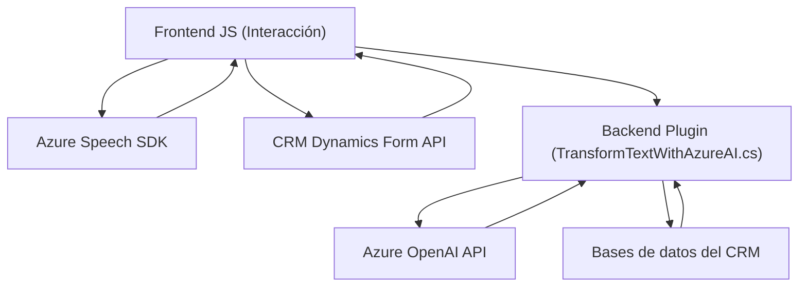

### Breve Resumen Técnico

El proyecto engloba tres áreas clave: un **frontend** realizado en JavaScript, un **plugin backend** para Dynamics 365 implementado en C#, y una integración con servicios externos como Azure OpenAI y Azure Speech SDK. La solución apunta a mejorar la accesibilidad y experiencia de usuario mediante reconocimiento de voz, síntesis de voz y transformación de texto, destacando funcionalidades como la captura de entrada por voz, la síntesis del contenido de formularios, y la transformación del texto a estructuras JSON mediante reglas específicas.

---

### Descripción de la Arquitectura

#### Tipo de Solución
La solución tiene una naturaleza **multicapa**, donde se destacan:
1. **Frontend (JS)**: Módulos diseñados para capturar entrada por voz, sintetizar texto y manejar la interacción directa del usuario en formularios.
2. **Backend (Plugin en C#)**: Plugin que gestiona la lógica avanzada de transformación de texto con servicios como OpenAI, expuesto mediante Dynamics 365.
3. **Servicios externos**: Azure Speech SDK para reconocimiento y síntesis de voz. Azure OpenAI para IA en procesamiento avanzado de texto.

Gracias a la integración de servicios externos, la arquitectura sigue un enfoque **Cliente-Servidor**, con elementos adicionales de **API-consumer** en el backend y el frontend.

#### Patrones de Arquitectura
1. **Modularidad**: El sistema presenta alta cohesión, separando responsabilidades entre módulos como síntesis de voz, reconocimiento de entrada y transformación de texto.
2. **Consumo dinámico de dependencias externas**: SDKs (Azure Speech) cargados en tiempo de ejecución para optimizar el uso de recursos.
3. **Integración con servicios externos**: Usa APIs como Azure Speech y Azure OpenAI para obtener funcionalidades avanzadas (reconocimiento, síntesis y transformación de texto).
4. **Plugin-based Architecture**: En el backend, se sigue el modelo de plugins típico de Dynamics 365 para desacoplar extensiones personalizadas.
5. **Transformación de datos (Adaptadores)**: Procesa datos internos de formularios y los adapta para consumo por usuarios o servicios externos.

---

### Tecnologías Usadas
- **JavaScript**: Uso extensivo en el frontend para gestionar lógica de interacción y llamadas a servicios como Azure Speech SDK.
  - Librerías: Azure Speech SDK (`window.SpeechSDK`) para síntesis y reconocimiento.
  - APIs internas de Dynamics (`Xrm.WebApi.online`) para manipulación de datos en formularios.
- **C# (.NET)**: Desarrollo del plugin de Dynamics usando `Microsoft.Xrm.Sdk`.
  - Frameworks y dependencias: Manipulación HTTP (`System.Net.Http`) y parsing JSON (`System.Text.Json`, `Newtonsoft.Json.Linq`).
- **Azure Speech Services**: Para reconocimiento y síntesis de voz.
- **Azure OpenAI**: Para procesamiento avanzado de texto usando GPT-4 (IA).
- **CRM Dynamics 365**: Contexto en las APIs internas y como plataforma principal de interacción.

---

### Diagrama **Mermaid**   
El siguiente diagrama representa la interacción y dependencia entre los componentes del sistema:

---

### Conclusión Final

Este repositorio corresponde a una **solución empresarial multi-capa** diseñada para mejorar la interacción y la accesibilidad en formularios CRM. La solución combina reconocimiento y síntesis de voz con transformación de texto basada en reglas definidas por IA. Utiliza tecnologías modernas como Azure Speech SDK y Azure OpenAI, junto con Dynamics 365, permitiendo granularidad y flexibilidad en funciones clave como la entrada por voz y manipulación dinámica de datos.

La arquitectura utiliza patrones bien definidos como modulación, adaptadores y consumo de servicios externos para asegurar extensibilidad, escalabilidad y mantenimiento eficiente. Esta solución puede integrarse en cualquier sistema CRM que busque modernizar su interacción con usuarios y optimizar procesos con inteligencia artificial.