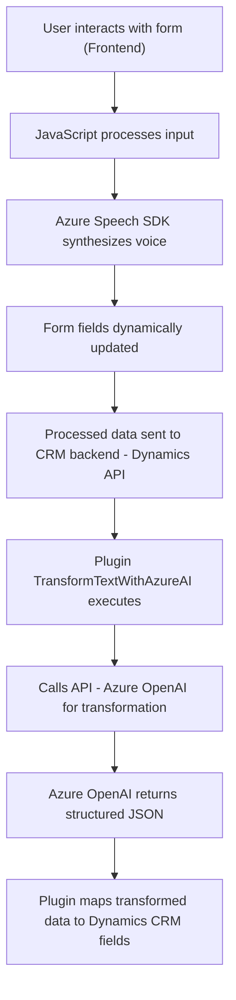

# Análisis completo

## Breve resumen técnico
El repositorio contiene tres archivos principales que implementan funcionalidades relacionadas con la interacción mediante voz, procesamiento de texto y transformación de datos utilizando el **Azure Speech SDK**, **Azure OpenAI Service** y **Dynamics 365 CRM**. La solución parece orientada a simplificar procesos en formularios dinámicos y mejorar la experiencia del usuario con inteligencia artificial aplicada.

## Descripción de arquitectura
La arquitectura utiliza componentes integrados en **Microsoft Dynamics CRM**, con complementos para reconocer voz, transformar texto y mapear datos a formularios. Los módulos están estructurados con un enfoque funcional y modular. Además:
1. El procesamiento en el frontend utiliza SDKs dinámicos bajo demanda.
2. La lógica backend utiliza plugins en el marco de Dynamics 365, delegando complejidades a servicios externos como Azure OpenAI.
3. La arquitectura puede considerarse **modular con integración API**, con una mezcla de **patrones monolíticos** (en plugins y funciones del frontend) y **microservicios** (por las llamadas asincrónicas a servicios de Azure).

## Tecnologías usadas
1. **Frontend**:
   - **JavaScript ES6**: Para interacción dinámica del formulario.
   - **Azure Speech SDK**: Reconocimiento de voz y síntesis de texto a voz.
2. **Backend**:
   - **C# .NET Framework**: Implementación en plugins para Dynamics CRM.
   - **Azure OpenAI Service**: Transformación de datos.
   - **REST API**: Comunicación con servicios de Azure, utilizando `HttpClient`.
   - **System.Text.Json**: Procesamiento eficiente de JSON.
   - **Microsoft.Xrm.Sdk**: Para integrar la lógica del plugin.
3. **Integration Layer**:
   - Integración con Dynamics 365 Web API.
   - Uso dinámico de SDKs en el navegador para evitar sobrecarga de recursos.

## Dependencias o componentes externos
1. **Azure Speech SDK**:
   - URL dinámica: `https://aka.ms/csspeech/jsbrowserpackageraw`.
   - Reconocimiento y síntesis de voz en el frontend.
2. **Azure OpenAI Service**:
   - Endpoint: `"https://openai-netcore.openai.azure.com/"`.
   - Transformación de texto en backend.
3. **Dynamics 365 CRM**:
   - Plugins para procesamiento de datos directamente en la entidad CRM.
   - Llamadas API para gestión de datos.
4. **Librerías estándar**:
   - JSON manipuladores (`System.Text.Json`, `NewtonSoft.Json`).
   - Web API (`Xrm.WebApi`).

## Diagrama Mermaid válido para GitHub

## Conclusión final
Este repositorio refleja una estructura modular adecuada para un sistema que integra inteligencia artificial en el flujo de trabajo de formularios dinámicos en **CRM**. La solución utiliza tecnologías modernas de reconocimiento de voz y procesamiento de texto, delegando complejidades computacionales a servicios como Azure Speech SDK y Azure OpenAI Service. La mezcla de patrones monolíticos (plugins) con un diseño orientado a servicios lo hace eficiente, aunque podría beneficiarse de una arquitectura más orientada a microservicios para mayor escalabilidad.