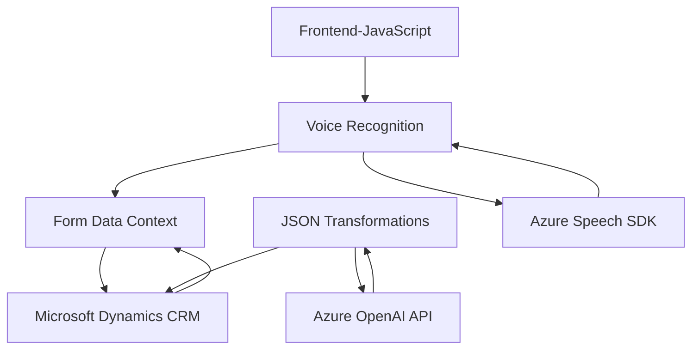

### Breve resumen técnico

El repositorio presenta archivos que se enfocan en integrar reconocimiento de voz e inteligencia artificial con Microsoft Dynamics 365, utilizando servicios externos como Azure Speech SDK y Azure OpenAI. Tiene una mezcla de tecnologías del lado del cliente (frontend en JavaScript para guiar interacciones de usuario) y componentes del lado del servidor (plugin en C# que se integra como extensión de Dynamics CRM).

---

### Descripción de arquitectura:

La solución implementa una **arquitectura híbrida basada en n capas y servicios desacoplados**. El frontend utiliza JavaScript para interactuar con el usuario en un entorno basado en formularios (Microsoft Dynamics). Transformaciones complejas de datos se delegan a un plugin de Dynamics CRM, que a su vez se conecta con un microservicio de Azure OpenAI para procesar información. La separación de responsabilidades es clara:
- El frontend se encarga de la interacción directa con el usuario.
- El plugin maneja la relación entre datos transcritos y su transformación mediante un servicio externo.
- Azure Speech SDK se usa para la integración del reconocimiento y síntesis de voz.

---

### Tecnologías usadas:
1. **Microsoft Dynamics CRM**:
   - Gestión de formularios y datos contextuales.
   - Puntos de extensión mediante Plugins.
   - APIs como `Xrm.WebApi`.

2. **Azure Speech SDK**:
   - Integración para reconocimiento de voz y síntesis de audio, descargado dinámicamente en el navegador (lazy loading).
   - Configuración de claves y región para acceso a servicios de Azure.

3. **Azure OpenAI via REST API**:
   - Comunicación con el modelo GPT para transformar texto según normas.

4. **Lenguajes**:
   - **JavaScript**: En el frontend para reconocimiento y síntesis de voz, procesando y asignando datos.
   - **C#**: En el servidor para manejar lógica de negocio avanzada y procesar datos mediante Azure OpenAI.

5. **Pattern design**:
   - Modularización: Funciones específicas con responsabilidades únicas (ej., lectura, síntesis, actualización de datos).
   - Facade: Simplificación del uso de SDK y servicios externos dentro del frontend y backend.
   - Plugin-based: Arquitectura diseñada para extender Dynamics CRM sin alterar su núcleo.

---

### Diagram Mermaid válido para GitHub:

---

### Conclusión final:

La solución implementada en el repositorio integra tecnologías modernas para mejorar la interacción entre usuarios y formularios en entornos corporativos mediante el uso de comandos de voz, inteligencia artificial y servicios de nube como Azure Speech SDK y OpenAI. 

La arquitectura híbrida (mezclando n capas y servicios externos) sigue principios de modularidad y separación de responsabilidades. Además, el uso del patrón de Plugins para extender Microsoft Dynamics sin alterar su núcleo es eficiente y escalable. Sin embargo, algunas áreas pueden ampliarse, como el manejo avanzado de errores en conexiones API, optimización de flujo modular o integración de pruebas automatizadas.