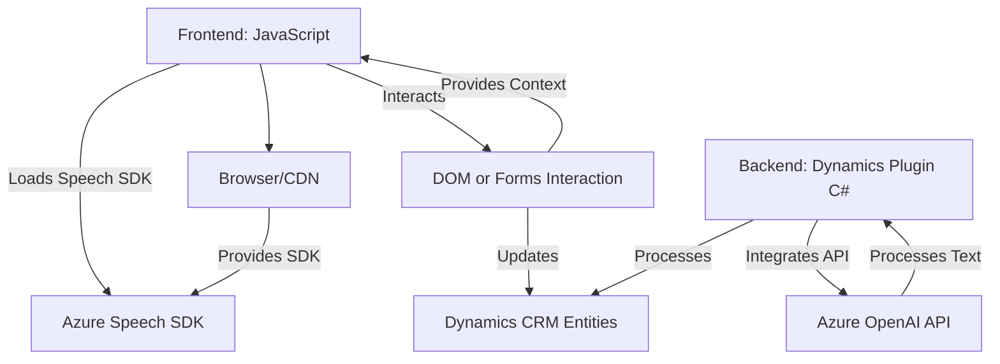

### Breve Resumen Técnico:
El repositorio es una solución orientada a la integración entre Dynamics CRM y servicios en la nube de Azure (Speech y OpenAI). Combina capacidades de entrada de voz, síntesis de voz y procesamiento avanzado de texto con reglas predefinidas. La solución incluye códigos front-end en JavaScript y un plugin en C# para mayor extensibilidad desde Dynamics CRM.

---

### Descripción de Arquitectura:
1. **Tipo de Solución**: La solución es híbrida, compuesta por:
   - **Frontend API-like**: Utiliza servicios en la nube como Azure Speech SDK para interactuar con formularios CRM y permite entrada/salida por voz.
   - **Backend Plugin**: Extiende la funcionalidad de Dynamics CRM mediante un plugin que transforma texto con Azure OpenAI.
   - Dependencia de API externa (Azure Speech y OpenAI).
   - Dependencia interna del framework Dynamics CRM.

2. **Arquitectura**: Con base en los patrones observados:
   - **Multicapa**: 
     - La capa de presentación (JavaScript).
     - La capa de negocio (CRM Plugin en C# manejando reglas y lógica).
     - La capa de servicios externos (integración con Azure OpenAI y Speech).
   - **Event-Driven**: Plugins de Dynamics CRM responden a eventos específicos en el CRM.
   - Algunos principios respetan ideas de la **arquitectura hexagonal**, especialmente en el intercambio entre el sistema interno (Dynamics CRM) y servicios externos (Azure).

---

### Tecnologías Usadas:
- **Lenguajes**: JavaScript (Front-end), C# (Backend).
- **Frameworks**:
  - Dynamics CRM SDK (`IPlugin` interface, `IOrganizationServiceFactory`).
  - Azure Speech SDK.
  - Azure OpenAI API.
- **APIs del navegador**: Carga scripts dinámicos, manejo de datos DOM/formularios.
- **Bibliotecas**: Newtonsoft.Json, System.Net.Http, Azure SDK (`Azure Speech` y `OpenAI`).
- **Patrones observados**:
  - **Callback y Promises** en JavaScript para cargas asíncronas.
  - **Factory** (`IOrganizationServiceFactory`).
  - **Microservicio**: Delegando procesamiento textual a OpenAI en Azure.
  - **Mapping/Normalization**: Aplicado en transcripciones y datos de formularios.

---

### Dependencias o Componentes Externos:
1. **Externo**:
   - **Azure Speech SDK**: Servicio en la nube para síntesis y transcripción de voz.
   - **Azure OpenAI API**: Procesamiento avanzado de texto.
   - **Microsoft Dynamics Web API**: Para comunicarse con objetos y registros dentro del entorno CRM.

2. **Interno**:
   - Manejo de formularios (como `executionContext`, `formContext`) dentro del entorno Dynamics CRM.
   - La lógica interna permite interactuar con entidades y campos del sistema CRM, como `attribute.controls.get()` y `attribute.data.entity.attributes.get()`.

---

### Diagrama Mermaid Válido para GitHub:

---

### Conclusión Final:
La solución es una integración entre un frontend basado en JavaScript y un plugin en C# para Microsoft Dynamics CRM con servicios avanzados de IA y voz proporcionados por Azure Cloud. Utiliza una arquitectura multicapa, separando la lógica de presentación, negocio y datos de manera efectiva. Los patrones observados reflejan una estructura modular y extensible, adecuada para entornos empresariales impulsados por servicios en la nube.