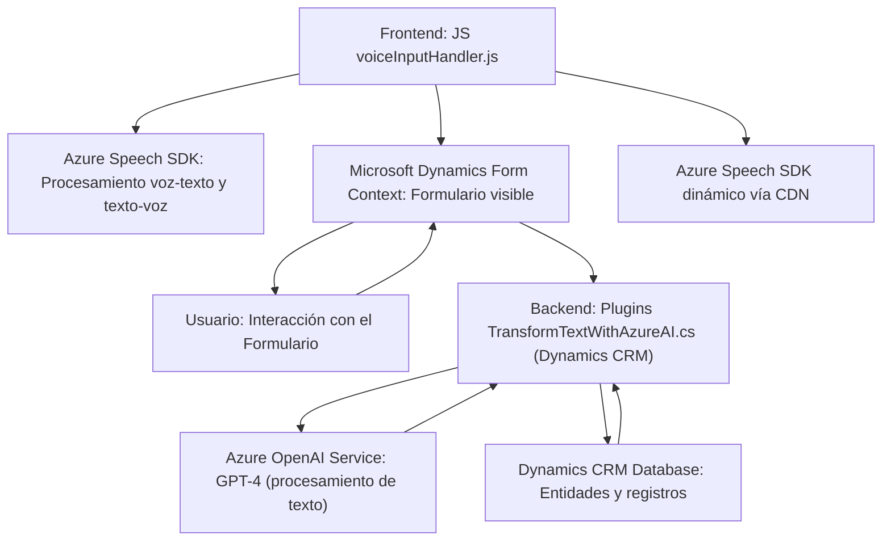

### Breve resumen técnico
El repositorio parece estar desarrollado para potenciar la interacción de usuario con formularios dinámicos en una aplicación integrada a **Microsoft Dynamics CRM** mediante el uso de voz y procesamiento de texto. Está dividido principalmente en:
1. **Frontend en JavaScript**: Interacción con el usuario, manejo de eventos en formularios visibles y procesamiento de voz con Azure Speech SDK.
2. **Backend (Plugin en .NET)**: Procesa texto mediante Azure OpenAI (GPT-4) y transforma la entrada en respuesta estructurada (JSON) para integrar funcionalidad avanzada en Dynamics CRM.

### Descripción de arquitectura
La solución puede clasificarse como una **arquitectura híbrida de cliente-servidor basada en servicios de terceros**. El frontend se comunica directamente con un SDK externo (Azure Speech) para procesar texto y voz, mientras que el componente de backend en formato de plugin extiende Dynamics CRM con procesamiento adicional mediante Azure OpenAI. No es una arquitectura de microservicios tradicional ni monolito, pero utiliza patrones como:
- **N-capas**: Separación clara entre frontend, interacción con el servicio SDK, y backend plugin.
- **Integración basada en SDKs y APIs externas**.
- **Plugin Pattern en Dynamics CRM**.

### Tecnologías usadas
1. **Frontend**:
   - **JavaScript** (ES6+).
   - **Azure Speech SDK**: Para reconocimiento de voz y síntesis de texto a voz.
   - **Manipulación de DOM** (APIs nativas del navegador).
   - **Descripción contextual** (Dynamics CRM).
2. **Backend**:
   - **C# (.NET Framework)**.
   - **Microsoft Dynamics CRM SDK**.
   - **Azure OpenAI GPT-4**: Procesamiento avanzado de texto.
   - Dependencias para desarrollo:
     - `Newtonsoft.Json`, `System.Net.Http`, `System.Text.Json`.

3. **Patrones y características**:
   - Carga dinámica de SDKs.
   - Modularidad con el principio de "responsabilidad única" (funciones con tareas específicas).
   - Arquitectura centrada en eventos para el frontend.

### Dependencias externas o componentes conectados
1. **Frontend**:
   - Azure Speech SDK.
   - APIs del navegador.
2. **Backend**:
   - Azure OpenAI service (GPT-4).
   - Dynamics CRM APIs y servicios organizacionales (`Xrm.WebApi`).
   - Librerías para interacción HTTP (para las solicitudes a servicios externos).

---

### Diagrama Mermaid

---

### Conclusión final
Esta solución es un ejemplo de integración avanzada entre frontend dinámico, servicios SDK externos (Azure Speech), y un backend orientado a plugins dentro de **Dynamics CRM**. Su arquitectura se basa en la interacción con APIs y servicios externos (Azure Speech y OpenAI) para enriquecer la experiencia de usuario mediante reconocimiento de voz y procesamiento de texto automatizado. Aunque no utiliza microservicios, su diseño modular garantiza escalabilidad en el contexto de Dynamics CRM, con un patrón de arquitectura orientado a **N-capas** y alto nivel de adaptabilidad.