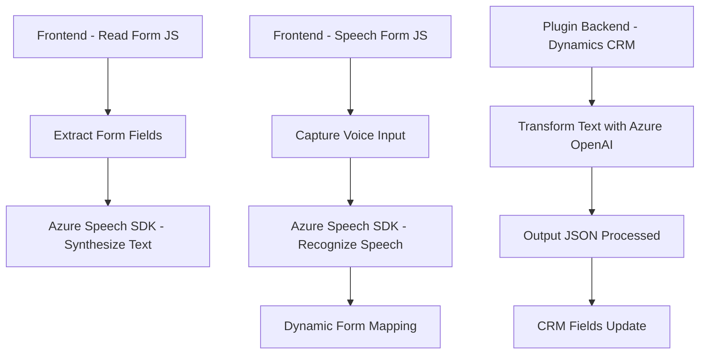

### Breve resumen técnico
El repositorio contiene funcionalidad distribuida entre componentes de frontend (en JavaScript) y un plugin backend (en C#) preparado para Dynamics CRM, lo que sugiere una solución integrada para la interacción entre formularios y reconocimiento/síntesis de voz utilizando servicios externos como Azure Speech y Azure OpenAI. Esto está diseñado para incrementar accesibilidad, automatización y personalización en interacciones con usuarios finales.

---

### Descripción de arquitectura
1. **Frontend Architecture**:
   - El frontend está organizado de forma modular con diferentes archivos (`readForm.js`, `speechForm.js`) que separan la funcionalidad de síntesis y reconocimiento de voz. Esta segmentación sugiere una arquitectura basada en componentes reutilizables para tareas específicas.
   - Se emplea el *patrón Loader dinámico* para cargar el SDK de Azure Speech solo cuando es necesario, ayudando a optimizar el rendimiento y reducir dependencias iniciales.

2. **Backend Architecture**:
   - El plugin (`TransformTextWithAzureAI.cs`) sigue el paradigma de *comandos*, enlazando la lógica a eventos disparados dentro de Dynamics CRM. Está dedicado a integrar procesamiento de texto mediante servicios de Azure OpenAI que funcionan bajo reglas predefinidas.
   
3. **Arquitectura general**:
   - La solución es híbrida: combina elementos de un monolito para el plugin backend y una separación basada en componentes fácilmente integrables para el frontend. Aunque el sistema no es completamente microservicio, incluye consumo de servicios externos que son parte de una arquitectura de n capas distribuida.

---

### Tecnologías usadas
1. **Frontend**:
   - JavaScript para la lógica de síntesis y reconocimiento de voz.
   - Azure Speech SDK para síntesis de voz y reconocimiento en tiempo real.
   - APIs estándar del navegador para manipulación del DOM (formulario).

2. **Backend**:
   - C# como base del desarrollo de plugins.
   - Dynamics CRM SDK (Microsoft.Xrm.Sdk) para la manipulación del modelo de datos en Dynamics CRM.
   - Azure OpenAI para procesamiento avanzado de texto mediante REST APIs.
   - HttpClient y JSON Serialization para la comunicación y consumo de servicios.

---

### Dependencias o componentes externos presentes
1. **Frontend**:
   - Azure Speech SDK: Cargado dinámicamente desde un CDN.
   - APIs del navegador: DOM y manipulación de eventos en formularios.

2. **Backend**:
   - Azure OpenAI: Llamadas HTTP para transformar texto.
   - Dynamics CRM WebAPI: Interacción directa con los datos de Dynamics para lectura y escritura en formularios y campos.
   - System.Net.Http y Newtonsoft.JSON: Para construcción y procesamiento de payloads JSON.

---

### Diagrama **Mermaid** válido para GitHub Markdown

---

### Conclusión final
La solución está diseñada para integrar interacción basada en voz (frontal) y transformación de texto avanzada (backend), optimizando la funcionalidad dentro del ecosistema Dynamics CRM. Aunque no es una arquitectura 100% basada en microservicios, utiliza servicios externos para aumentar la modularidad y extender funcionalidades. El diseño modular del frontend, junto con el modelo de eventos backend, crea una integración cohesiva entre accesibilidad y procesamiento automatizado.