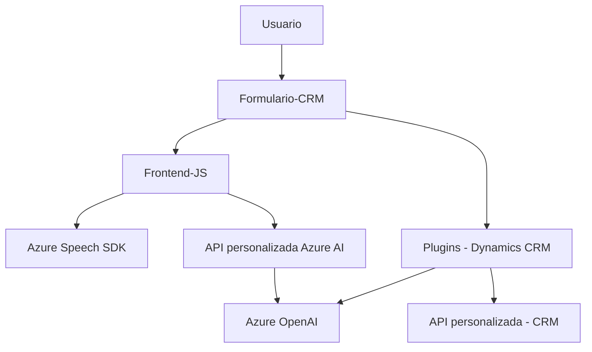

### Breve resumen técnico:
Este repositorio forma parte de un sistema que integra funcionalidades de reconocimiento y síntesis de voz, procesamiento de texto mediante IA, y gestión de formularios contextuales en un entorno Dynamics CRM. Utiliza los servicios de **Azure Speech SDK** y **Azure OpenAI** para mejorar la interacción con el usuario mediante comandos hablados y transformaciones avanzadas de texto.

---

### Descripción arquitectónica:
La arquitectura se clasifica como **arquitectura de n capas** porque está organizada en distintas capas con responsabilidades claras:
1. **Frontend JavaScript**:
   - Maneja la interacción de usuario con formularios y comandos hablados.
   - Modulariza tareas específicas como reconocimiento de voz y síntesis de texto.
2. **Integración API personalizada**:
   - Procesa texto transcrito mediante llamadas a APIs internas y externas, como Azure OpenAI para tareas avanzadas.
3. **Backend Plugin en C#**:
   - Amplía las capacidades del CRM mediante plugins que se ejecutan dentro del entorno para procesamiento de datos y transformación mediante Azure OpenAI.

Se observa una tendencia hacia **modularidad** y **acoplamiento controlado**, con dependencias hacia servicios externos para funciones de inteligencia artificial y síntesis de voz.

---

### Tecnologías, frameworks y patrones usados:
1. **Frontend:** JavaScript
   - SDK dinámico: **Azure Speech SDK**.
   - Manipulación de formularios (mapas de atributos y valores) en entornos CRM.

2. **Backend/Plugins:** C#
   - Framework: **Dynamics CRM SDK**.
   - API cliente: **Microsoft.Xrm.Sdk**.
   - Integración: **Azure OpenAI API**.
   - Serialización/Deserialización: **Newtonsoft.Json**.

3. **Patrones:**
   - **Modularidad:** Funciones agrupadas por responsabilidades específicas.
   - **Cliente-servidor:** APIs HTTP para comunicación transaccional.
   - **Plugin-based architecture:** Extensiones del CRM usando clases específicas de Dynamics CRM (`IPlugin`).
   - **Gestión dinámica de SDKs:** Carga de Azure Speech SDK en tiempo de ejecución (frontend).

---

### Dependencias o componentes externos presentes:
1. **Azure Speech SDK**:
   - Para reconocimiento y síntesis de voz.
2. **Azure OpenAI**:
   - Potente procesamiento y transformación de texto.
3. **Microsoft Dynamics CRM**:
   - Entorno principal para gestión de datos y formularios.
4. **Newtonsoft.Json**:
   - Manejo de estructuras JSON en plugins.
5. **API personalizada del sistema CRM**:
   - Ampliación funcional del CRM mediante servicios internos.

---

### Diagrama Mermaid válido para GitHub:

---

### Conclusión final:
Este repositorio integra varias tecnologías relacionadas con la interacción inteligente de usuario, aprovechando capacidades avanzadas de **reconocimiento de voz** y **procesamiento de lenguaje natural**. La arquitectura, aunque es de n capas, muestra modularidad, desacoplamiento parcial, y extensibilidad a través de servicios externos (Azure Speech SDK y OpenAI). La elección de dependencias externas como Azure Speech y OpenAI es ideal para sistemas que buscan mejorar la experiencia de usuario mediante voz e inteligencia artificial.