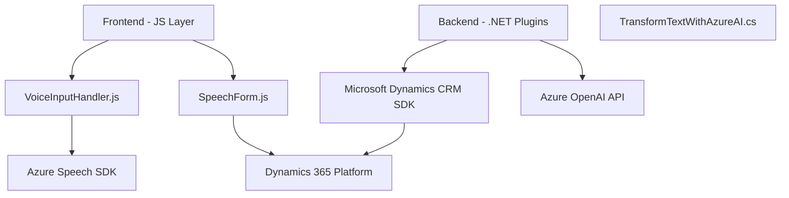

### Breve resumen técnico
El repositorio parece estar diseñado como una solución integral para una plataforma CRM (Dynamics 365), empleando funcionalidades de frontend basadas en JavaScript y complementos backend en .NET para procesamiento avanzado de voz y texto, con dependencia directa en servicios de Azure (Speech SDK y OpenAI API). Los archivos están organizados modularmente para funciones específicas, como captura y síntesis de voz, asignación de valores a formularios, y procesamiento y transformación de contenido textual.

---

### Descripción de arquitectura
La arquitectura utiliza patrones tanto en el frontend como en el backend:
- **Frontend:** Implementa la capa de presentación y entrada de datos mediante una combinación de JavaScript y Azure Speech SDK. Este componente interactúa directamente con los usuarios a través de formularios en la interfaz de Dynamics 365. Se identifica el uso de patrones de modularidad y fachada para aislar funcionalidades específicas.
  
- **Backend:** Está construido en una arquitectura basada en **Plugins** de Dynamics CRM, aprovechando el ecosistema .NET Framework y Azure OpenAI API para realizar transformaciones complejas de texto o tareas de IA. El plugin actúa como un microservicio especializado para la plataforma CRM y utiliza un enfoque desacoplado al delegar funciones críticas a servicios externos.

La arquitectura general parece inclinarse hacia un **enfoque híbrido**:
1. **Monolito modular en el frontend:** Es único y autocontenido.
2. **Microservicios distribuidos en el backend:** Aprovechan servicios externos en la nube (Azure API).

---

### Tecnologías y frameworks usados
#### Frontend:
- **JavaScript:** Lenguaje usado para manipulación del DOM y lógica de negocio en el navegador.  
- **Azure Speech SDK:** API para síntesis y reconocimiento de voz.  
- **Dynamics 365 APIs (`Xrm.WebApi`):** Facilitadora de interacciones con la plataforma CRM.

#### Backend:
- **Microsoft Dynamics CRM SDK:** Framework base para desarrollo dentro del ecosistema Dynamics 365.  
- **.NET Framework:** Para desarrollo de plugins.  
- **Azure OpenAI API:** Procesamiento semántico y generación de JSON estructurado.  
- **Newtonsoft.Json:** Manejo avanzado de datos en formato JSON.

---

### Dependencias y componentes externos
- **Azure Speech SDK:** Para las funcionalidades de reconocimiento y síntesis de voz en el frontend.
- **Azure OpenAI API:** Para procesamiento de texto basado en IA en el plugin de backend.
- **Microsoft Dynamics SDK:** Brinda las herramientas base para extender la funcionalidad del CRM.
- **Browser APIs (DOM):** Usadas por los archivos de frontend para manipular interfaz de usuario.
- **Newtonsoft.Json:** Facilita la serialización/deserialización de estructuras JSON en C#.

---

### Diagrama Mermaid

---

### Conclusión final
El repositorio integra soluciones técnicas para la interpretación y manipulación de datos en una plataforma Dynamics 365 usando componentes de frontend y backend. La arquitectura híbrida es eficiente al combinar un monolito modular en el frontend para interactuar directamente con usuarios y microservicios en el backend que aprovechan la potencia de servicios externos como Azure. Este diseño favorece la escalabilidad, modularidad y separación de preocupaciones, haciendo que sea apto para tareas extendidas de automatización y procesamiento de datos en tiempo real. Sin embargo, sería conveniente evaluar la seguridad del manejo de credenciales para servicios externos como Azure APIs.