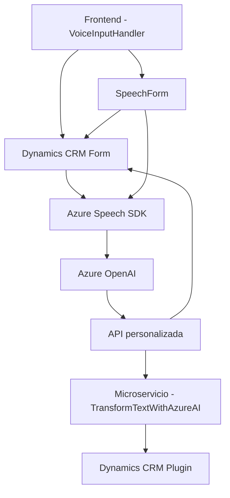

### Breve Resumen Técnico
El repositorio contiene una solución orientada principalmente a la integración de servicios externos con Dynamics CRM, logrando la interacción a través de una interfaz frontend en JavaScript, conectada con APIs y plugins que facilitan el procesamiento de datos y usan inteligencia artificial (Azure Speech SDK y Azure OpenAI).

---

### Descripción de la arquitectura
La arquitectura del sistema se podría considerar híbrida, combinando los siguientes características:
- **N Capas:** Separación de responsabilidades en distintas capas (Frontend para el cliente y capa de datos para los plugins en Dynamics CRM).
- **Microservicios:** Integración con sistemas externos mediante API y servicios como Azure OpenAI y Speech SDK.
- **Hexagonal Architecture (Ports and Adapters):** En el plugin `TransformTextWithAzureAI.cs`, se observan patrones donde se desacopla la lógica interna de Dynamics CRM de la integración externa (Azure OpenAI).

La solución tiene un enfoque modular, con los componentes categorízados en Frontend (interacción usuario-formulario) y Backend (API dinámica + plugins). Este diseño favorece la separación de preocupaciones, la testabilidad y la posibilidad de incorporar nuevas tecnologías.

---

### Tecnologías usadas
1. **Frontend:**
   - **JavaScript:** Lenguaje principal para la interacción con el DOM y el cliente de Dynamics CRM.
   - **Dynamics CRM APIs:** Manipulación de formularios y entidades desde la interfaz.
   - **Azure Speech SDK:** Para reconocimiento y síntesis de voz.
   - **REST API personalizada:** Posiblemente basada en HTTP/JSON.

2. **Backend:**
   - **Microsoft CRM SDK:** Implementación de un plugin basado en Dynamics CRM.
   - **C#:** Lenguaje de programación utilizado para desarrollar el plugin `TransformTextWithAzureAI`.
   - **Azure OpenAI:** API para procesamiento avanzado de texto con GPT.
   - **Middleware:** Llamadas a servicios externos (Azure).
   - **JSON:** Formato estructurado para datos de API y transformaciones.

3. **Libraries and Frameworks:**
   - `Newtonsoft.JSON` y `System.Text.Json`: Manejo de datos serializados.
   - `System.Net.Http`: Comunicación por HTTP (API externa).

---

### Diagrama Mermaid válido para GitHub

---

### Conclusión Final
Este repositorio ofrece una solución extensible y moderna basada en un enfoque de integración con servicios externos como Azure Speech SDK y Azure OpenAI. La arquitectura permite una clara separación por capas y el uso de patrones como el diseño hexagonal para desacoplar la lógica del plugin de su interacción externa. Los componentes principales trabajan de forma sincronizada para ofrecer reconocimiento y síntesis de voz, junto a la transformación dinámica de datos basados en inteligencia artificial.