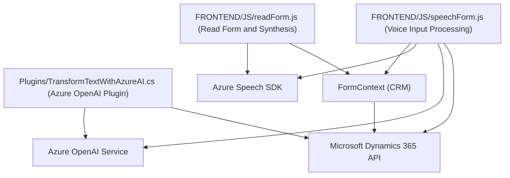

### Breve resumen técnico:

La solución contiene tres componentes principales que integran funcionalidad para la interacción por voz y procesamiento de datos en un contexto de formularios de Dynamics CRM. Utiliza el Azure Speech SDK para síntesis y reconocimiento de voz, el Azure OpenAI para transformación de texto mediante IA, y plugins para extender las capacidades del CRM. Está diseñado como un sistema modular con detalles claros para cada funcionalidad y su interacción con servicios externos.

---

### Descripción de arquitectura:

La arquitectura se caracteriza como una **multicapa (n-capas)** combinada con elementos de integración basada en microservicios externos. El sistema tiene capas de front-end (JS), que interactúan con el usuario y los servicios de terceros (como Azure APIs), y una capa de backend mediante el plugin de Dynamics CRM en C#. La arquitectura se enfoca en desacoplar responsabilidades mediante componentes modulares y reutilizables.

#### Estructura arquitectónica:
1. **Capa de presentación (Frontend):** Formada por JavaScript (`readForm.js`, `speechForm.js`) que genera interacción con los usuarios mediante voz y formulario.
2. **Capa de lógica de negocio:** Incluye operaciones para procesar los datos del formulario (en el frontend) o transformar los datos hablados (`Plugins/TransformTextWithAzureAI.cs`) en el backend.
3. **Capa de integración externa:** Comunicación con APIs de Azure Speech SDK y Azure OpenAI Service para síntesis/reconocimiento de voz y procesamiento de texto con IA.
4. **Capa de persistencia:** Abstraída por Dynamics CRM mediante Web API (`Xrm.WebApi`) para definir e interactuar con el contexto y datos del formulario.

---

### Tecnologías usadas:

1. **JavaScript:**
   - Modularidad con funciones.
   - Azure Speech SDK.
   - Dinámica basada en `formContext` (Dynamics CRM).
   - Construcción de APIs personalizadas.

2. **C# (Plugins):**
   - Interacción con Microsoft Dynamics CRM.
   - Integración con Azure OpenAI Service.
   - `Newtonsoft.Json` y `System.Text.Json` para serialización/deserialización.
   - `HttpClient` para realizar solicitudes HTTP.

3. **Frameworks y servicios:**
   - **Azure Speech SDK:** Para síntesis y reconocimiento de voz.
   - **Azure OpenAI Service:** Para transformación de texto mediante IA.
   - **Microsoft Dynamics 365 SDK/Web API:** Para extender la funcionalidad del CRM y manipular formularios.

4. **Patrones de diseño:**
   - Modularidad.
   - Integración de servicios externos.
   - Carga dinámica de scripts (SDK).
   - Responsabilidad única en funciones.

---

### Diagrama Mermaid:

---

### Conclusión final:

La solución es una combinación de frontend (JavaScript) y backend (C# plugin) enfocada principalmente en integrar la funcionalidad avanzada de reconocimiento y síntesis de voz (Azure Speech SDK) y procesamiento de texto mediante IA (Azure OpenAI), en un escenario de formularios dinámicos de Microsoft Dynamics CRM.

La arquitectura utiliza una **organización en n-capas** con una división clara entre lógica de presentación, negocio y acceso a datos. La integración con **Azure APIs y Dynamics CRM APIs** demuestra un enfoque híbrido hacia las aplicaciones modernas, donde servicios en la nube enriquecen la funcionalidad tradicional de sistemas empresariales.

Este diseño es adecuado para empresas que implementen soluciones basadas en CRM y busquen incorporar tecnologías avanzadas como AI y procesamiento de voz a sus flujos de trabajo. La tecnología y patrones muestran una implementación sólida y buenas prácticas, aunque la dependencia directa de servicios externos y del ecosistema de Dynamics CRM puede limitar su aplicabilidad para entornos fuera de ese ecosistema.