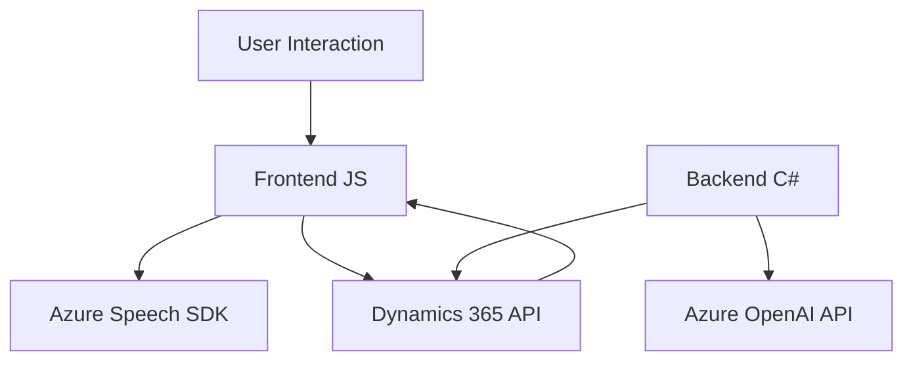

## Breve resumen técnico

El repositorio presenta archivos que implementan interacción intensa entre un frontend, servicios de reconocimiento y síntesis de voz de Azure SDK, y un backend (Dynamics 365 CRM). La solución se orienta hacia la integración de comandos de voz con procesamiento de texto estructurado para manipular formularios y realizar transformaciones basadas en IA.

## Descripción de arquitectura

La arquitectura del sistema es híbrida y está basada en el patrón **n capas** con una fuerte separación modular:
- **Frontend:** Contiene lógica de JavaScript asociada al manejo de formularios, reconocimiento de voz, y síntesis de texto a voz. Se integra con Azure Speech SDK y el API de Dynamics 365.
- **Backend:** Implementa lógica en el servidor mediante un plugin (TransformTextWithAzureAI.cs) que utiliza Azure OpenAI para transformar texto en JSON y trabajar con formularios empresariales. Este componente sigue el patrón de plugins de Dynamics CRM.
- **Servicios externos:** La solución utiliza Azure Speech SDK para reconocimiento y síntesis de texto, además de Azure OpenAI para transformación personalizada de texto.

## Tecnologías usadas

1. **Frontend:**
   - **JavaScript:** Implementación del manejo de voz, detección de datos, e integración con Azure.
   - **Azure Speech SDK:** Reconocimiento de voz y síntesis de texto a voz.
   - **Dynamics 365 API:** Para acceso a datos de formularios y lógica dinámica.

2. **Backend:**
   - **C#:** Implementación del plugin para Dynamics CRM.
   - **Newtonsoft.Json y System.Text.Json:** Manejo de JSON.
   - **Azure OpenAI API:** Procesamiento inteligente de texto.

## Diagrama Mermaid válido para GitHub

## Conclusión final

La solución integra un sistema frontend, que utiliza comando de voz y síntesis de texto para interactuar con formularios, y un backend personalizado centrado en la transformación de texto mediante reglas de IA. Implementa una arquitectura **n capas** con un enfoque modular y aprovechamiento extensivo de servicios externos como **Azure Speech SDK** y **Azure OpenAI API**. Configuraciones como el plugin y el manejo asincrónico aseguran flexibilidad y escalabilidad mientras se alinean con las capacidades del ecosistema Dynamics 365.