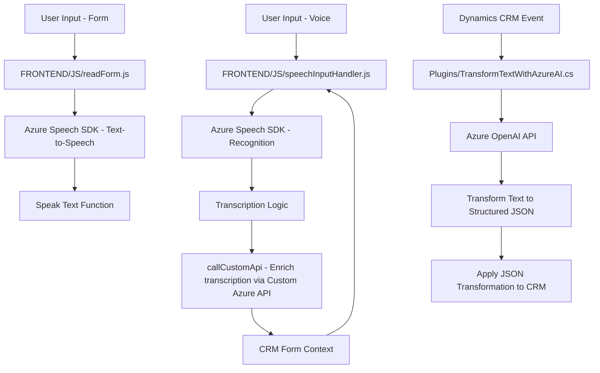

### Breve resumen técnico
La solución descrita es un conjunto modular de componentes que integra la interacción por voz, la lectura y escritura dinámica en formularios de Microsoft Dynamics CRM, y transformación textual avanzada utilizando Azure OpenAI. Está orientada a mejorar los flujos de trabajo en sistemas de CRM mediante capacidades de audio y procesamiento de inteligencia artificial.

---

### Descripción de arquitectura
1. **Tipo de solución**: 
   - Principalmente un integración que combina frontend (JavaScript para interacción con el usuario y captura de voz) y backend (plugin para procesamiento avanzado mediante Azure OpenAI).
   - Los componentes también interactúan con APIs externas (Azure Speech SDK y Azure OpenAI).

2. **Arquitectura observada**: 
   - **Distribuida de n capas**:
     - Capa de presentación (frontend JavaScript).
     - Capa de lógica de negocio (plugin en CRM y backend que llama a Azure OpenAI).
     - Capa de datos (integración directa con Microsoft Dynamics CRM).
   - La arquitectura adhiere a principios **orientados a servicios (SOA)**, ya que los componentes encapsulados consumen APIs externas específicas y son modularmente integrables.

---

### Tecnologías, frameworks y patrones usados
1. **Frontend (JavaScript)**:
   - **Azure Speech SDK** para síntesis y reconocimiento de voz.
   - **APIs de Dynamics CRM** (`Xrm.WebApi`) para interacciones en formularios.
   - **Patrones de diseño observados**:
     - **Facade**: Simplifica la operación mediante métodos específicos que encapsulan lógica de interacción con el SDK y APIs.
     - **Delegation pattern**: Utiliza callbacks para manejar asincronía (como en `ensureSpeechSDKLoaded`).

2. **Backend (C# Plugin)**:
   - **Microsoft Dynamics SDK** (`IPlugin`, `IOrganizationService`) para personalización de CRM.
   - **Azure OpenAI** para transformación avanzada de texto.
   - **Newtonsoft.Json.Linq** para manipulación JSON.
   - **Patrones de diseño observados**:
     - **Maestro-esclavo**: El plugin actúa como maestro y delega tareas de procesamiento textual avanzado a Azure OpenAI.
   - **Restful API Integration**: Realización de solicitudes HTTP hacia servicios externos (Azure).

3. **Other technologies**:
   - Integration with **Microsoft Dynamics CRM** for structured data handling and mapping fields.
   - **Speech-to-Text & Text-to-Speech**: Enhancing user interaction with voice capabilities.

---

### Dependencias o componentes externos
1. **Azure Speech SDK**:
   - Usado en el frontend para síntesis y reconocimiento de voz.

2. **Azure OpenAI API**:
   - En el backend, utilizado para transformar texto en estructuras JSON con modelos GPT.

3. **Microsoft Dynamics API**:
   - Administra y manipula datos en el contexto de un CRM.

4. **Libraries in backend**:
   - `Newtonsoft.Json.Linq`: JSON object manipulation.
   - `.NET Framework`: Foundation of the plugin, including HTTP communication (`System.Net.Http`).

---

### Diagrama Mermaid

El siguiente diagrama representa la interacción entre los elementos de la solución (frontend, backend, APIs externas y el sistema CRM):

---

### Conclusión final
La solución representa una integración avanzada de voz, texto y procesamiento con inteligencia artificial en ambientes de Microsoft Dynamics CRM. La arquitectura utiliza un enfoque modular en varias capas (frontend-backend-integrations) con principios de diseño como Facade, delegation y plugins para adaptar funcionalidades. Las dependencias externas, como Azure Speech SDK, Azure OpenAI, y Microsoft Dynamics APIs, refuerzan la interacción y la capacidad de procesamiento, haciendo que la solución sea óptima para mejorar la eficiencia en entornos CRM.