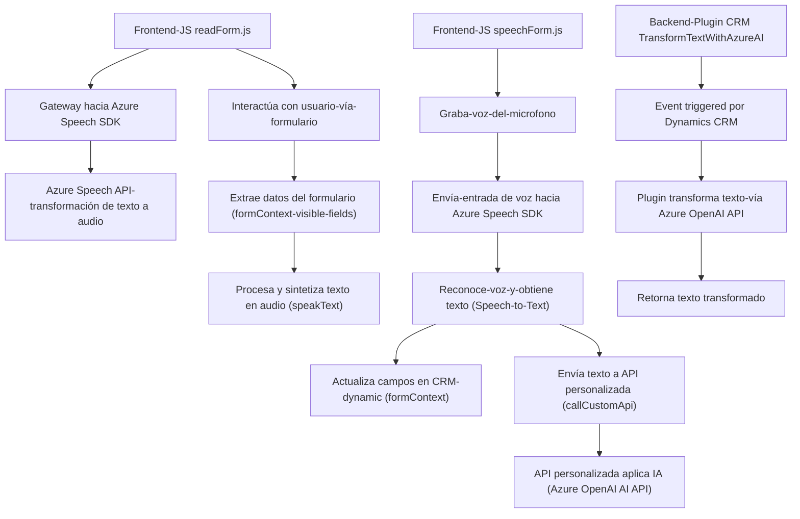

### Breve resumen técnico
El repositorio tiene componentes diseñados para proporcionar interacción entre un sistema CRM de Dynamics 365 y servicios avanzados de procesamiento de voz y texto en la nube, principalmente basados en Azure Speech SDK y Azure OpenAI. La solución incluye tanto un frontend implementado en JavaScript como un backend basado en complementos para Dynamics CRM con C#.

---

### Descripción de arquitectura
La arquitectura puede clasificarse como **modular con integración hacia servicios externos** (Azure) utilizando un enfoque **event-driven**. Cada módulo del frontend y el backend tiene identificado su responsabilidad principal y emplea integraciones con SDKs/servicios externos como Azure Speech y Azure OpenAI para una mayor funcionalidad.

1. **Frontend**: Estructura basada en **arquitectura de módulos**. Las funciones que representan la interacción entre el usuario, el navegador, el micrófono y SDK dinámico se cargan y distribuyen de manera aislada. Utilizan patrones como **gateway** hacia Azure Speech y mecanismos de rutas API para la interacción con backend.
2. **Backend/Plugin CRM**: Sigue el patrón **plugin design pattern** utilizando la **n-capas** recomendada por Microsoft Dynamics CRM. Encapsula una lógica específica (transformación de texto vía IA) y la ejecuta bajo eventos del sistema CRM en un contexto definido.

---

### Tecnologías, Frameworks y Patrones Usados
1. **Frontend**:
   - **Lenguaje**: JavaScript (funcional con soporte Promise).
   - **Frameworks y SDKs**: 
     - **Azure Speech SDK** (para síntesis de voz y reconocimiento de audio).
     - Dynamics CRM API (Xrm context).
   - **Patrones**:
     - Modularidad (componentes funcionales como `speakText`, `applyValueToField`, etc.).
     - Gateway integrador (Azure Speech SDK como intermediario hacia servicios Cloud).

2. **Backend (Plugin)**:
   - **Lenguaje**: C# (.NET Framework).
   - **Frameworks y SDKs**:
     - Dynamics CRM SDK (`Microsoft.Xrm.Sdk` para interacción).
     - Azure OpenAI REST API para procesamiento avanzado de texto.
     - System.Net.Http para llamadas HTTP (REST API).
   - **Patrones**:
     - Plugin Design Pattern (Dynamics CRM).
     - Service Layer (integración con Azure).

---

### Dependencias o componentes externos
1. **Azure Speech SDK**: Empleado en el frontend para reconocimiento de voz y síntesis de texto hacia audio. Requiere una clave de API y región.
2. **Azure OpenAI Service**: Utilizado en el plugin del backend para realizar transformaciones de texto.
3. **Microsoft Dynamics CRM SDK**: Base para el plugin que interactúa con los sistemas CRM.
4. **Microsoft Dynamics CRM API**: Integración con las API de Dynamics CRM.
5. **JSON Serialization**:
   - `System.Net.Http` y `System.Text.Json` en C#.
   - `JSON.parse` y manipulación directa en el frontend.

---

### Diagrama Mermaid válido para GitHub

---

### Conclusión final
Este repositorio presenta una solución híbrida que combina frontend y backend para gestionar formularios y un flujo de reconocimiento y síntesis de voz. También incluye capacidades avanzadas de procesamiento de texto mediante IA con plugins en Dynamics CRM.

El diseño está bien estructurado en módulos y adherido a estándares recomendados para las respectivas herramientas utilizadas (Azure SDK y Dynamics CRM). Sin embargo, hay áreas que pueden mejorarse:
- **Seguridad**: Centralizar las configuraciones relacionadas con claves de acceso en un archivo protegido.
- **Escalabilidad**: Considerar herramientas adicionales para monitorización de los servicios en la nube.
