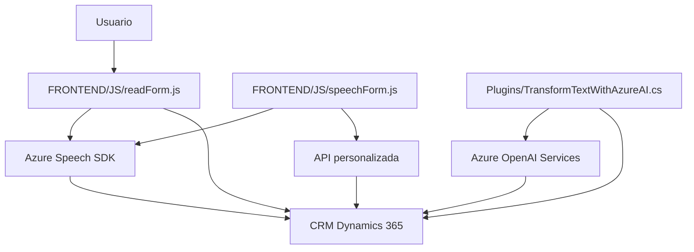

### Breve resumen técnico
El repositorio contiene tres archivos de código organizados en directorios que abarcan una solución relacionada con la interacción entre usuarios, formularios en una interfaz web y el uso de la síntesis/reconocimiento de voz mediante Azure Speech SDK y Azure OpenAI. Este sistema parece estar integrado con Dynamics 365 a través de plugins, lo que permite manipular datos de entrada y salida de formularios asociados con un CRM o sistema de gestión empresarial.

Movimiento entre datos visibles en formularios, procesamiento por voz y uso de APIs externas sugiere una solución diseñada para mejorar la interacción del usuario mediante interfaces conversacionales.

---

### Descripción de la arquitectura
1. **Arquitectura general:** El sistema tiene una arquitectura híbrida basada en:
   - **Multicapas**: En términos de separación de presentación (frontend), lógica de negocio (negocio/form processing en funciones JavaScript) y almacenamiento/contexto (Dynamics CRM plugin y APIs).
   - **Integración con sistemas externos**: Un flujo confederado de datos entre Azure Speech SDK para el procesamiento de audio, Azure OpenAI para el análisis semántico del texto, y el entorno Dynamics CRM.
2. **Componentes:** Incluye:
   - **Frontend**: Operaciones para extraer y mostrar los datos en interfaz.
   - **Plugins**: Operaciones asociadas a reglas relacionadas con el modelo de negocio del CRM.
   - **Exposición de servicios externos**: Usando tanto el Speech SDK como el servicio OpenAI.

---

### Tecnologías usadas
1. **Frontend:**  
   - **JavaScript ES6+**: Todos los paquetes están organizados como funciones para la interacción con reglas y modularidad.  
   - **Azure Speech SDK**: Procesamiento de reconocimiento de voz y síntesis de voz.  
   - **Form Context API**: Interacción directa con los contextos y atributos del formulario en Dynamics 365.  
   - **Callback pattern y asincronía**: Uso de promesas y callbacks para garantizar ejecución dinámica.

2. **Backend/Dynamics Plugin:**  
   - **C#**, con el uso de .NET Framework o .NET Core. Implementación de un plugin para Dynamics CRM.  
   - **Microsoft.Xrm.Sdk**: Biblioteca estándar de Dynamics para consulta de datos y ejecución de lógica personalizada.  
   - **System.Text.Json, Newtonsoft.Json**: Recursos para la manipulación JSON en C#.  
   - **System.Net.Http**: Comunicación directa con APIs externas, como el endpoint de Azure OpenAI.

3. **Servicios Externos:**  
   - **Azure Speech SDK**: Para síntesis de voz y reconocimiento de texto.  
   - **Azure OpenAI Service**: Para transformar texto mediante reglas específicas en JSON estructurado.

---

### Diagrama Mermaid válido para **GitHub**

---

### Conclusión final
El repositorio aloja una solución bien organizada destinada a usar tecnología de reconocimiento/síntesis de voz y transformación de texto en una interfaz web conectada a un sistema de gestión empresarial (Dynamics 365). Con una mezcla de tecnologías modernas como el Azure Speech SDK y Azure OpenAI, la solución destaca por su diseño modular en el frontend y la integración con plugins en el backend que amplían las capacidades del CRM.  

Sin embargo, la arquitectura podría mejorarse introduciendo un enfoque más orientado a servicios o una arquitectura hexagonal, que aísle de manera más clara la lógica del negocio del acceso a recursos externos (APIs y servicios) para reducir dependencias directas.