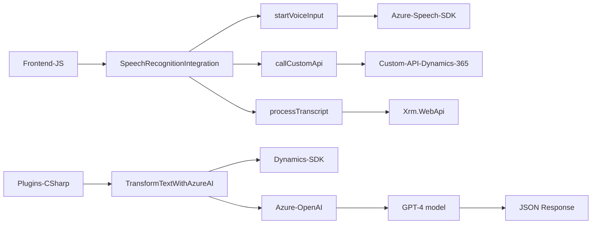

### **Breve resumen técnico**

El repositorio estructura una solución orientada a la integración de inteligencia artificial (Azure Speech SDK y OpenAI GPT) dentro del ecosistema Microsoft Dynamics 365. La funcionalidad se centra en mejorar la interacción de usuarios con formularios mediante reconocimiento y síntesis de voz, así como con la transformación avanzada de datos vía OpenAI.

---

### **Descripción de arquitectura**
La arquitectura es híbrida:
1. **Frontend (JS)**: Modularidad basada en funciones específicas para interactuar con datos de formularios y servicios externos (Azure Speech SDK). Es un componente de la capa de presentación que sigue principios del MVC.
2. **Backend (Plugin)**: Una arquitectura orientada a eventos (Event-driven) basada en el patrón plugin para extender las capacidades de Dynamics CRM. Utiliza el patrón "Dependency Injection" a través de `IServiceProvider`.
3. **Integración de APIs externas**: Comunicación con servicios externos mediante HTTP APIs como Azure Speech SDK y Azure OpenAI para procesar audio, reconocimiento de voz y transformación de texto.

---

### **Tecnologías usadas**
1. **Frontend**
   - **JavaScript**
   - **Azure Speech SDK** para síntesis y reconocimiento de voz, acceso dinámico vía loading de script.
   - Dynamics 365 SDK para manipulación del contexto de formularios.
   - **Custom API** para extender llamadas a servicios específicos.

2. **Backend**
   - **C#** como lenguaje principal.
   - **Microsoft Dynamics CRM SDK** para la integración con Dynamics.
   - **Azure OpenAI** para procesamiento de datos avanzados.
   - **Newtonsoft.Json** para manipular datos JSON.
   - **System.Net.Http** para manejo de las comunicaciones con el servicio REST de OpenAI.

---

### **Diagrama Mermaid**

---

### **Conclusión final**
Este repositorio implementa una solución que mejora la experiencia de usuario en el ecosistema Dynamics 365 utilizando servicios avanzados de Azure para síntesis y reconocimiento de voz, además de procesamiento de texto con OpenAI. La arquitectura adopta un enfoque híbrido de **n capas+event-driven** entre el frontend y el backend, con patrones de modularidad en el front y encapsulación en el plugin. Las tecnologías empleadas están bien alineadas con servicios de Dynamics y Azure, indicando una solución optimizada para procesos empresariales y productividad en entornos CRM.