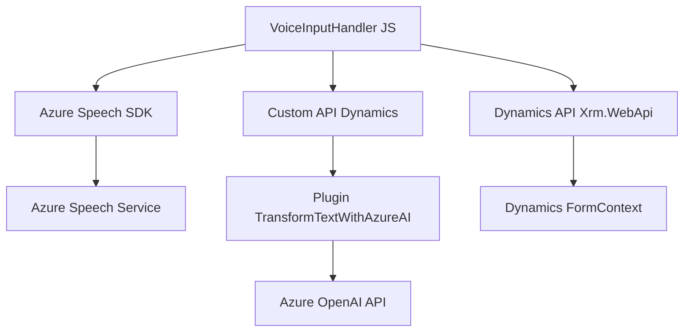

### Breve resumen técnico
El repositorio contiene código dividido en tres áreas principales: un frontend basado en Javascript para interactuar con Dynamics 365, integración con servicios de inteligencia artificial de Azure, y un plugin en C# que utiliza Azure OpenAI para procesamiento de texto estructurado. La solución emplea Azure Speech SDK, Dynamics APIs y patrones relacionados con eventos y modularidad, soportando características tanto de entrada como síntesis de voz y transformación de datos textuales.

---

### Descripción de arquitectura
La arquitectura combina aspectos de capas tradicionales y componentes de servicios distribuidos. En el frontend, hay una interacción directa con formularios en Dynamics 365 mediante APIs y eventos que controlan elementos específicos como síntesis y reconocimiento de voz. Por otro lado, los plugins funcionan como puntos de extensión dentro de Dynamics, integrándose con APIs externas de Azure para procesamiento de texto. Esto genera una arquitectura orientada hacia una solución híbrida basada en capas y eventos, con integración externa de microservicios de AI.

---

### Tecnologías usadas
1. **Frontend:**  
   - **Javascript:** Para la lógica de interacción.
   - **Dynamics 365 Web API (`Xrm.WebApi.online`).**
   - **Azure Speech SDK:** Para síntesis y reconocimiento de voz.
   - **Callback/Promise:** Manejo asíncrono de SDK y APIs.
   - Eventos asociados a la interacción de formularios.

2. **Backend/Plugins:**  
   - **C# (.NET Framework/Dynamics SDK):** Desarrollo de plugins para Dynamics 365.
   - **Azure OpenAI APIs:** Transformación avanzada de datos en JSON.
   - **HTTP Client (`System.Net.Http`).**

3. **Interacciones:**  
   - Solicitudes REST a servicios externos como Azure OpenAI y Dynamics Custom APIs.
   - Conversión de datos transcritos en español a formato JSON estructurado.
   - Mapa de campos para mejorar asignación dinámica en formularios.

---

### Diagrama **Mermaid** válido para GitHub

---

### Conclusión final
La solución combina tecnologías modernas de asistentes por voz y procesamiento de texto, con una integración avanzada hacia servicios cloud como Azure Speech y OpenAI. Mientras la estructura del código en el frontend emplea patrones de modularidad y elementos de diseño basado en eventos, el backend se alinea al modelo típico de plugins para Dynamics CRM. Es una solución robusta, ideal para automatizar tareas dentro de entornos empresariales usando inteligencia artificial, pero puede ser optimizada en aspectos de seguridad y abstracción de dependencias críticas como claves API.