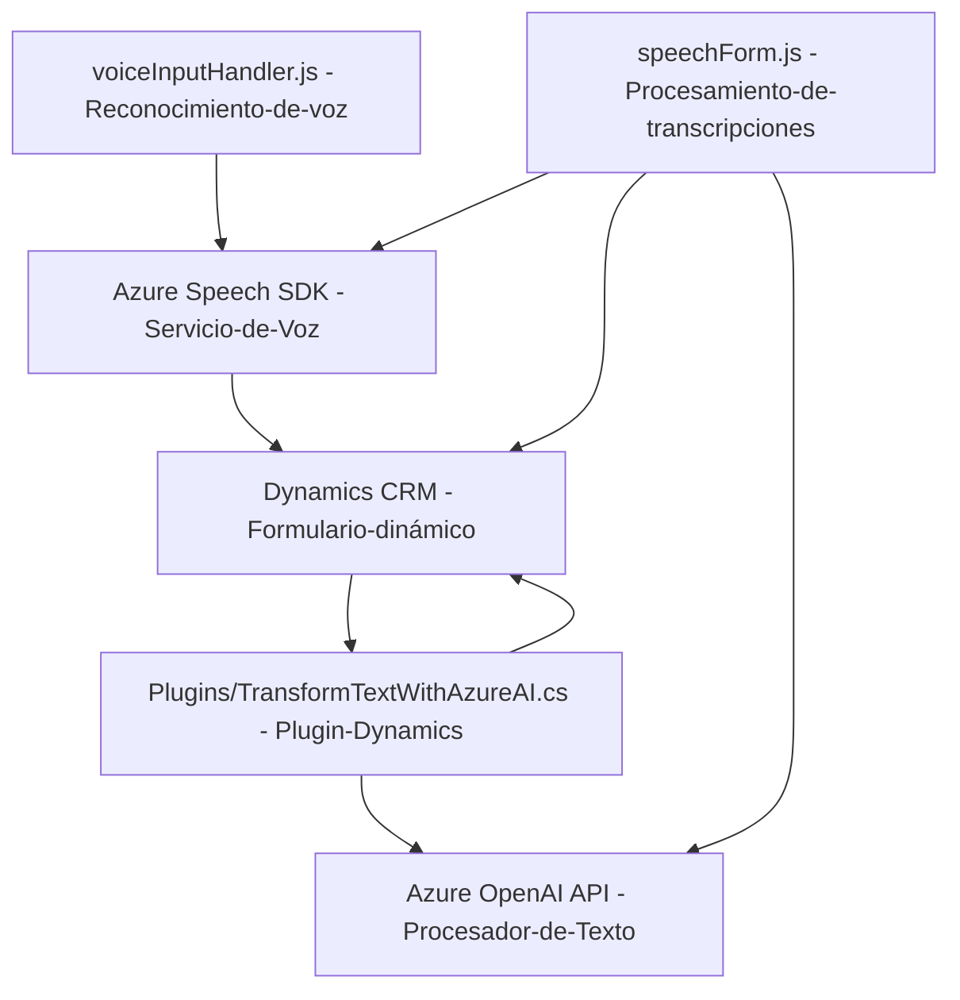

## Breve resumen técnico

El repositorio contiene un sistema arquitectónicamente compuesto por distintos componentes que integran tecnología de IA proporcionada por Azure (OpenAI y Speech SDK) con Dynamics 365 para enriquecer la experiencia de usuario, específicamente en el manejo de formularios mediante procesamiento de voz.

---

## Descripción de arquitectura

La arquitectura parece estar basado en **n capas** con componentes distribuidos:
1. **Frontend JavaScript**: Implementa procesamiento y entrada de voz mediante Azure Speech SDK, interactuando directamente con formularios en Dynamics 365.
2. **Backend Dynamics Plugin**: Un plugin para Dynamics CRM extendiendo sus capacidades mediante el uso de Azure OpenAI API, manejado en capa de lógica empresarial del CRM.
3. **Integración de servicios externos**:
   - Azure Speech SDK para reconocimiento y síntesis de voz.
   - Azure OpenAI API para procesamiento de texto basado en IA.

La estructura sugiere un **modelo híbrido** entre monolito y servicios externos. El código que gestiona el frontend se organiza por funcionalidades en módulos, y el plugin sigue patrones propios de Dynamics CRM con intervenciones directas en el flujo de datos.

---

## Tecnologías usadas

**Frontend:**
- Lenguaje: JavaScript
- SDK: Azure Speech SDK
- Contexto: Dynamics 365 `executionContext`

**Backend Plugin:**
- Lenguaje: C#
- Framework: Dynamics CRM SDK (Microsoft.Xrm.Sdk)
- Desarrollo paralelo con: REST API (Azure OpenAI), Newtonsoft.Json

**General:**
- Azure Speech SDK
- Azure OpenAI API
- Asincronía basada en Promises (Frontend)

**Patrones identificados:**
- Modularización funcional (frontend).
- SDK Gateway para cargar e interactuar con Azure Speech.
- Dependency Injection y Validación en el plugin para Dynamics CRM.
- Procesamiento asincrónico en frontend y backend (promesas y REST).
- Pipeline y Mapping Pattern para el manejo dinámico de input y output en formularios.

---

## Diagrama Mermaid

---

## Conclusión final

El repositorio es una solución híbrida que combina frontend (JavaScript) y backend (Dynamics CRM plugin en C#) integrándose mediante SDKs y APIs de Azure. Está orientado al enriquecimiento de la experiencia del usuario a través de la IA y la voz, en un entorno de trabajo CRM. La arquitectura destaca por su modularización y patrones integradores, siendo idónea para construir soluciones robustas con dependencia en servicios de terceros como Azure.