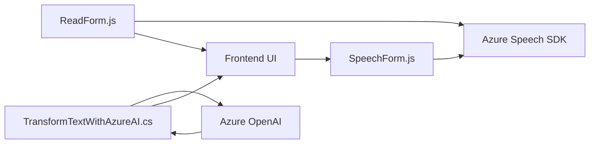

### Breve resumen técnico

El repositorio analiza múltiples archivos que trabajan en conjunto, destacándose por su enfoque hacia integración con servicios de Azure (especialmente Azure Speech SDK y Azure OpenAI) para funcionalidades de reconocimiento de voz y procesamiento de texto. Los resultados obtenidos se transforman y aplican a formularios dentro de sistemas Dynamics CRM. 

La solución se ocupa de:
1. **Frontend**: Para manejar formularios y la interfaz vinculada al usuario (JS).
2. **Backend plugins personalizados**: Extensiones para realizar tareas como la transformación de textos mediante inteligencia artificial (Azure OpenAI).
3. **Servicios externos**: Integra servicios basados en Microsoft Azure, como Azure Speech para síntesis de voz y transcripción, y Azure OpenAI para procesamiento avanzado de lenguaje.

---

### Descripción de arquitectura

La arquitectura general combina elementos de las siguientes aproximaciones:
1. **Arquitectura de servicios**:
   - Cada archivo actúa como un servicio independiente para cumplir su tarea específica (procesamiento, integración, API de voz, interacción con formularios).
   - Esto podría ser parte de una arquitectura **microservicios** si se separa en servicios individuales desplegables. Sin embargo, los plugins de Dynamics CRM están más alineados con un modelo de **n capas** dentro del ecosistema.
   
2. **Armonización de servicios internos y externos**:
   - El componente de frontend utiliza formularios dinámicos de Dynamics CRM, implementando patrones de adaptadores para transformar datos externos obtenidos del reconocimiento de voz y APIs de Azure.
   - El backend emplea un plugin en la capa del servidor de Dynamics CRM para realizar la lógica del negocio y consumir el servicio de Azure OpenAI.

---

### Tecnologías usadas

1. **Frontend**:
   - **JavaScript**: Utilizado para construir scripts integrados en el entorno del CRM con funcionalidades dependientes de eventos en formularios.
   - **Azure Speech SDK**: Manejo de síntesis y reconocimiento de voz.
   - **Dynamics CRM APIs**: Uso de `formContext` y `Xrm.WebApi`.

2. **Backend**:
   - **Microsoft Dynamics SDK**: Usado para implementar plugins.
   - **Azure OpenAI GPT-4**: Para procesamiento avanzado de lenguaje (transformación de texto).
   - **HTTP Requests**: Para consumir servicios externos (REST API de Azure).

3. **Patrones arquitectónicos**:
   - **Integración con servicios externos**: SDK de speech integrado con frontend; API OpenAI en backend.
   - **Adaptadores**: Mapeo de datos desde transcripción de voz o salida de OpenAI hacia el esquema del formulario.
   - **Event-driven architecture**: Integración de lógica en eventos del UI como inicio de grabación de voz o envío a servicios. Utilización de callbacks.

---

### Diagrama Mermaid válido para GitHub

- RF: Operaciones de lectura de formularios (Frontend).
- SC: Manejo de reconocimiento de voz en formularios (Frontend).
- TP: Plugin para transformar texto (Backend).
- SDK1: SDK de síntesis y reconocimiento de voz.
- API1: Servicio Azure OpenAI para procesamiento de texto.

---

### Conclusión final

El análisis del repositorio indica que se trata de una **integración de servicios externos de Azure en una solución Dynamics CRM**. Utiliza un modelo de arquitectura **mixtamente n capas** adaptado para aplicaciones CRM con dependencias externas configuradas para enriquecer las funcionalidades del sistema. 

La elección de tecnologías como Azure Speech SDK, OpenAI y Dynamics CRM denota un enfoque en soluciones de automatización y procesamiento avanzado, lo que es ideal para empresas que buscan modernizar sus procesos y mejorar la experiencia de usuario. Sin embargo, el diseño actual puede beneficiarse de configuraciones dinámicas para parámetros en Azure (como endpoint y claves) y mejor control de extensibilidad, especialmente para despliegues más robustos.