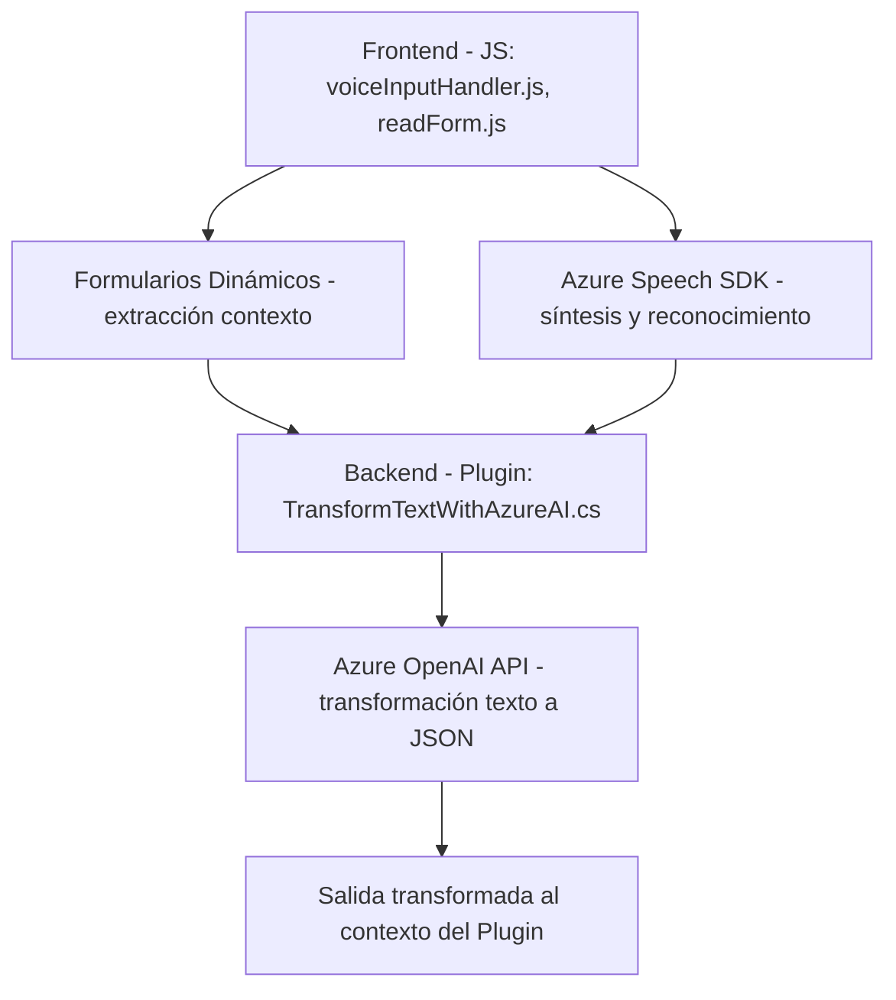

# Análisis Técnico del Repositorio

## Breve resumen técnico

El repositorio contiene tres archivos clave que implementan diversas funcionalidades para formar parte de una solución diseñada para interactuar con formularios dinámicos, integrar el reconocimiento de voz, texto y síntesis con servicios como Azure Speech SDK y Azure OpenAI, y transformar datos en tiempo real. La solución utiliza tecnologías de Microsoft como Dynamics CRM y APIs externas de Azure.

---

## Descripción de la arquitectura

1. **Tipo de Solución:** La arquitectura global parece estar diseñada para integrarse como un plugin de Dynamics CRM utilizando archivos independientes de front-end y back-end. Se trata de una combinación de **API (servicio de Azure OpenAI)** y **front-end dinámico (JS)** con soporte **event-driven** en plugins integrados.

2. **Arquitectura:**
   - La solución sigue un enfoque de **n capas**:
     - **Capa de presentación:** Archivos JS (`voiceInputHandler.js`, `readForm.js`) interactúan con la UI para procesar formularios dinámicos.
     - **Capa de aplicación:** Logic como el CRM plugin (`TransformTextWithAzureAI.cs`) para transformar texto basado en usuarios y datos externos.
     - **Capa externa:** Integración con APIs externas como Azure Speech SDK y Azure OpenAI.
   - También hay principios del patrón **hexagonal**, donde diferentes adaptadores (SDK, APIs externas) interactúan con las funcionalidades principales como la administración de formularios dinánicos y eventos.

---

## Tecnologías Usadas

### Frontend:
1. **Tecnologías:**
   - **JavaScript** para lógica del cliente.
   - **Azure Speech SDK** proporciona reconocimiento de voz/síntesis de texto.
   - **HTTP requests** para invocar APIs personalizadas.

2. **Framework/Plataformas:**
   - **Dynamics 365 CRM:** Los contextos y formularios provienen de este framework.

### Backend:
1. **Lenguaje:** 
   - **C#** para el desarrollo del plugin en Dynamics CRM.

2. **Frameworks/Bibliotecas:**
   - **Microsoft.Xrm.Sdk:** Amplia integración con Dynamics 365.
   - **Newtonsoft.Json**: Para manipulación JSON.
   - **HttpClient:** Comunicación con Azure OpenAI API.

### Patrón y Conectores:
- **Patrones de Integración:** 
  - Uso de SDK externos (Azure Speech SDK) y API REST (Azure OpenAI API) para interconexión con servicios de nube de Microsoft.
- **Modularización:** 
  - Distribución lógica de funcionalidad en archivos JS y clases en C#.
- **Event-driven:** 
  - Uso de disparadores de eventos en Dynamics CRM para ejecutar el plugin.

---

## Dependencias externas y componentes posibles

1. **Azure Speech SDK:** 
   Utilizado como dependencia externa para la síntesis de voz y reconocimiento desde el front-end.

2. **Azure OpenAI API:** 
   API utilizada en el plugin para transformar datos textuales mediante procesamiento de lenguaje natural (IA).

3. **Configuration Management:** 
   Puede requerir almacenamiento seguro de claves API y regiones mediante servicios como **Azure Key Vault**.

4. **CRM Dynamics 365:** 
   Dependencia organizacional esencial para el entorno del usuario final.

---

## Diagrama Mermaid

---

## Conclusión Final

La solución representa una arquitectura limpia y bien diseñada, especializada en proporcionar funcionalidades avanzadas de voz y texto mediante integración con servicios en la nube (Azure Speech SDK y OpenAI). Si bien se designa principalmente como un plugin de Dynamics CRM, su interacción con API externas y el manejo avanzado de datos sugieren ciertos elementos de una implementación hexagonal.

En general, la solución es adecuada para entornos empresariales que gestionan formularios dinámicos y requieren soporte para síntesis de voz, reconocimiento y procesamiento avanzado de lenguaje natural. La seguridad y manejo de claves para Azure deberían revisarse para garantizar una implementación robusta adecuada al entorno de producción.