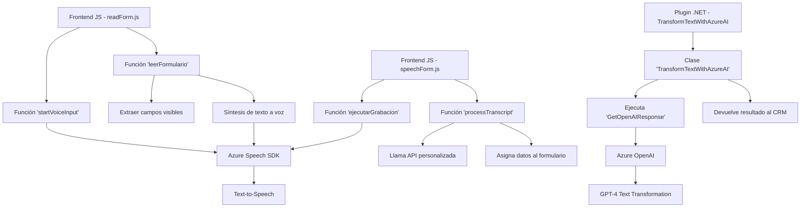

### Breve resumen técnico

El repositorio parece estar diseñado para integrar capacidades avanzadas de voz y transformación de texto con un sistema CRM, posiblemente Microsoft Dynamics 365. Las funcionalidades principales del proyecto incluyen:
- Captura de datos desde formularios y conversión de texto a voz utilizando Azure Speech SDK.
- Reconocimiento de voz para permitir interfaz conversacional y asignar valores a formularios CRM.
- Transformación avanzada de texto con Azure OpenAI y funciones específicas de un plugin de Dynamics CRM para procesamiento en tiempo real.

---

### Descripción de arquitectura

El diseño general incluye un enfoque modular en el frontend (organizado en funciones específicas para la manipulación de datos), mientras que en el backend se utiliza una arquitectura de complementos o plugins. Por otro lado, hay integración con **servicios externos de Azure**, como el Speech SDK y OpenAI, que actúan como "capas externas".

#### Tipo de arquitectura:
- El frontend sigue un modelo **reducido de procesamiento por capas**, donde las interacciones entre módulos (procesamiento de formularios, captura de datos, reconocimiento de voz, etc.) se encuentran bien separadas. No hay uso explícito de un patrón como MVC o MVVM.
- La parte backend (plugins de Dynamics CRM) responde al patrón **Plugin Design Pattern**, involucrando un diseño típico para integraciones con plataformas como Dynamics CRM.
- La solución no presenta un modelo distribuido (no hay microservicios ni desacoplamiento significativo entre módulos).

#### Componentes clave de la arquitectura:
1. **Frontend JavaScript**: Independiente y centrado en interactuar con datos del formulario. Integra SDKs externos como parte de la lógica visual.
2. **Backend Plugin (.NET)**: Define la lógica ejecutada en Dynamics CRM, que interactúa directamente con Azure OpenAI para transformación avanzada de texto.
3. **Integraciones externas**:
   - Azure Speech SDK para operaciones text-to-speech y reconocimiento de voz.
   - Azure OpenAI para procesamiento de texto complejo.

---

### Tecnologías usadas

1. **Frontend (JavaScript)**
   - JavaScript básico: Sin uso explícito de librerías como React/Vue/Angular.
   - Azure Speech SDK: Para conversión de texto a voz y reconocimiento de voz.
   - Contexto CRM: Probablemente integrando Microsoft Dynamics XRM API.

2. **Backend (.NET C#)**
   - Microsoft Dynamics SDK.
   - .NET Framework/C#: Desarrollo de un plugin con implementación `IPlugin`.
   - Azure OpenAI Services: Interacción con GPT-4 usando llamadas HTTP y JSON.
   - Librerías auxiliares: `System.Text.Json`, `Newtonsoft.Json.Linq`, `System.Net.Http`.

3. **Frameworks o Patrones**
   - Modulación funcional en JavaScript.
   - Plugin Design Pattern para el backend.
   - "Integration Layer" para interactuar con Azure APIs.

---

### Diagrama Mermaid válido para GitHub

---

### Conclusión final

El repositorio es una solución híbrida que combina un frontend en JavaScript y un backend en .NET, diseñada para mejorar la interacción de los usuarios con un sistema CRM, probablemente Microsoft Dynamics 365. Las funcionalidades clave incluyen reconocimiento de voz, conversión texto-voz y procesamiento con IA utilizando Azure OpenAI.

El diseño general presenta buena modularidad y uso adecuado de SDKs externos. No obstante, la solución aún parece estar muy acoplada al contexto de formularios en CRM y a servicios específicos de Azure. Esto puede limitar la adoptabilidad del código en entornos diferentes y puede beneficiarse de una implementación más desacoplada, como microservicios o una arquitectura basada en eventos.