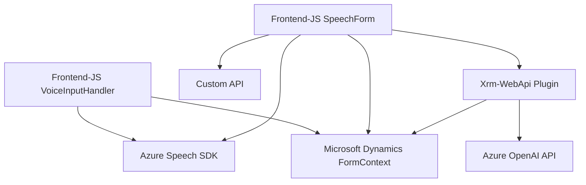

### Breve resumen técnico
El repositorio describe una solución integrada que utiliza reconocimiento de voz, síntesis de voz, procesamiento de formularios y transformación de texto en JSON mediante servicios externos como Azure Cognitive Services (Speech SDK, OpenAI). Se centra en ofrecer capacidades extendidas al software Dynamics CRM, mediante la interacción dinámica y manipulativa de formularios y datos a través de APIs y plugins personalizados.

---

### Descripción de arquitectura
La solución tiene al menos tres componentes principales:
1. **Frontend**: Scripts ejecutados en el navegador, utilizados para manejar la interacción con el usuario, formularios de Dynamics CRM, y las capacidades de síntesis/reconocimiento de voz.
2. **Backend-Plugin**: Código .NET que actúa como un plugin de Dynamics CRM, encargado de traducir datos y generar JSONs a través de Azure OpenAI.
3. **Servicios de integración**: SDK y APIs externas proporcionadas por Azure para realizar las tareas de reconocimiento/síntesis de voz (Speech SDK) y procesamiento de texto (OpenAI).

La arquitectura se asemeja a un enfoque **n-capas**:
- **Frontend/Presentation Layer**: Manejo de interacciones de usuario dinámicas.
- **Middleware**: Scripts que integran datos entre la capa de frontend y las APIs externas.
- **Backend (Plugin Layer)**: Procesamiento lógico profundo e integración de API.

Adicionalmente, el código demuestra características relacionadas con arquitectura **orientada a APIs** y modularidad.

---

### Tecnologías usadas
1. **Frontend (JavaScript):**
   - **Azure Speech SDK**: Para síntesis y reconocimiento de voz.
   - **Microsoft Dynamics CRM APIs**: Con Xrm.WebApi para gestionar formularios.
   - **Promises/Asynchronous Functions**: Para interacción fluida con APIs.

2. **Backend (.NET - C#):**
   - **Microsoft Dynamics SDK (Microsoft.Xrm.Sdk)**: Extensión de funcionalidades de CRM mediante plugins.
   - **Azure OpenAI API**: Para análisis y transformación avanzada de texto.
   - **Newtonsoft.Json.Linq**: Manejo avanzado de datos JSON.
   - **System.Net.Http**: Llamadas HTTP para conectarse a APIs.
   - **Regex (System.Text.RegularExpressions)**: Validación y procesamiento de datos basados en patrones.

3. **Servicios Externos:**
   - Azure Speech SDK (para reconocimiento y síntesis de voz).
   - Azure OpenAI API (GPT-4o para procesamiento y transformación de texto).

---

### Diagrama Mermaid

---

### Conclusión final
La solución en el repositorio es una integración avanzada de un **Frontend dinámico basado en JavaScript** y un **Backend basado en .NET** que implementa plugins para Microsoft Dynamics CRM, con soporte adicional para servicios de Azure. La arquitectura es predominantemente **n-capas** con patrón **orientado a APIs**, una transición fluida entre la gestión de formularios en cliente, y la extensión lógica en el lado del servidor. A pesar de estar funcionalmente rico, debe mejorar en aspectos como la seguridad de las credenciales y manejo de errores robusto en todas las capas.