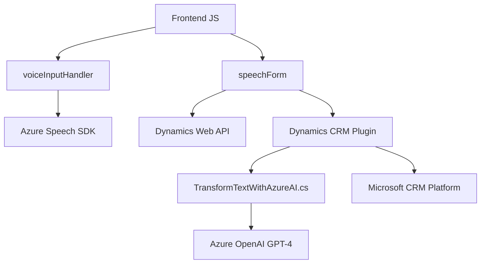

### Análisis de la solución

#### **Breve resumen técnico**
El repositorio se compone de un sistema híbrido orientado principalmente hacia la integración de interacción por voz y procesamiento de datos mediante tecnologías SaaS como Azure Speech SDK y Azure OpenAI. Los archivos muestran funcionalidades específicas para interactuar con formularios en Dynamics 365 y para implementar un plugin que convierte texto mediante Inteligencia Artificial (IA).

---

#### **Descripción de arquitectura**
1. **Tipo de solución:** Este repositorio representa una solución enfocada en la interacción con formularios (Dynamics 365) utilizando entrada de voz, procesamiento de información con IA y respuestas sintetizadas en formato de voz o texto. Dentro de la estructura, se observa un componente **frontend JavaScript** para la parte interactiva de los formularios y un **backend/código C# que actúa como plugin para Dynamics CRM**.
2. **Arquitectura general:** 
   - Una arquitectura **n-capas** distribuida entre manejo del frontend (JS) y procesamiento en el backend (Dynamics & Azure OPEN AI). Aunque no es un sistema completamente desacoplado basado en microservicios, aprovecha una arquitectura integrativa con servicios externos de nube gestionados por Microsoft (Azure) y una capa de negocio personalizada (Plugins).
   - El frontend utiliza módulos para manejar diferentes funcionalidades como entrada de voz y datos del formulario vinculados, mientras que el backend amplía la funcionalidad del CRM con reglas específicas mediante el **patrón de plugin**.

---

#### **Tecnologías, frameworks y patrones utilizados**
1. **Frontend**:
   - **Apache Dynamics CRM Web API** a través de `Xrm.WebApi`.
   - **Azure Speech SDK (JS)**: Framework cliente para síntesis y reconocimiento de voz.
   - **Patrones utilizados:**
     - **Modularidad:** Código dividido por responsabilidades.
     - **Callback/asynchronous patterns:** Uso de `async/await` y callbacks para gestionar operaciones asincrónicas.
     - **API Integration Patterns:** Integración con servicios (Speech SDK, Dynamics).

2. **Backend**:
   - **Lenguaje:** C# (Microsoft .NET Framework).
   - **Librerías:** 
     - `Microsoft.Xrm.Sdk` para la integración de plugins en Dynamics CRM.
     - `Newtonsoft.Json` y `System.Text.Json` para la manipulación y serialización de datos JSON.
   - **Servicio de IA:** Azure OpenAI GPT para transformación de datos (external RESTful endpoint).
   - **Patrones utilizados:**
     - **Plugin Design Pattern:** Implementación personalizada de la interfaz `IPlugin` para CRM.
     - **Messaging Strategy:** Uso de servicios REST de Azure OpenAI.
     - **Microservicio:** Externalización de la lógica avanzada a un sistema cloud externo (Azure).

---

#### **Dependencias o componentes externos**
1. API de **Dynamics 365**:
   - `Xrm.WebApi` para interacción con datos del CRM (consultas y modificar campos).
   - Endpoint configurado en `speechForm.js` para procesamiento de datos API (`callCustomApi`).
   - Métodos de búsqueda de registros (como `retrieveMultipleRecords`) en la capa de backend.

2. Servicios de **Azure Speech SDK**:
   - Este SDK es responsable de la síntesis de voz y reconocimiento del habla en tiempo real, utilizado ampliamente en el frontend.

3. **Plugin de Dynamics y Azure OpenAI**:
   - Integración directa con el endpoint GPT-4 desde Azure используется `TransformTextWithAzureAI.cs`.

4. **Otras dependencias internas y externas:**
   - Gestión de Promesas para flujo asincrónico (JS/TS).
   - Métodos de utilidad para la manipulación de datos estructurados.
   - Framework Dynamics CRM para plugins e interacción del frontend.

---

#### **Diagrama Mermaid válido para GitHub Markdown**

---

### **Conclusión final**
El repositorio analizado muestra un proyecto híbrido de **integración SaaS** para la interacción basada en voz y transformación dinámica de datos en formularios de Dynamics CRM. Emplea una combinación de frontend modular utilizando **Azure Speech SDK** con procesamiento asincrónico y un **backend extensible** en forma de plugin que usa el modelo de **Azure OpenAI GPT-4** para el análisis avanzado de texto. La arquitectura es funcional para aplicaciones empresariales que necesiten extender sus capacidades de interacción mediante voz e inteligencia artificial, adoptando una solución extensible y escalable basada en componentes externos de la nube.