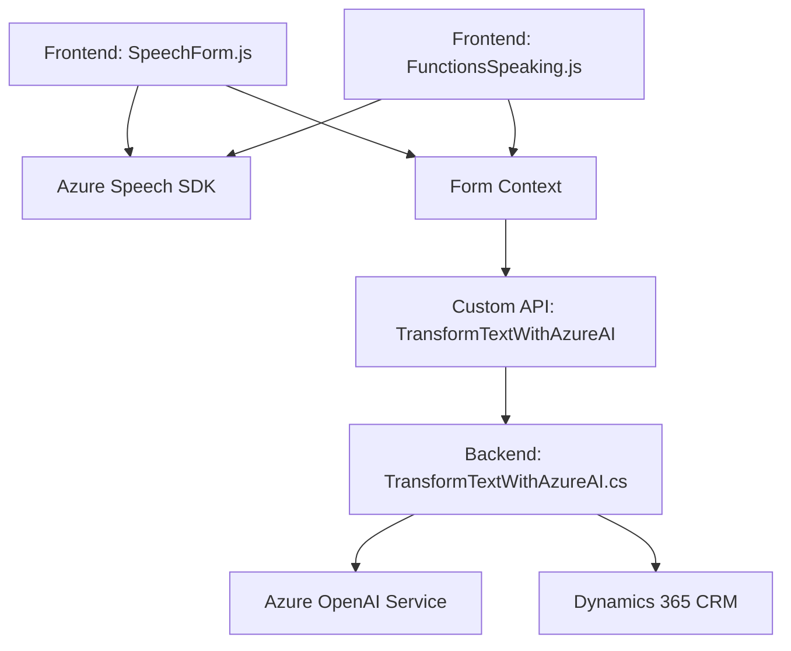

### Breve resumen técnico:
El repositorio desplegado demuestra una solución integrada entre componentes de frontend JavaScript y plugins de backend para Dynamics 365. Emplea Microsoft Azure Speech SDK para funcionalidades de síntesis de voz y transcripción de texto, y Azure OpenAI para la transformación y procesamiento de texto en el backend. Esto se enmarca en aplicaciones empresariales desplegadas sobre la plataforma Dynamics 365.

---

### Descripción de arquitectura:
La arquitectura general puede clasificarse como híbrida, combinando:
- **Microservicios**: Los plugins y APIs personalizadas actúan como servicios independientes que se comunican con otros componentes y servicios externos.
- **Arquitectura de capas**: La segmentación entre lógica de frontend (manipulación de formularios y procesamiento de los datos) y lógica de backend (transformación de texto mediante un plugin conectado a Azure OpenAI) indica una estructura n-capas.

Los componentes tienen una clara separación de responsabilidades: formulación de interfaces y captura de voz en el frontend, mientras que el backend gestiona las interacciones avanzadas con la lógica central y servicios externos como Azure OpenAI y Dynamics CRM.

---

### Tecnologías usadas:
1. **Frontend:**
   - **JavaScript:** Lenguaje principal para las funciones de formulario y de síntesis de voz.
   - **Azure Speech SDK:** Implementado para síntesis de texto a voz y transcripción de voz.
   - **Dynamics 365 API:** Interacción con los controles visibles y atributos del formulario.

2. **Backend:**
   - **C# (.NET framework):** Implementación de plugins para Dynamics CRM.
   - **Azure OpenAI Service:** Generación y transformación de texto mediante modelos de IA.
   - **Newtonsoft.Json:** Manipulación de datos JSON.
   - **System.Text.Json y System.Net.Http:** Gestión de peticiones HTTP hacia el servicio Azure.
   - **Microsoft.Xrm.Sdk:** SDK específico para la integración con Dynamics CRM.

3. **Servicios externos:**
   - **Azure Speech SDK**
   - **Azure OpenAI Service**
   - **Dynamics 365 Plugins y APIs personalizadas**

---

### Diagrama Mermaid válido para GitHub:

---

### Conclusión final:
La solución integrada construida en este repositorio evidencia un proyecto que habilita accesibilidad y eficiencia en la interacción con formularios de Dynamics 365 mediante síntesis de voz y transcripción de audio. La integración de tecnologías líderes como Azure Speech SDK y Azure OpenAI Service permite servicios escalables y avanzados, mientras que el diseño híbrido n capas/microservicio organiza la lógica por contextos y responsabilidades. 

Este enfoque es ventajoso para soluciones corporativas centradas en la automatización y personalización de procesos, ofreciendo una experiencia optimizada para la mejora de las interacciones hombre-máquina. Sin embargo, se requiere atención hacia la seguridad de las credenciales, que parecen estar directamente incluidas en el código, ocasionando riesgos. Proper API Key Management y OAuth podrían mejorar el diseño desde el punto de vista de seguridad.