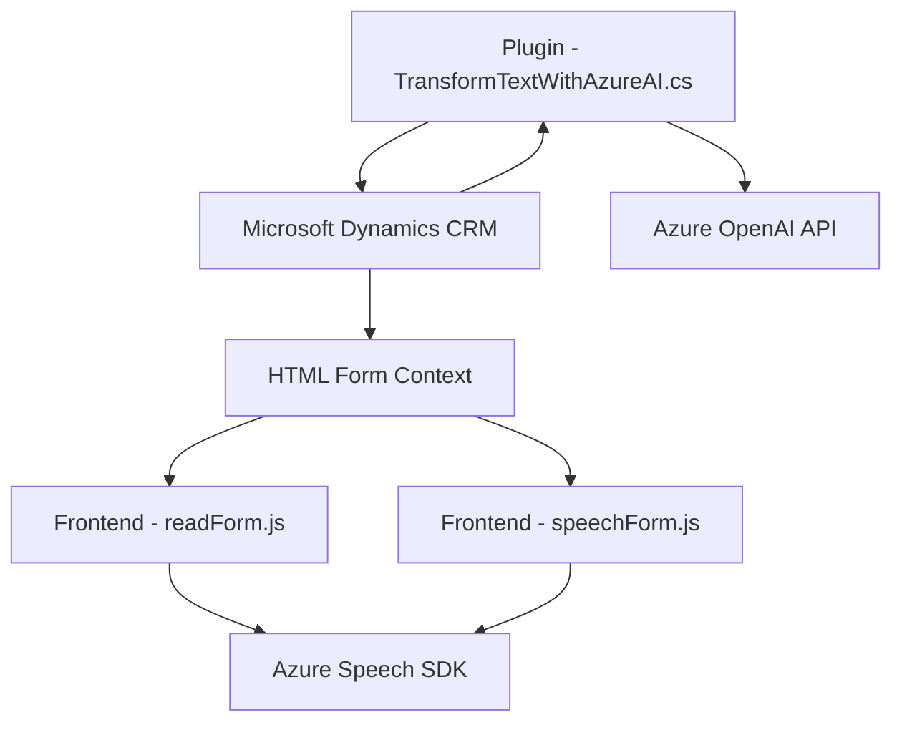

# Análisis del repositorio

## Breve Resumen Técnico
El repositorio contiene tres componentes principales:
1. **Funciones frontend (`readForm.js` y `speechForm.js`)**: Scripts JavaScript que interactúan con Azure Cognitive Services Speech SDK para lectura y entrada de voz en formularios. Se integran con Microsoft Dynamics CRM.
2. **Plugin backend (`TransformTextWithAzureAI.cs`)**: Código C# diseñado como plugin para Dynamics CRM que utiliza Azure OpenAI para manipulación y transformación avanzada de texto en formato JSON.

Se observa que los diferentes componentes están diseñados para integrarse con Microsoft Dynamics CRM y servicios de Azure, sirviendo como solución amplia y parcialmente modular orientada a voz y procesamiento de texto.

---

## Descripción de Arquitectura
La solución utiliza una **arquitectura híbrida basada en N capas** que combina las siguientes características:
- **Frontend (JS)**: Script en la capa de presentación, interactuando con Dynamics y Azure SDK para voz. El patrón observado es modular con funciones especializadas.
- **Backend (C# - Plugin)**: Codificación como plugin de Dynamics CRM que ejecuta lógica adicional en la capa de negocio para transformar texto con el servicio Azure OpenAI.
- **Servicios externos** (Azure Cognitive Services y Dynamics APIs): Se integran como módulos externos de funcionalidad clave para procesamiento de voz y transformación de texto.

---

## Tecnologías Usadas
1. **Lenguajes**:
   - **JavaScript**: Para la interacción con formularios y servicios externos en el frontend.
   - **C#**: Para plugins en Dynamics CRM.
2. **Frameworks/SDKs**:
   - **Azure Speech SDK**: Para síntesis y reconocimiento de voz.
   - **Microsoft Dynamics SDK (`Xrm.WebApi` y `IOrganizationService`)**: Para acceso y modificación de datos en Dynamics CRM.
   - **Azure OpenAI API**: Procesamiento avanzado del texto.
3. **Patrones**:
   - Modularización: Funciones desacopladas en el frontend para facilidad de mantenimiento.
   - **Gestión de eventos UI**: Interacción entre el contexto del formulario y el usuario.
   - **Proxy**: Integración con servicios externos de Azure (Speech SDK, OpenAI).
   - **Capa de negocio basada en plugins**: Ejecución de lógica personalizada en Dynamics CRM.

---

## Dependencias y Componentes Externos
1. **Azure Cognitive Services Speech SDK**:
   - Para reconocimiento y síntesis de voz.
2. **Azure OpenAI API**:
   - Para transformación de texto desde el plugin en el backend.
3. **Microsoft Dynamics CRM APIs**:
   - Para interactuar con datos y entidades en Dynamics CRM.
4. **Otros**:
   - `System.Net.Http`: Llamadas HTTP en el plugin.
   - `Newtonsoft.Json.Linq`: Operaciones avanzadas con JSON.

---

## Diagrama Mermaid

---

## Conclusión Final
La solución presenta una arquitectura híbrida basada en N capas que aprovecha servicios de Azure y el modelo de extensibilidad de Dynamics CRM. El diseño modular en el frontend y la integración vía plugins al backend aseguran escalabilidad y flexibilidad. Si bien está enfocado a la interacción por voz y procesamiento de texto, existen dependencias críticas de servicios externos que deben ser cuidadosamente gestionadas para garantizar la estabilidad del sistema.