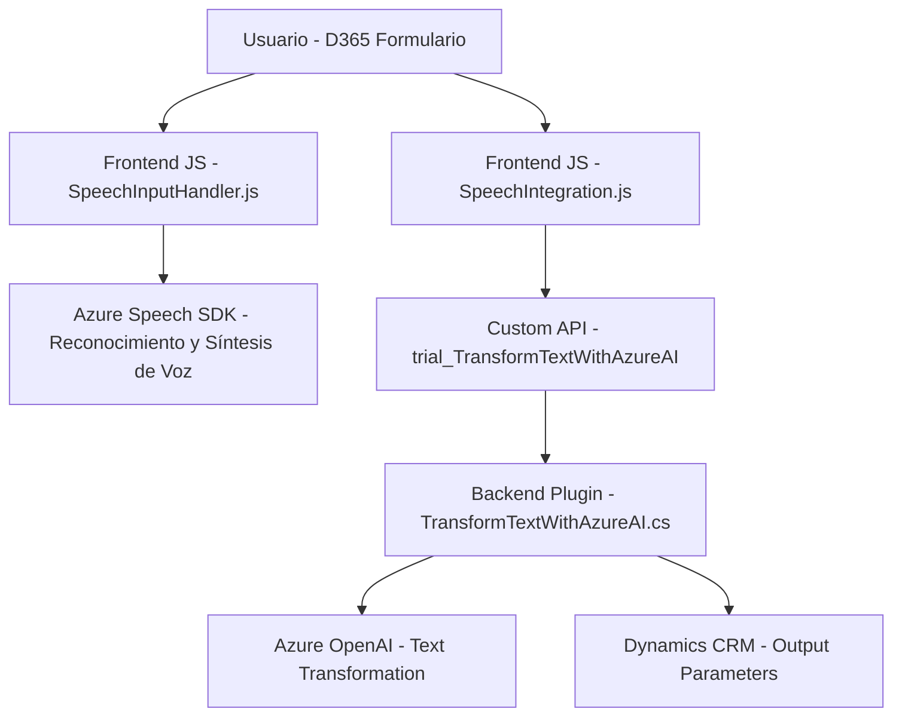

### Breve resumen técnico:
El repositorio integra funcionalidades avanzadas basadas en inteligencia artificial y reconocimiento de voz para un sistema Dynamics CRM. Los archivos proporcionan módulos frontend (JavaScript) y un backend en forma de plugin (`TransformTextWithAzureAI.cs`) que interactúa con Dynamics CRM usando el SDK de Azure Speech y Azure OpenAI para transformar y manipular datos de formularios de manera dinámica.

---

### Descripción de arquitectura:
1. **Arquitectura general:**  
   - Principalmente orientada a **Cliente/Servidor** con componentes diseñados para operar en un flujo basado en contexto dentro de Dynamics CRM.  
   - Usa **módulos de interacción UI (frontend)** que procesan voz y datos locales en el navegador y conectan al backend mediante llamadas API.  
   - Backend implementado como **Plugin** (extensión registrada en Dynamics CRM), permitiendo manipulación avanzada de datos y lógica de negocio centralizada.

2. **Componentes clave:**  
   - **Frontend:** Modular y basado en funciones independientes, capaz de procesar voz, interactuar con el SDK de Azure Speech, aplicar valores en formularios y enviar datos al backend.  
   - **Backend/Plugin:** Encapsula la lógica avanzada de manipulación, llamando a servicios externos como Azure OpenAI para transformar texto en JSON estructurado.

3. **Patrones usados:**  
   - **Modularización:** Separación de funciones en archivos individuales para garantizar cohesión.  
   - **Carga dinámica:** SDK de Azure Speech solo se carga cuando es necesario.  
   - **Delegación y principios SOLID:** Lógica específica se delega en funciones independientes tanto en frontend como en el backend.  
   - **Integración mediante API:** Envío de datos del cliente a una Custom API de Dynamics CRM y comunicación con Azure OpenAI.

---

### Tecnologías utilizadas:
1. **Frontend:**  
   - JavaScript: Base del frontend para integración con Dynamics CRM.  
   - Azure Speech SDK: Reconocimiento de voz y síntesis de texto a audio.  
   - Dynamics 365 Context API (`executionContext`): Manejo del contexto de formularios dinámicos.  

2. **Backend:**  
   - C#: Implementación del plugin para Dynamics CRM.  
   - Azure OpenAI: Transformación de texto a JSON estructurado.  
   - `Microsoft.Xrm.Sdk`: Marco para interacción con Dynamics CRM.  
   - HTTP y JSON: Comunicación entre el plugin y servicios externos como Azure OpenAI.  

---

### Diagrama **Mermaid** válido para GitHub:

---

### Conclusión final:
El repositorio demuestra una implementación moderna y modular basada en la interacción fluida entre un frontend con tecnologías de reconocimiento de voz y un backend con servicios de inteligencia artificial. La arquitectura refleja buenas prácticas como desacoplamiento funcional, delegación dinámica y uso eficiente de las APIs externas de Azure para ampliar la funcionalidad empresarial en Dynamics CRM. Este diseño es ideal para aplicaciones orientadas a la productividad en entornos corporativos que demanden procesamiento de datos automatizado y funciones avanzadas de voz y texto.