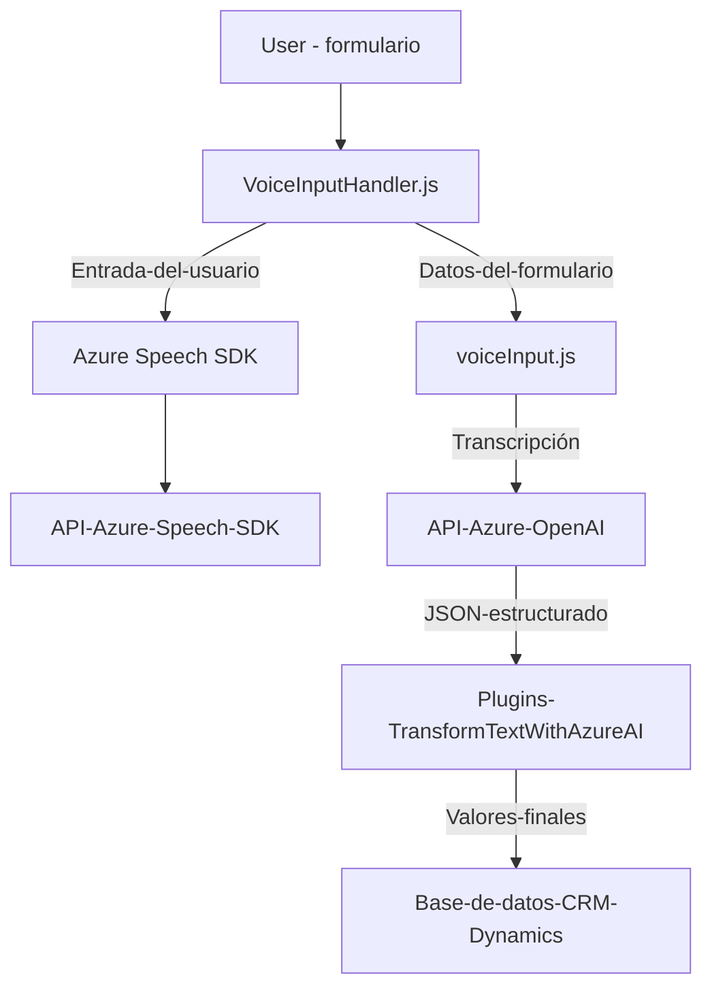

### Breve resumen técnico

El repositorio configura un sistema orientado a la interacción entre usuarios y formularios dinámicos en un entorno de Microsoft Dynamics CRM. El sistema se basa en dos principales funcionalidades:
1. **Generación de voz:** Lectura y síntesis de datos visibles desde formularios, utilizando el servicio `Azure Speech SDK`.
2. **Reconocimiento y procesamiento de voz:** Conversión de entrada de voz a texto estructurado y asignación de respuestas transcritas a formularios dinámicos en Dynamics CRM ‌(con opción de integración de Inteligencia Artificial por medio de Azure OpenAI).

Además, la solución incluye un plugin desarrollado en C#, que usa la API de **Azure OpenAI** para transformar textos en un formato JSON adecuado.

---

### Descripción de arquitectura

La arquitectura implementa un diseño basado en **n capas**. Las funcionalidades están repartidas conforme a las siguientes capas:
1. **Capa de Presentación (Frontend/JS):** 
   - Contiene archivos para interactuar directamente con el usuario (captura de datos y reconocimiento de voz). Opera en el cliente (browser) junto con un SDK cargado dinámicamente.
2. **Capa de Aplicación:** 
   - Implementada en el archivo C# (plugin). Actúa como punto de contacto entre el sistema de CRM y servicios externos como Azure OpenAI para realizar transformaciones avanzadas.
3. **Capa de Integración (Azure APIs):** 
   - Servicios externos (Azure Speech SDK y Azure OpenAI) son utilizados para reconocimiento, síntesis de voz, y procesamiento avanzado del lenguaje.

En este sentido, la solución se puede considerar un **sistema híbrido entre monolito expandido e integración de servicios externos**, ya que utiliza plugins específicos en un núcleo CRM central y dependencias externas para funcionalidades de IA y voz.

---

### Tecnologías usadas

#### Frontend (JS)
1. **Microsoft Dynamics Framework (XRM Framework)**:
   - Para obtener, modificar y mapear datos de formularios mediante `Xrm.WebApi`.
   - Método `formContext.data.entity.attributes.get()` y manipulación de objetos del formulario.
2. **Azure Speech SDK**:
   - Funciones de reconocimiento y síntesis de voz por medio de servicios REST (`SpeechConfig`, `AudioConfig`, `SpeechSynthesizer`, etc.).
3. **Vanilla JavaScript**:
   - Es utilizado para crear funciones auxiliares y gestión de dependencias. Por ejemplo: `ensureSpeechSDKLoaded` aplica un cargado dinámico.

---

#### Backend (C# Plugin)
1. **Microsoft Xrm SDK**:
   - Manipula propiedades del CRM como contexto, servicios organizacionales y ejecución de plugins.
2. **Azure OpenAI API**:
   - Reconocimiento avanzado de lenguaje natural con reglas específicas, utilizando el modelo GPT.
3. **Librerías .NET**:
   - `System.Net.Http`: Para comunicación con APIs REST.
   - `Newtonsoft.Json`/`System.Text.Json`: Para serialización y deserialización de datos en el formato JSON.

---

### Diagrama Mermaid **compatible con GitHub**

---

### Conclusión final

La solución analizada permite automatizar procesos de entrada y salida en un entorno de Microsoft Dynamics CRM utilizando servicios orientados a IA y voz de Azure. La implementación sigue principios de modularidad y promueve la separación de responsabilidades utilizando una estructura de capas nítidas.

#### Puntos destacados:
1. Solución híbrida: Incluye cliente (frontend) y plugin backend en CRM, conectados con servicios externos (Azure APIs).
2. Las tecnologías utilizadas favorecen la integración y compatibilidad con Microsoft Dynamics y Azure mediante el uso de SDKs y APIs.
3. Sigue patrones de diseño modernos:
   - Pipeline de procesos en el frontend.
   - Plugin-based architecture y Service Locator en el backend.

Esta arquitectura es efectiva en casos de uso que requieren la integración en tiempo real con servicios de síntesis y reconocimiento de voz, así como procesamiento avanzado con IA. Sin embargo, podría beneficiarse de pruebas adicionales para garantizar resiliencia frente a dependencias externas y escalabilidad del diseño ante casos de uso de mayor concurrencia.