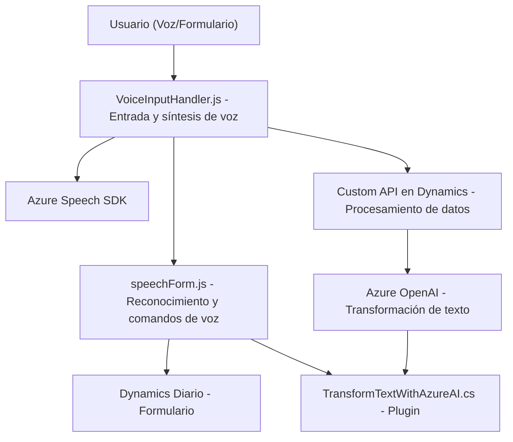

### Breve resumen técnico
Este repositorio facilita la integración entre entrada de voz, procesamiento de formularios (frontend) y transformación de texto mediante inteligencia artificial (backend). Utiliza Azure Speech y OpenAI para convertir voz y texto en información procesada, integrada con sistemas como Dynamics CRM para automatización de datos.

---

### Descripción de la arquitectura
La solución parece seguir una arquitectura **n-capas** con tres niveles principales:
1. **Frontend:** Archivos en JavaScript (`VoiceInputHandler.js` y `speechForm.js`) manejan la interacción de usuarios, sintetización y reconocimiento de voz.  
2. **Backend:** Plugins en C# (`TransformTextWithAzureAI.cs`) implementan lógica empresarial y delegan el procesamiento al servicio Azure OpenAI.
3. **Integración externa:** Servicios de Microsoft Azure (Speech SDK y OpenAI) permiten el procesamiento de texto y voz, delegando tareas computacionalmente intensivas.

### Tecnologías usadas
1. **Frontend:** 
   - Lenguaje: JavaScript.
   - SDK: Azure Speech SDK para reconocimiento de voz y síntesis de audio.
   - API: DOM y Web API de Dynamics (JavaScript context `Xrm.WebApi.online.execute`).

2. **Backend:**
   - Lenguajes: C#.
   - Framework: Dynamics CRM SDK para desarrollo de plugins.
   - API externas: Azure OpenAI como servicio REST para transformación de texto.

3. **General:** 
   - JSON: Procesamiento y comunicación de datos entre capas.
   - HTTP: Integraciones REST con APIs externas.

### Dependencias externas
1. **Azure Speech SDK:** Manejo de entrada y salida por voz para el frontend.
2. **Dynamics CRM Web API:** Comunicación con formularios de Dynamics y acceso a datos internos del sistema.
3. **Azure OpenAI:** Transformación avanzada de texto.
4. **HTTP & JSON Frameworks:** Manejo de llamadas API y transformación de datos estructurados.

---

### Diagrama Mermaid

---

### Conclusión final
La solución combina inteligencia artificial (Azure Speech y OpenAI) con arquitectura basada en n-capas. Los componentes están claramente separados por función (frontend, backend e integración externa), ofreciendo extensibilidad y flexibilidad para manejar entradas de voz y transformar información. Sin embargo, podría ser vulnerable a problemas de configuración de credenciales y falta de validación de dependencias externas.