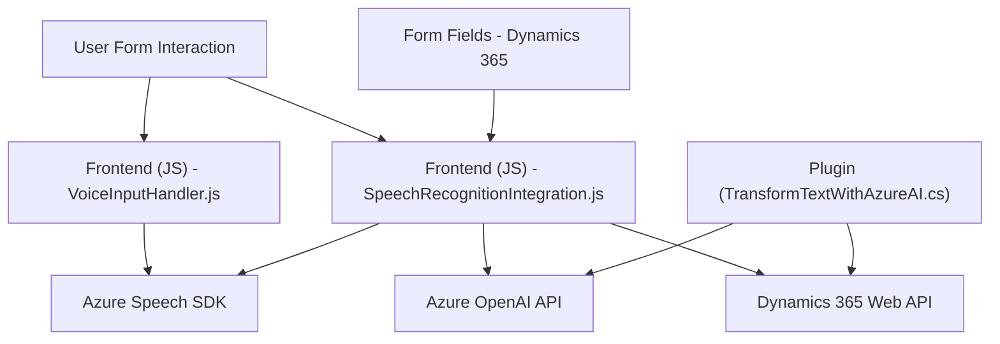

### **Resumen técnico**

El repositorio muestra una solución orientada a la integración de reconocimiento de voz, procesamiento de datos mediante IA y su vinculación con formularios en **Microsoft Dynamics 365**. La estructura está dividida en tres categorías principales: frontend (JavaScript para gestión en navegador), API/script de plugins (.NET para lógica del servidor en Dynamics), y APIs externas como **Azure Speech SDK** y **Azure OpenAI**. 

### **Descripción de arquitectura**
La solución combina un modelo **n-capas**:
1. **Frontend/Cliente**:
   - Manejo de reconocimiento y síntesis de voz en el navegador junto con la interacción en tiempo real en formularios.
   - Modularidad, con funciones separadas para entrada y salida de voz, sincronización de datos, y conversión de valores del formulario.
2. **Servidor/API dinámica**:
   - Un plugin en Dynamics CRM (escrito en .NET) permite consumir **Azure OpenAI API** para transformar datos en JSON estructurado.
3. **Servicios externos**:
   - APIs proporcionadas por Azure para Speech SDK y OpenAI, lo que denota una dependencia significativa en servicios externos.

### **Tecnologías usadas**
1. **Frontend**:
   - **JavaScript**:
     - Dominante en las áreas de reconocimiento y síntesis de voz.
     - Uso del SDK de Microsoft Dynamics para manipulación de formularios interactivos.
     - **Azure Speech SDK** integrado vía API.
   - **Dynamics 365 Web API** para operaciones con el servidor.
   - Programación asíncrona con promesas y manejo basado en eventos.

2. **Backend/API/plugin**:
   - **.NET Framework** con el SDK de **Microsoft CRM**.
   - **Azure OpenAI API** para procesamiento de texto.
   - Uso de librerías como `Newtonsoft.Json` y herramientas HTTP para consumo y serialización de servicios.

3. **Servicios externos**:
   - **Azure Speech Services** para síntesis/reconocimiento de voz.
   - **Azure OpenAI Services** para transformación en JSON avanzados.

### **Arquitectura general**
La arquitectura general está basada en **n-capas**:
1. **Capa de presentación**: Implementada en frontend (JavaScript), manejando la interacción del usuario con formularios (visualización, conversión y síntesis de voz).
2. **Capa de aplicación/negocio**:
   - Plugin de Dynamics CRM con lógica centralizada para integración de AI y reconocimiento conversión personalizada.
   - Manejo de reglas de negocio para actualización del formulario desde resultados de procesamiento.
3. **Capa externa/infraestructura**:
   - Azure Speech SDK funciona como conexión para reconocimiento y síntesis.
   - Azure OpenAI alimenta capacidades de transformación.

### **Diagrama Mermaid**

### **Conclusión final**
Esta solución es una arquitectura híbrida que utiliza un modelo **ncapas**, altamente modular, integrando tecnologías modernas de reconocimiento y síntesis de voz, con procesamiento de IA mediante Azure OpenAI. Su estructura está orientada a proporcionar una experiencia enriquecida de interacción con formularios en **Dynamics 365**. Aunque robusta, depende directamente de **servicios externos de Azure**, por lo que su funcionamiento depende de acceso continuo a esos servicios. Esto podría resultar en un alto costo asociado, dependiendo del volumen de uso.