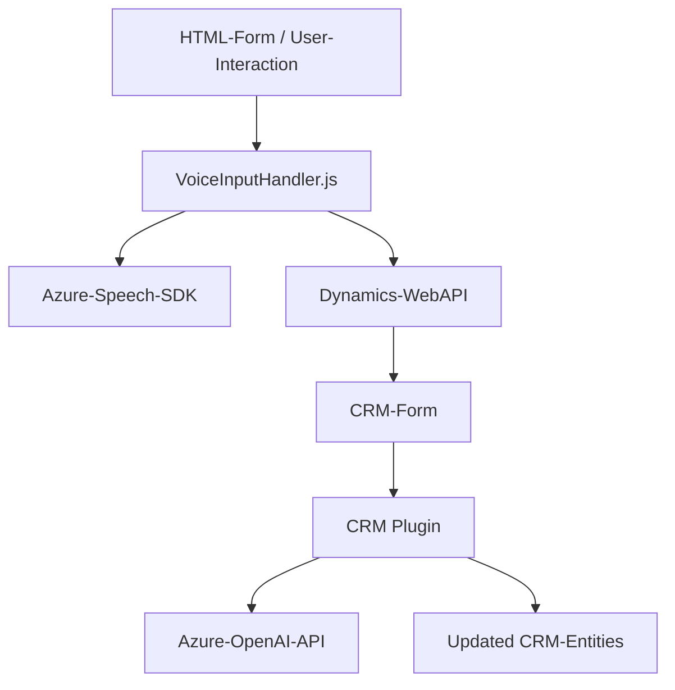

## Breve resumen técnico:
El repositorio analiza tanto el frontend como los plugins de Dynamics CRM con interacción directa a APIs de Azure, incluyendo Speech SDK y OpenAI. La solución abarca procesamiento de datos por voz, síntesis y transformación, y gestión dinámica de formularios en contextos CRM. La arquitectura involucra comunicación desacoplada entre el frontend, Dynamics CRM, Azure SDK, y servicios externos de inteligencia artificial.

---

### Descripción de arquitectura:
La solución presenta una arquitectura híbrida que combina el acceso directo de los servicios frontend ejecutados en el navegador y la interacción backend (Dynamics CRM) con servicios externos. A continuación, los detalles:

1. **Frontend (JavaScript)**:
   - Desarrollado para trabajar de manera modular y asistida por un SDK externo (Azure Speech SDK).
   - Procesa datos locales en tiempo real desde formularios visibles y utiliza APIs de Azure para transformar o sintetizar voz.

2. **Backend (Dynamics CRM Plugins)**:
   - Utiliza un patrón basado en plugins (`IPlugin`) que integra reglas de negocio en eventos específicos del CRM.
   - Utiliza Azure OpenAI APIs para procesar texto mediante inteligencia artificial y devolver datos estructurados (JSON).

3. **Integración**:
   - Comunicación entre niveles (frontend-backend) mediante APIs internas (Dynamics Web API) y llamadas hacia servicios externos (Azure Speech y OpenAI).
   - Modularidad en las funciones permite modificación escalable de funcionalidades en ambas capas.

### Arquitectura observada:
La solución tiene características de una arquitectura **n-capas**, donde:
- El **frontend (capa de presentación)** maneja la interacción con el usuario y se conecta a servicios externos en tiempo real.
- El **backend (capa de negocio)** está basado en un plugin del CRM que implementa la lógica de transformación en la plataforma.
- La **capa de integración externa** se conecta con APIs de Azure (SDK y servicios REST).

### Tecnologías, frameworks y patrones usados:
- **Tecnologías**:  
  - Frontend: JavaScript, Azure SDK, Dynamics Web API.  
  - Backend: Microsoft Dynamics Plugin API (`IPlugin`), C#.  
  - Comunicaciones: HTTP con Azure SDK, Web APIs de Dynamics.
  
- **Frameworks**:  
  - Dynamics CRM / Microsoft Power Platform.  
  - Azure SDK (Speech and OpenAI).  

- **Patrones**:
  - **Plugin Pattern**: En el backend (Dynamics CRM integration).
  - **Delegate Pattern**: En el frontend mediante callbacks.
  - **API Integration**: Sistema que externaliza procesos de negocio hacia servicios de Azure.
  - **Layered Architecture**: Problemas y datos tratados en diferentes niveles: presentación (frontend), negocio (CRM Plugin) e integración externa.

---

### Dependencias o componentes externos:
1. **Azure Speech SDK**:
   - Convertir texto a voz (frontend).
   - Reconocimiento y transcripción de voz a texto en tiempo real.
   
2. **Azure OpenAI Service**:
   - Transformación de texto en JSON estructurado (basado en normas configurables).

3. **Microsoft Dynamics CRM**:
   - Utiliza el contexto de las entidades CRM a través de `IOrganizationService`.

4. **Frameworks adicionales**:
   - `System.Text.Json`, `Newtonsoft.Json.Linq` para el manejo de datos JSON.
   - `System.Net.Http` para comunicación con APIs externas.

---

### Diagrama **Mermaid**:

---

## Conclusión final:
Esta solución proporciona una arquitectura escalable basada en capas, donde el procesamiento de datos por voz y texto se integra eficientemente con Dynamics CRM. La implementación tiene un fuerte enfoque modular utilizando SDKs y APIs externas, permitiendo una fácil ampliación de funcionalidades. Sin embargo, la seguridad de las credenciales de las APIs externas (especialmente Azure) debe ser mejorada para la producción. En general, el enfoque híbrido es óptimo para escenarios de automatización complejos y altamente personalizados.