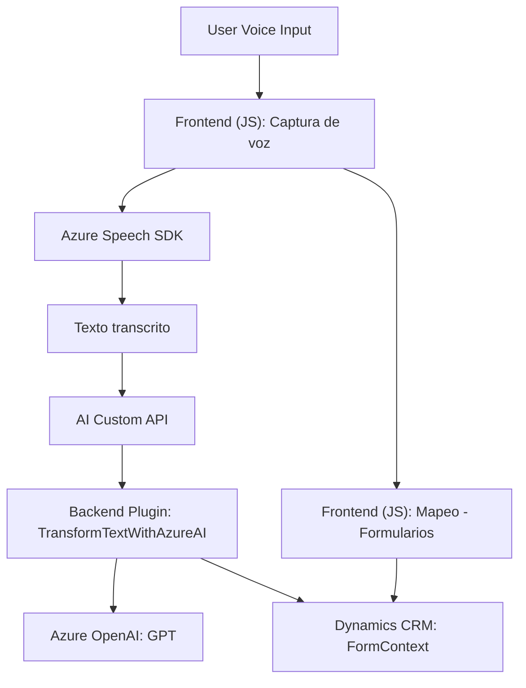

### Breve resumen técnico

El repositorio está formado por distintos componentes que trabajan en conjunto para proporcionar funcionalidad centrada en la interacción con voz, manipulación de formularios (Dynamics CRM) y transformación de datos mediante servicios de nube (Azure Speech SDK y Azure OpenAI). Las principales responsabilidades del repositorio incluyen:
1. **Frontend funcionalidad basada en voz**: Captura de voz, síntesis, reconocimiento y procesamiento de datos en formularios.
2. **Backend plugin**: Procesamiento avanzado de texto con Azure OpenAI como parte de un plugin en Dynamics CRM.

### Descripción de la arquitectura

La solución está basada en una **arquitectura de integración entre capas frontend y backend**:
- **Frontend**: Realiza el procesamiento de voz y la interacción con formularios visibles.
- **Backend**: Implementa lógica de procesamiento y transformación mediante servicios de nube (Azure OpenAI).
Ambos componentes dependen de los servicios de Microsoft Dynamics CRM, lo que sugiere una arquitectura **n capas** centrada en el cliente.

### Tecnologías usadas

- **Frontend**:
  - **Azure Speech SDK**: Reconocimiento y síntesis de voz.
  - **Microsoft Dynamics CRM SDK (formContext)**: Manipulación y lectura de formularios.
  - **Custom API**: Integrada para permitir la ejecución de modelos de IA externos.
  - **JavaScript** basado en módulos funcionales.

- **Backend**:
  - **Dynamics CRM Plugin SDK**: Implementación del plugin.
  - **Azure OpenAI (GPT)**: Análisis y transformación de texto.
  - **Newtonsoft.Json**, **System.Net.Http**, **System.Text.Json**: Para manejo de datos y comunicación con APIs.

### Tipo de arquitectura

La solución emplea una arquitectura **n capas**:
1. **Capa de presentación**: Construida en el frontend con interacción directa del usuario mediante voz y formularios.
2. **Servicios y lógica de negocio**: En el backend, mediante plugins de Dynamics CRM y procesamiento avanzado gracias al servicio Azure OpenAI.
3. **Integración con servicios externos**: Uso de Azure SDK y API REST.

### Dependencias y componentes externos

1. **Azure Speech SDK**: Para reconocimiento y síntesis de voz.
2. **Azure OpenAI**: Transformación avanzada de texto con IA.
3. **Microsoft Dynamics CRM SDK**:
   - Interacción con formularios.
   - Ejecución de plugins personalizados (`TransformTextWithAzureAI`).
4. **HTTP API**: Llamadas a servicios externos.

### Diagrama Mermaid válido para GitHub

Este diagrama describe los flujos principales de comunicación entre las capas y las dependencias externas (Azure).

### Conclusión final

La solución representa una integración bien diseñada entre **frontend** basado en voz, **backend** procesando datos mediante IA y los servicios de **Dynamics CRM**. La elección de un enfoque **n capas** es adecuada para gestionar separación lógica y delegar trabajo a servicios externos (Azure Speech y OpenAI). Sin embargo, es fundamental garantizar la seguridad en el uso de claves de API y optimizar el manejo de dependencias para un rendimiento eficiente.