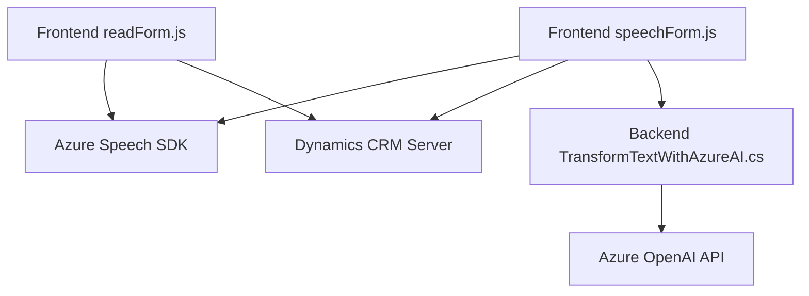

### Breve resumen técnico

Este repositorio implementa funcionalidades para añadir capacidades de entrada y síntesis de voz en entornos integrados con **Dynamics CRM** utilizando **Azure Speech SDK** y **Azure OpenAI API**. Incluye componentes frontend en **JavaScript** para la interacción directa con formularios y un plugin backend en **C#** para la integración avanzada mediante APIs personalizadas.

---

### Descripción de arquitectura

La solución sigue una **arquitectura de tres capas**:
1. **Frontend JavaScript**: gestiona la captura y síntesis de voz, actualización de los formularios (*Presentation Layer*).
2. **Backend Plugin en C#**: maneja la lógica para procesar datos con Azure OpenAI y actualizar información en Dynamics CRM mediante APIs específicas (*Business Logic Layer*).
3. **External Services and SDK**: integra servicios de terceros como Azure Speech SDK y Azure OpenAI API (*Data Access Layer*).

Entre los patrones utilizados se destacan:
- **Facades** con funciones específicas (JavaScript) que organizan tareas independientes.
- **API Gateway** para llamadas a servicios externos como Azure Speech y OpenAI.
- **Plugin Pattern** en Dynamics CRM para encapsular lógica específica e integrarla al ecosistema Microsoft.
- Modularidad para separación por funcionalidades.

---

### Tecnologías utilizadas

1. **Frontend**:
   - Lenguaje: `JavaScript`.
   - Frameworks/SDKs: `Azure Speech SDK`.
   - Funciones: Reconocimiento de voz, actualización dinámica de formularios CRM.

2. **Backend**:
   - Lenguaje: `C#`.
   - Frameworks: `.NET Framework`.
   - APIs y librerías:
     - `Azure OpenAI API`: Para manejo de texto con lógica de IA.
     - `Newtonsoft.Json` y `System.Text.Json`: Para serialización/deserialización JSON.

3. **Integraciones**:
   - CRM: `Dynamics 365` (usando APIs como `Xrm.WebApi` en el frontend y `IOrganizationService` en el backend).
   - Terceros: Azure Speech SDK y Azure OpenAI.

---

### Diagrama Mermaid válido para GitHub Markdown

---

### Conclusión final

Este repositorio combina frontend JavaScript con backend C# plugins para extender las funcionalidades del CRM con entrada, síntesis y procesamiento de voz a través de APIs de Azure. La solución emplea una **arquitectura en tres capas**, donde cada capa cumple roles específicos: interacción del usuario, la lógica de negocio, y el manejo de datos con servicios externos. Usa recursos modernos de **Azure Speech SDK** y **Azure OpenAI API**, manteniendo una clara separación de responsabilidades y siguiendo patrones establecidos como el **plugin pattern** y la **modularidad funcional**.

Esta arquitectura es apta para soluciones empresariales donde la integración entre sistemas es fundamental, con un enfoque modular y extensible que permite añadir capacidades futuras con facilidad.