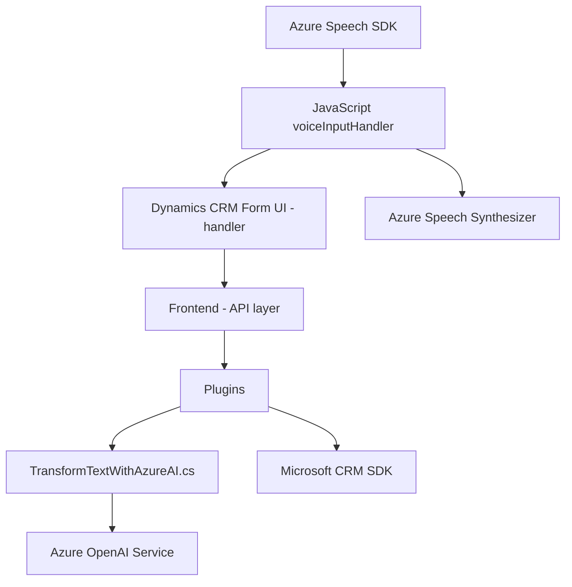

### Breve resumen técnico:
Los archivos analizados implementan funcionalidades para aplicaciones integradas con Microsoft Dynamics CRM. Estas funcionalidades incluyen la lectura, transformación y síntesis de datos desde formularios UI utilizando **Azure Speech SDK** y **Azure OpenAI Service**, y complementan la interacción tradicional de CRM con capacidades de accesibilidad y procesamiento inteligente de texto y voz. La solución incluye componentes frontend y backend y está orientada a mejorar la experiencia del usuario mediante voz e inteligencia artificial.

---

### Descripción de arquitectura:
La arquitectura combina componentes de frontend (JavaScript) con lógica backend de CRM (C# plugins). Aunque no es un sistema completo de microservicios, la solución es modular:
1. **Frontend**: Utiliza un enfoque modular con funciones separadas para cada tarea específica, como el manejo de SDK de terceros para voz y el procesamiento de formularios. Se estructura como **arquitectura de capas**, con una capa de integración con el SDK (speech), una capa de procesamiento de datos y una capa de comunicación con APIs externas.
2. **Backend**: Implementa un plugin basado en el patrón **Plugin Pattern** de Microsoft Dynamics CRM para interactuar con Azure OpenAI Service y transformar el texto según reglas específicas. Este plugin utiliza **Service Locator** para gestionar la inyección de dependencias.
3. **Integración externa**: La arquitectura está altamente centrada en **servicios externos (Speech SDK y OpenAI)** y dependencias API. Está diseñada para aprovechar servicios en la nube sin incluir lógica pesada en los módulos de la aplicación.

---

### Tecnologías usadas:
1. **Frontend**:
   - **Lenguaje:** JavaScript.
   - **Frameworks y SDKs:** Azure Speech SDK.
   - **Plataforma de destino:** Microsoft Dynamics CRM (entorno frontend).
   - **Diseño modular:** Cada función cumpliendo responsabilidades específicas, siguiendo principios de **Single Responsibility**.
2. **Backend**:
   - **Lenguaje:** C#.
   - **Framework:** Microsoft Dynamics CRM SDK.
   - **Servicios integrados:** Azure OpenAI Service y HTTP API.
   - **Plugins:** Extensión directa utilizando el patrón Plugin para Dynamics CRM.

---

### Diagrama Mermaid válido para GitHub:

---

### Conclusión final:
Esta solución implementa una integración de frontend y backend enfocada en mejorar la interacción de usuarios con sistemas Dynamics CRM utilizando voz y AI. Los componentes aseguran modularidad y extensibilidad mediante el uso de SDKs y servicios cloud, siguiendo patrones como **Facade**, **Plugin** y **Observer**, además de integrar tecnologías modernas como **Azure Speech** y **Azure OpenAI**. Aunque su diseño no es completamente de microservicios, los módulos podrían extenderse fácilmente para incluir más funcionalidades distribuidas.