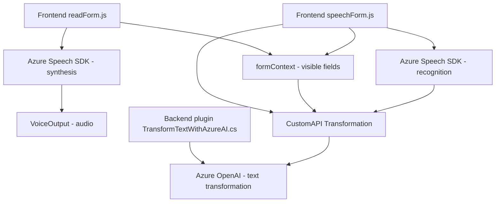

### Breve resumen técnico:

El repositorio está compuesto por tres archivos principales:  
1. **`FRONTEND/JS/readForm.js`**: Módulo que extrae datos de formularios visibles, los procesa y genera síntesis de voz utilizando Azure Speech SDK.  
2. **`FRONTEND/JS/speechForm.js`**: Módulo que implementa reconocimiento de voz, interactúa con APIs personalizadas y actualiza dinámicamente formularios.  
3. **`Plugins/TransformTextWithAzureAI.cs`**: Plugin de Dynamics 365 para transformar texto utilizando servicios de Azure OpenAI.  

### Descripción de arquitectura:

La solución se basa en una **arquitectura de n capas** que conecta tres capas principales:
1. **Frontend (presentación)**: Maneja lógica de interacción con el usuario mediante formularios, reconocimiento de voz y generación de síntesis de voz.
2. **API/Servicios externos (Azure)**: Utiliza Azure Speech SDK y Azure OpenAI para realizar funciones avanzadas (voz y transformación de texto con IA).
3. **Backend (Dynamics 365 Plugins)**: Implementa funcionalidades específicas mediante extensiones (plugins) para procesar y trasladar datos dentro de un sistema CRM.

Se utiliza **desacoplamiento** mediante el consumo de APIs externas y una asignación modular entre los elementos de software. Los archivos están bien distribuidos para seguir principios de reutilización y separación de preocupaciones.

### Tecnologías usadas:

1. **Frontend**:
   - JavaScript.
   - Azure Speech SDK.
   - Dinamismo sobre formularios con Microsoft Dynamics (`formContext`).

2. **Backend**:
   - Plugins desarrollados en C# para Dynamics 365.
   - Azure OpenAI vía llamadas HTTP para procesamiento de texto.

3. **Servicios externos**:
   - SDK de Azure Speech (para síntesis y reconocimiento de voz).
   - Azure OpenAI (para transformación de texto y sistemas IA).

4. **Patrones de diseño**:
   - Patrón MVC-like parcial: Componentes que extraen datos del formulario, los procesan y generan una salida (voz o actualizaciones en el formulario).
   - Integración de servicios externos: SDK (speech) e integración API (Azure OpenAI).
   - Helpers y Delegación: Funciones independientes para simplificar tareas específicas.

### Diagrama Mermaid válido para GitHub:

### Conclusión final:

La solución utiliza una arquitectura basada en **n capas**, que conecta un frontend interactivo (JavaScript y formularios) con servicios avanzados de Azure (Speech SDK y OpenAI) y un backend extensible (plugins de Dynamics CRM). La integración de SDK y APIs es clave para delegar funciones específicas como síntesis y reconocimiento de voz, así como transformación mediante IA. Es una solución escalable, modular y bien diseñada para aplicaciones empresariales con soporte de servicios en la nube.