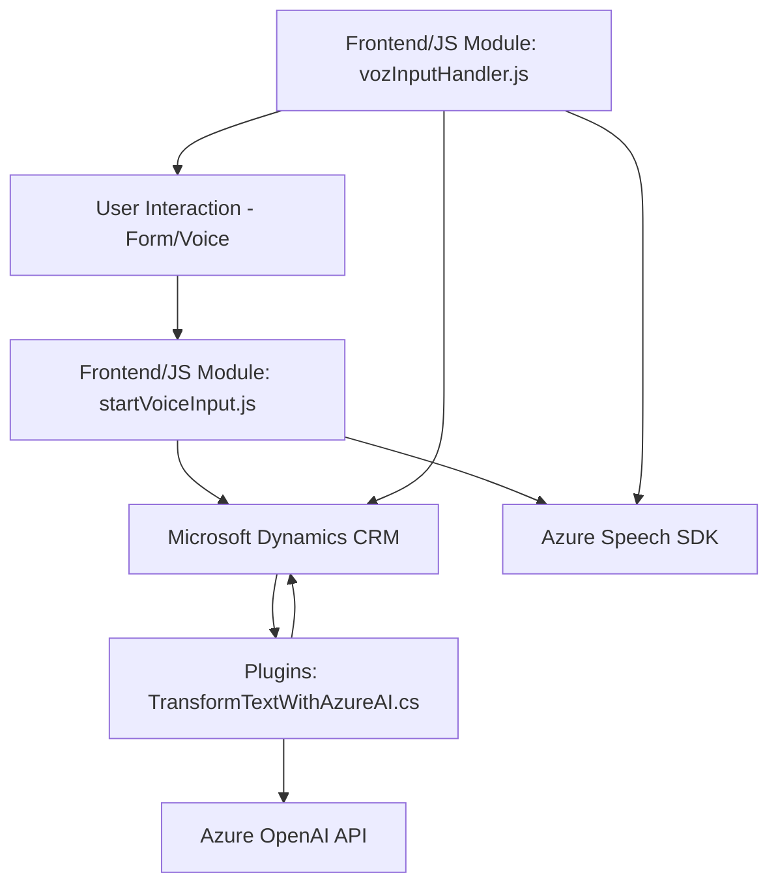

### Breve resumen técnico:

El repositorio contiene una solución híbrida que constituye una integración entre componentes de frontend y plugins de backend que trabajan en conjunto con Microsoft Dynamics 365 y los servicios cognitivos de Azure (Speech SDK y OpenAI API). La interacción con esta solución puede automatizar la entrada y salida de datos en formularios, mediante reconocimiento de voz y síntesis, junto con procesamiento avanzado de texto asistido por inteligencia artificial.

---

### Descripción de arquitectura:

La solución integra dos componentes principales:
1. **Frontend**:
   - Enfocado en la interacción con el usuario. Incluye módulos que gestionan el reconocimiento de voz y la síntesis para automatizar la captura de datos y la comunicación en formularios, utilizando **Azure Speech SDK**.
   - Modular y basado en JavaScript, enfocado en la interacción vía formularios integrados con Microsoft Dynamics 365 y servicios externos.

2. **Backend (Plugins)**:
   - Consiste en un plugin desarrollado con .NET (`TransformTextWithAzureAI.cs`) que interactúa directamente con Dynamics CRM mediante el patrón de **Plugin Pattern**.
   - Desencadena el procesamiento avanzado de texto usando **Azure OpenAI API** y entrega un resultado en formato JSON.

#### Arquitectura:
La solución implementa una arquitectura **n-capas**:
- **Capa de presentación** (Frontend): Dirigida al usuario final, basada en JavaScript y conectada a Dynamics 365.
- **Capa de negocio**: Integrada en el backend como plugins de Dynamics, empleando lógica personalizada para enriquecer y estructurar datos con inteligencia artificial.
- **Capa de datos**: Utiliza APIs web dentro del propio Dynamics y Azure.

Adicionalmente:
- Implementa patrones como **Facade**, **Dynamic Field Binding**, **Event-driven architecture** y **Plugin Pattern**.

---

### Tecnologías usadas:
1. **Frontend**:
   - **JavaScript**: Base principal para lógica y manipulación de DOM/formularios.
   - **Azure Speech SDK**: Para reconocimiento y síntesis de voz.
   - **Dynamics API**: Para interacción con formularios (contenidos y atributos).

2. **Backend**:
   - **.NET Framework** (C#): Lógica del plugin.
   - **Microsoft Dynamics SDK**: Para extender el comportamiento de CRM.
   - **Azure OpenAI API**: Procesamiento de texto basado en IA.
   - **Librerías JSON** (`Newtonsoft.Json` y `System.Text.Json`): Para manejo estructurado de datos.

3. **Dependencias externas**:
   - Azure Speech y OpenAI SDKs (servicio REST y scripts descargados dinámicamente).

---

### Diagrama Mermaid válido para GitHub:

---

### Conclusión Final:

La solución representa una integración bien concebida entre tecnologías de frontend y backend, diseñada para automatizar la interacción entre usuarios y Microsoft Dynamics CRM. Está orientada a la integración de servicios cognitivos avanzados de Azure como el Speech SDK y OpenAI, lo que permite añadir elementos de inteligencia artificial en una arquitectura modular y escalable.

Aunque funcional y técnicamente adecuada, uno de los desafíos potenciales incluye la dependencia directa de configuración manual para servicios externos (ej. claves y regiones de Azure). Recomendaciones futuras pueden incluir:
1. Introducir un sistema de configuración externalizado para gestionar claves y regiones de servicios.
2. Mejorar el desacoplamiento entre los módulos de frontend y el backend.
3. Extender soporte para idiomas y procesamiento multilingüe.

Esta solución demuestra ser una implementación robusta para entornos corporativos y de automatización avanzada en CRMs.