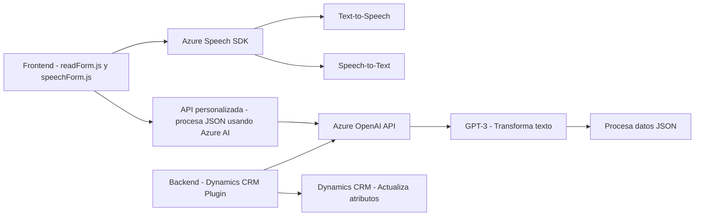

**Resumen técnico:**

Los archivos analizados pertenecen a un sistema que combina frontend (JavaScript), comunicación con servicios de voz y procesamiento inteligente del lenguaje natural respaldado por Azure. Parte del código opera en el cliente para interactuar con la interfaz de usuario, mientras que un plugin en la parte del backend procesa datos en Dynamics CRM utilizando Azure OpenAI.

---

**Descripción de arquitectura:**

- La solución sigue el modelo de **arquitectura en capas**:
  - **Frontend (capa de presentación):** Archivos JavaScript (`readForm.js`, `speechForm.js`) se encargan de la interacción con el usuario y relacionadas con el reconocimiento de voz y síntesis de texto a voz.
  - **Servicios externos:** Azure Speech SDK para reconocimiento de voz y síntesis de texto, acompañado de un API personalizada para procesamiento de texto avanzado con inteligencia artificial.
  - **Plugin de backend (lógica de negocio):** Un plugin en Dynamics CRM transforma los datos utilizando Azure OpenAI y se integra directamente con el sistema para permitir actualizaciones basadas en procesamiento de lenguaje natural.

---

**Tecnologías usadas:**

1. **Frontend:**
   - JavaScript ES6+.
   - Azure Speech SDK: Para funciones de reconocimiento de voz (Speech-to-Text y Text-to-Speech).
   - Promesas y programación asíncrona (`async/await`).

2. **Backend (Plugin en Dynamics CRM):**
   - C#: Implementación usando la interfaz `IPlugin` para Dynamics CRM.
   - Azure OpenAI API (GPT-3): Usada para transformar texto en JSON estructurado.
   - `HttpClient` (C#): Llamadas a servicios externos de Microsoft Azure OpenAI.
   - `System.Text.Json` y `Newtonsoft.Json` para manipulación de datos JSON.

3. **Integración externa:**
   - Azure services:
     - Azure Speech SDK para reconocimiento de voz.
     - Azure OpenAI API para procesamiento de lenguaje natural.
   - Dynamics CRM Framework.

4. **Patrones:**
   - **Facade:** Simplifica las interacciones con tecnologías externas como el Azure Speech SDK y Dynamics CRM.
   - **Plugin Pattern:** Utilizado para integrar la funcionalidad personalizada en Dynamics CRM.
   - **Eventos y programación reactiva:** En los archivos JavaScript del frontend.

---

**Diagrama Mermaid:**

Este diagrama representa las relaciones y dependencias entre componentes (Azure SDK, OpenAI, frontend y backend).

---

**Conclusión final:**

La solución integra tecnologías modernas (Azure Speech, OpenAI, Dynamics CRM) en una **arquitectura de capas**, con una fuerte orientación hacia el reconocimiento de voz y procesamiento de lenguaje natural. Aunque la separación entre frontend y backend existe, hay una alta dependencia de servicios externos, específicamente dentro del marco de Azure. La modularidad del código, manejo de errores, y estructura general indican que está bien diseñado para su función específica, con áreas prometedoras para optimización como la mejora de configuración dinámica y desacoplamiento de dependencias estáticas.