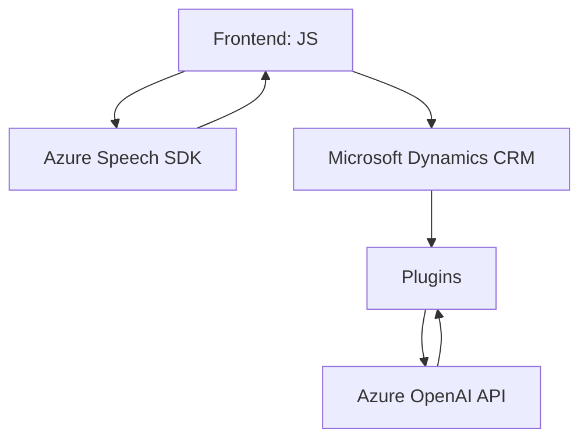

### Resumen técnico
El repositorio describe una solución que integra un frontend basado en JavaScript con funcionalidades relacionadas con formularios y procesamiento de voz mediante Azure Speech SDK, complementada por un plugin de C# en Microsoft Dynamics CRM. El propósito general es recopilar datos del usuario utilizando formularios dinámicos y entrada de voz, procesarlos con servicios de inteligencia artificial (Azure OpenAI), y almacenar o transformar dichos datos de manera estructurada en un entorno CRM.

---

### Descripción de la arquitectura  
Esta solución exhibe las características más cercanas al **patrón de arquitectura por capas**. El frontend actúa como la capa de presentación para la entrada y visibilidad de datos, interactuando con servicios externos (como Azure Speech SDK y OpenAI API) y el CRM backend, que sirve como la capa de negocio y persistencia. La solución se apoya en el uso de un SDK externo y la integración de API tanto para procesamiento de voz como para transformación de datos basados en IA.

A pesar de tener un plugin para asegurar funcionalidades en Dynamics CRM, el diseño no manifiesta una arquitectura distribuida que habilite múltiples microservicios, lo que lo sitúa más cerca a un modelo **monolítico "N capas"** alojado dentro de un núcleo CRM extendido por componentes integrados de Azure.

---

### Tecnologías y patrones utilizados
1. **Frontend**: 
   - **JavaScript**: Manejo de formularios y eventos (DOM).
   - **Azure Speech SDK**: Reconocimiento y síntesis de voz.
   - **Promise y async/await**: Para el manejo asincrónico.

2. **Integración de servicios externos**:
   - **Azure Speech SDK**: Para entrada y salida de voz.
   - **Azure OpenAI API**: Transformación de texto sin procesar.
   - **Microsoft CRM SDK (`Xrm.WebApi`)**: Interacción directa entre frontend y backend CRM.

3. **Backend**: 
   - **C# Plugin** implementando **IPlugin** para procesamiento personalizado.
   - **Newtonsoft.Json**: Manipulación de JSON.
   - **HTTP Clients** para solicitudes externas (HttpClient y Headers).

4. **Patrones**:
   - **Desacoplamiento** usando SDK externos (Speech SDK, OpenAI API).
   - **Builder Design Pattern**: Generación de payloads personalizados para los servicios externos.
   - **Plugin Pattern** dentro del backend CRM.
   - **Dependency Inversion Principle**: Centralización de las interacciones con dependencias externas como Azure,
     mediante funciones específicas como `ensureSpeechSDKLoaded` y `GetOpenAIResponse`.

---

### Diagrama **Mermaid**  

---

### Conclusión final
La solución está construida como una extensión de Microsoft Dynamics CRM, utilizando una arquitectura de **N-capas**, que conecta la capa de presentación (frontend con formulación dinámica y entrada por voz) con servicios inteligentes (OpenAI, Azure Speech SDK) y la capa business logic y de datos proporcionada por CRM mediante plugins en C#. 

Los patrones aplicados como Builder y Plugin Pattern favorecen una implementación modular y estructurada, aunque la solución sigue siendo un monolito extendido. Sin embargo, el uso de servicios externos y SDK ayuda a descentralizar responsabilidades computacionales complejas. Dependencias críticas incluyen Azure Speech SDK, Azure OpenAI API y Microsoft Dynamics CRM SDK.