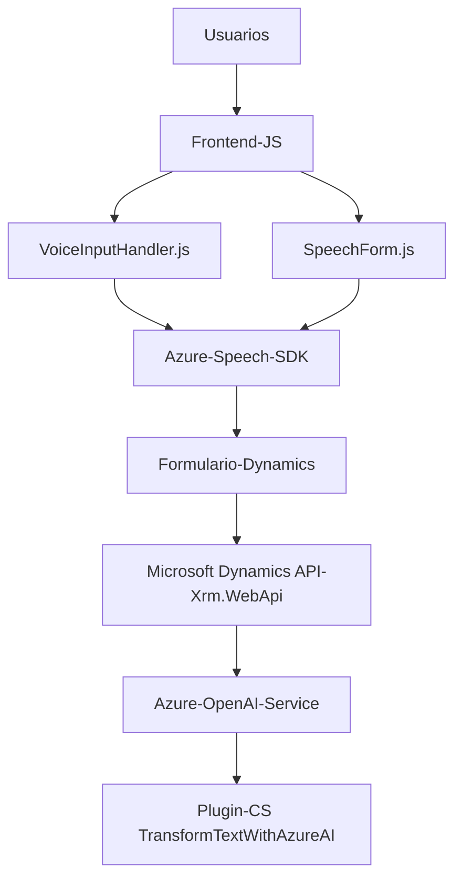

### Breve Resumen Técnico
El repositorio proporciona una solución orientada al procesamiento de interacción y manipulación de texto mediante voz y servicios de inteligencia artificial integrados con formularios en un entorno como Dynamics CRM. Incluye tres componentes principales:
- **Frontend/JS**: Captura y manipula datos de formularios por voz, usando Azure Speech SDK (interacción directa en navegadores).
- **Plugin/CS**: Procesamiento avanzado de texto mediante Azure OpenAI integrándose con Dynamics CRM como un plugin para operaciones internas.

---

### Descripción de Arquitectura
La solución utiliza una **arquitectura modular de capas acoplada con servicios externos (SDKs y APIs)** y está organizada en tres bloques fundamentales:
1. **Frontend**: Implementa interacción entre usuario y voz manejando datos de formularios.
2. **Integración con servicios externos**: Usa Azure Speech SDK y Azure OpenAI para encargarse de la lógica de reconocimiento de voz, síntesis, y procesamiento IA.
3. **Backend Plugin**: Ejecuta transformación avanzada de texto mediante llamadas HTTP al servicio de Azure OpenAI desde Dynamics CRM.

Mientras que el frontend utiliza patrones como **carga dinámica**, el plugin aplica modularidad y separación contextual, mostrando similitudes a una **arquitectura adaptativa de microservicios**, aunque está fundamentalmente orientada hacia un monolito extendido en el ambiente de Dynamics CRM.

---

### Tecnologías Usadas
1. **Frontend**
   - **JavaScript**: Base para la interacción en el navegador.
   - **Azure Speech SDK**: Manejo de voz para reconocimiento y síntesis.
   - **Microsoft Dynamics Framework (JavaScript)**: API para manipulación de formularios y datos.

2. **Backend Plugin**
   - **Microsoft Dynamics CRM Plugin Framework**: Extensión del CRM mediante C# y la interfaz `IPlugin`.
   - **Azure OpenAI Service**: Procesamiento de texto a nivel avanzado.
   - Librerías: `Newtonsoft.Json`, `System.Net.Http`, `System.Text.Json`.

3. **Patrones y Principios**
   - **Carga dinámica de dependencias**: Carga SDK solo cuando es estrictamente necesario para optimización.
   - **Modularidad**: Separación de responsabilidades (SDK → Voz, API → IA, UI → Formularios).
   - **Acoplamiento hacia servicios externos**: Uso de Azure Speech SDK y Azure OpenAI Service.

---

### Diagrama Mermaid (valido para GitHub Markdown)

---

### Conclusión Final
Este repositorio es una solución híbrida que combina un módulo de interacción de usuario (Frontend) y un plugin extendido para un sistema CRM (Backend), complementados por servicios externos (Azure Speech y OpenAI) haciendo una clara distinción de responsabilidades en términos de procesamiento, lógica y presentación. Aunque está enmarcado en un ecosistema monolítico (Dynamics), utiliza patrones de diseño modernos que le otorgan flexibilidad y escalabilidad para soportar casos de uso avanzados.