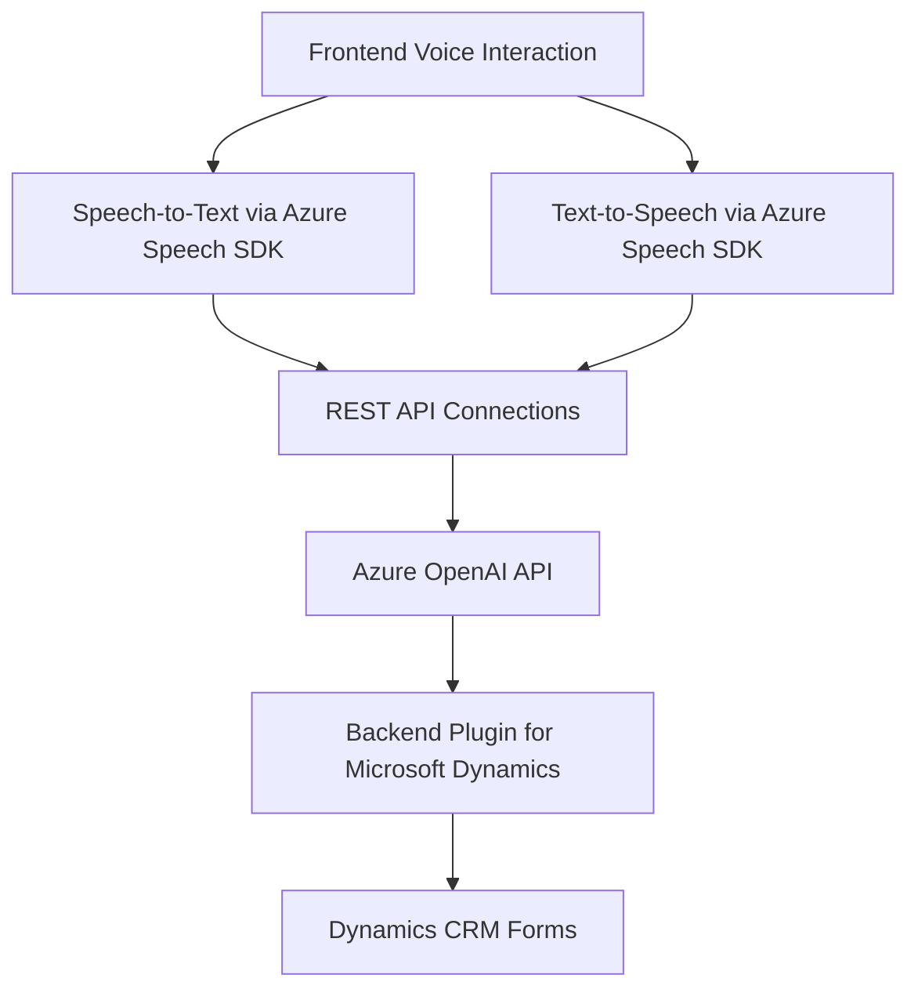

### Breve resumen técnico
Los archivos proporcionados forman parte de una solución diseñada para implementar interacción basada en voz con soporte de inteligencia artificial, utilizando servicios de Azure. Se integran directamente con formularios del frontend y con Microsoft Dynamics CRM por medio de un plugin personalizado.

---

### Descripción de arquitectura

La solución global emplea una **arquitectura de n capas** con integración de servicios externos. La aplicación divide claramente las responsabilidades en tres áreas:
1. **Frontend:** (Implemented in JavaScript) Manages interactions with the user, voice input, and converts the synthesized or recognized text into structured data.
2. **Backend Plugin:** (C# for Microsoft Dynamics CRM) Manages custom transformations using Azure OpenAI and integrates with Dynamics CRM.
3. **External Services**: Azure Speech SDK for voice synthesis and recognition, and Azure OpenAI for text transformation.

#### Observaciones arquitectónicas:
- **Processing by frontend and backend:** Heavy use of Azure services for text-to-voice, voice-to-text transformations, and AI-powered text processing defines the system's reliance on external resources.
- **Event-driven:** Asynchronous workflows are evident from the use of callbacks, promises, and plugins that trigger actions based on user input and events in Dynamics CRM.
- **Modular design:** Functions are implemented as discrete, independent tasks that adhere to the Single Responsibility Principle for clear maintainability of each component.

---

### Tecnologías usadas

1. **Frontend:** JavaScript.
2. **Azure Speech SDK** for voice input recognition and synthesis.
3. Azure OpenAI for AI-powered text transformations.
4. **Dynamics CRM SDK:** Plugin extensions with C#.
5. **REST APIs:** For communication with external AI APIs.
6. **Frameworks:** Dynamics CRM Plugin reliance (standard approach for CRM customization).
7. **Libraries in Plugins:** JSON handling libraries (`System.Text.Json` and `Newtonsoft.Json.Linq`) and HTTP request libraries.

---

### Diagrama Mermaid

---

### Conclusión final

Esta solución es una aplicación con una arquitectura de **n capas**, diseñada para integrar interacción por voz y procesamiento de datos mediante inteligencia artificial en un entorno especializado como Dynamics CRM. Aprovecha tecnologías avanzadas como Azure AI y Speech SDK para brindar capacidades de automatización y voz, garantizando modularidad y escalabilidad.

Los archivos JavaScript actúan como controladores del frontend para la interacción usuario-voz, mientras que el plugin en C# opera como responsable de la integración con Azure OpenAI y Dynamics CRM. Las dependencias externas como Azure Speech SDK y API REST con OpenAI son fundamentales para la solución.

Este diseño es adecuado para empresas que busquen mejorar la interacción basada en voz y procesar eficientemente datos mediante inteligencia artificial en plataformas CRM.