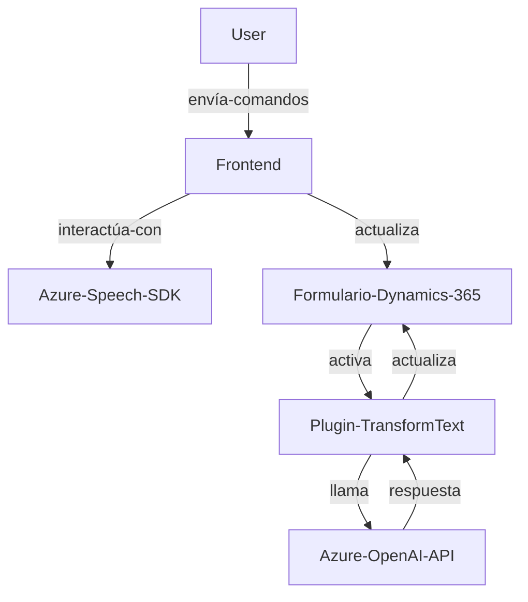

### **Resumen técnico**
El repositorio presenta tres archivos que implementan funcionalidades específicas destinadas al manejo de un formulario a través de reconocimiento de voz y sintetización de texto en un sistema Dynamics 365, integrándose con servicios de Azure Speech SDK y Azure OpenAI API. Cada archivo está diseñado para abordar un aspecto específico del comportamiento:

1. **Frontend**:
   - `voiceInputHandler.js`: Sintetiza información de un formulario en texto y discurso usando servicios externos de Azure Speech.
   - `speechForm.js`: Procesa datos desde reconocimiento de voz, los transcribe, y actualiza dinámicamente los valores del formulario.

2. **Backend Plugin** (`TransformTextWithAzureAI.cs`):
   - Un plugin que interactúa con Dynamics 365 y Azure OpenAI para transformar texto según reglas predefinidas y serializarlo como JSON.

---

### **Descripción de arquitectura**
La arquitectura es **n-capas con integración de servicios externos**:
1. **Presentación (Frontend)**: Consta de código en JavaScript altamente modular para interactuar con formularios. Aquí se utiliza el cliente web del Azure Speech SDK y se interactúa con el usuario.
2. **Lógica de negocio (Backend-Plugin)**: Un plugin de Dynamics 365 en C# que actúa como intermediario entre Dynamics 365 y Azure APIs para transformaciones específicas de los datos.
3. **Servicios externos**:
   - **Azure Speech SDK**: Reconocimiento y síntesis de texto a voz.
   - **Azure OpenAI API**: Manipulación de texto para estructuración avanzada y formato en JSON.

**Patrones utilizados**:
- **Modular Design**: Los archivos JavaScript están estructurados para garantizar que las responsabilidades estén diferenciadas.
- **Callback Pattern**: Usado para manejar la carga asíncrona del SDK.
- **Service Integration Pattern**: El plugin y el frontend se integran con APIs externas (Azure Speech y Azure OpenAI), siguiendo un enfoque orientado a servicios.
- **Plugins Architecture**: La lógica empresarial de Dynamics 365 se gestiona mediante la implementación del `IPlugin`.

---

### **Tecnologías utilizadas**
1. **Frontend**:
   - Lenguaje: JavaScript.
   - Biblioteca: Dynamics 365 JS SDK.
   - Azure Speech SDK.
   
2. **Backend**:
   - Lenguaje: C#.
   - Framework: Plugins de Dynamics 365 (`IPlugin`).
   - Azure OpenAI API.
   - JSON libraries (`System.Text.Json`, `Newtonsoft.Json.Linq`).

### **Dependencias externas detectadas**
1. **Azure Speech SDK**: Sintetizar voz y reconocimiento de audio.
2. **Azure OpenAI API**: Procesamiento y transformación avanzada de texto.
3. **Dynamics 365 SDK y Xrm.WebApi**: Interacción con entidades y formularios de Dynamics.

---

### **Diagrama Mermaid**

---

### **Conclusión**
El repositorio refleja una solución para procesar datos de formularios mediante comandos de voz y transformaciones textuales avanzadas con IA. Su arquitectura n-capas es adecuada para aplicaciones empresariales y aprovecha el ecosistema de Microsoft Dynamics 365 junto con las capacidades de Azure. Sin embargo, hay oportunidades de mejora, como asegurar las claves API y migrar hacia un enfoque más orientado a servicios o eventos, siguiendo arquitecturas como Event-Driven o Domain-Driven Design.