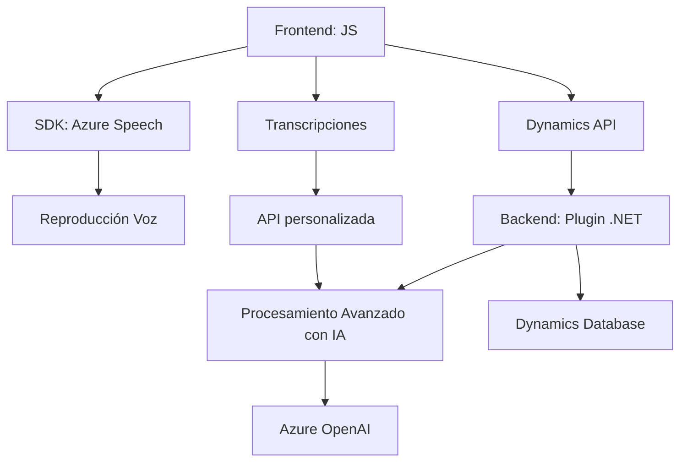

### Breve resumen técnico

Este repositorio incluye componentes orientados al procesamiento de formularios mediante entrada y salida de voz integrada con Azure Speech SDK y Dynamics 365 CRM. Adicionalmente, utiliza servicios como **Azure OpenAI API** para ampliar capacidades avanzadas de procesamiento basado en inteligencia artificial (IA). La solución está diseñada con orientación modular y se centra en interacciones entre un frontend (JavaScript), un backend CRM (plugins .NET), y servicios externos como Azure.

---

### Descripción de arquitectura

La arquitectura general puede clasificarse como **n capas**, con responsabilidades distribuidas entre frontend, backend, y servicios externos:

1. **Frontend**:
   - Manejo de entrada de voz y datos de formularios utilizando **JavaScript**.
   - Interacción directa con Azure Speech SDK.
   - Lógica específica para mapeo dinámico de campos en formularios.

2. **Backend**:
   - Plugins en Dynamics CRM desarrollados en **C#**.
   - Funcionalidad orientada a ejecutar lógica predefinida con el servicio Azure OpenAI API.

3. **Servicios externos**:
   - Uso del **Azure Speech SDK** para voz.
   - Interacción con Dynamics 365 API para manejo de datos del ecosistema CRM.
   - Azure OpenAI para reglas avanzadas de procesamiento de texto.

---

### Tecnologías usadas

1. **Frontend (JavaScript)**:
   - Azure Speech SDK: Para reproducción de texto en voz y reconocimiento de voz.
   - Integración directa con entornos como Dynamics 365 CRM.

2. **Backend (C#)**:
   - Dynamics 365 SDK (Microsoft.Xrm): Para plugins personalizados dentro del ecosistema CRM.
   - Azure OpenAI API: Para transformación de texto basado en IA.

3. **Patrones**:
   - **Modularidad**: Código distribuido en funciones y clases con responsabilidades claramente definidas.
   - **Carga dinámica**: Uso de carga dinámica para SDKs y recursos externos.
   - **Service-Oriented Architecture (SOA)**: Delegación de procesamiento en servicios externos.

---

### Diagrama basado en Mermaid

---

### Conclusión final

El repositorio ilustra una solución de **entrada y salida de voz** integrada con formularios en Dynamics 365. Usa tecnologías avanzadas como Azure Speech SDK y Azure OpenAI para ofrecer capacidades robustas y flexibles de síntesis, reconocimiento y transformación de voz/texto. La arquitectura modular facilita la reutilización de lógica y la integración con servicios externos, destacando el enfoque en desacoplamiento y modularidad.