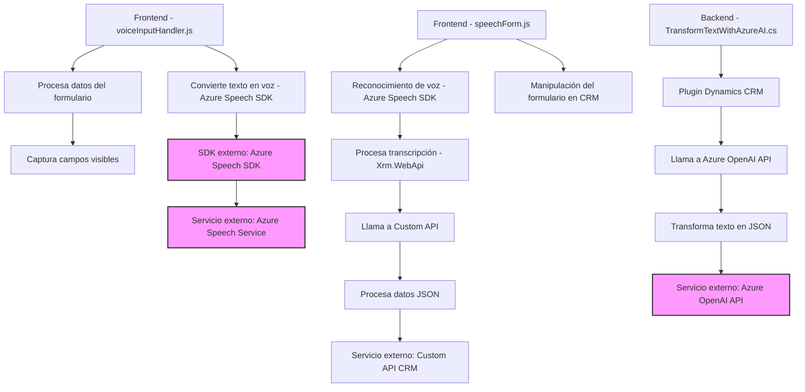

### Breve resumen técnico

Este repositorio contiene tres tipos de archivos que implementan diferentes partes de una solución con funcionalidades de interacción entre un frontend (basado en formularios) y servicios de inteligencia artificial en la nube, aprovechando Azure Speech SDK y Azure OpenAI. La solución está diseñada principalmente para aplicaciones que requieren reconocimiento de voz, síntesis de voz, y manipulación dinámica de formularios en contextos CRM como Microsoft Dynamics, además de transformación automática de texto estructurado mediante IA.

---

### Descripción de arquitectura

La solución utiliza una arquitectura **modular** con una integración orientada a servicios. El archivo del backend (`TransformTextWithAzureAI.cs`) representa el patrón de **Plugin Architecture**, que es común en integraciones con Microsoft Dynamics CRM. Por otro lado, los archivos JavaScript del frontend implementan un patrón **n capas** con una clara separación entre las responsabilidades: captación de datos del formulario, procesamiento de datos con IA cuando se requiere, y operaciones de síntesis o transcripción en tiempo real. 

La solución también presenta características de **event-driven design**, ya que muchas funciones dependen de disparadores como el inicio de SDK dinámico mediante callbacks. Para las interacciones externas, utiliza tecnologías como Azure Speech y Azure OpenAI API.

---

### Tecnologías usadas

1. **Frontend:**
   - **JavaScript:** Lenguaje principal para la funcionalidad de interacción con formularios.  
   - **Azure Speech SDK:** Para síntesis y reconocimiento de voz.  
   - **Dynamics CRM Web API (`Xrm.WebApi`)**: Operación con datos del sistema CRM (lecto-escritura de campos).  
   - **ES6 Modules**: Cada archivo JavaScript expone funciones claramente definidas para interoperabilidad.

2. **Backend:**
   - **C# (.NET Framework):** Lenguaje del plugin para extender las funcionalidades de Dynamics CRM.  
   - **Azure OpenAI API:** Para transformación de texto en formato JSON usando el modelo GPT.  
   - **Microsoft Dynamics SDK:** Gestión de eventos de plugin y manipulación de datos CRM.  
   - **System.Net.Http** y **System.Text.Json:** Manejadores para peticiones HTTP y lectura-escritura JSON.  
   - **Newtonsoft.Json:** Para procesamiento avanzado de JSON.

---

### Diagrama Mermaid válido para GitHub

---

### Conclusión final

Este repositorio representa una arquitectura de integración entre un frontend diseñado para interacción dinámica de voz y un backend basado en plugins que extiende funcionalidades en Microsoft Dynamics CRM. La introducción de servicios IA, como Azure Speech y OpenAI, añade capacidades avanzadas de síntesis y transformación de datos, lo cual hace que este sistema sea ideal para soluciones CRM inteligentes. El uso de patrones como Modularidad y Fluent API simplifica la adaptación y el mantenimiento de esta solución. La separación clara entre capas asegura escalabilidad y flexibilidad en los componentes individuales del diseño.