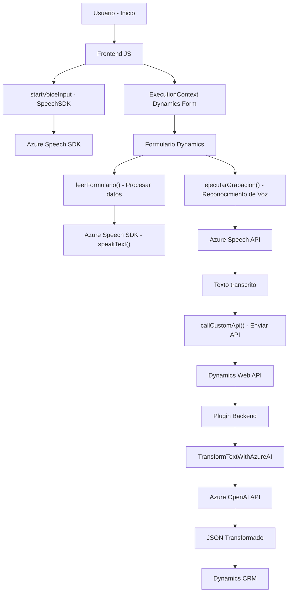

### Breve resumen técnico

El conjunto de archivos presentados en los distintos directorios muestra una solución híbrida que integra funcionalidades específicas de frontend y backend para Microsoft Dynamics CRM. Esta solución implementa reconocimiento de voz, síntesis de voz, integración con Azure Speech SDK, y procesamiento avanzado de texto usando Azure OpenAI. Los archivos evidencian modularidad, integración de servicios externos y uso de patrones comunes en el desarrollo de aplicaciones empresariales.

### Descripción de arquitectura

La arquitectura general se basa en un estilo **cliente-servidor híbrido**, donde:
1. **Frontend/JS**: Gestiona las interacciones del usuario (voz y manipulación del formulario en Dynamics 365) mediante JavaScript, utilizando el navegador como plataforma de ejecución. Estas funciones interactúan directamente con el contexto del formulario y cargan dinámicamente los servicios de Azure (Speech SDK).
2. **Backend/Plugins**: Ejecuta lógica empresarial personalizada en Dynamics CRM a través de un **plugin exclusivo**, con procesamiento basado en el modelo GPT de Azure OpenAI. Esto complementa el frontend al realizar transformaciones complejas de datos.
3. **Servicios Externos/IA y SDK**:
   - Azure OpenAI realiza transformaciones avanzadas en los datos (formato JSON).
   - Azure Speech SDK gestiona el reconocimiento y síntesis de voz en tiempo real.

El diseño combina **modularidad** en el frontend y backend con una arquitectura extensible que puede incorporar o escalar servicios adicionales en la nube. 

### Tecnologías usadas

1. **Frontend**:
   - Lenguaje: JavaScript.
   - Framework: Dynamics 365 Context (`executionContext`, `formContext`).
   - Servicios: Azure Speech SDK para reconocimiento y síntesis de voz.

2. **Backend**:
   - Lenguaje: C# (compatible con .NET Framework).
   - Plataforma: Dynamics 365 (usando plugins).
   - Servicios: Azure OpenAI (Modelos GPT).

3. **Infraestructura**:
   - **Microsoft Dynamics 365 Web API**: Permite la manipulación de metadatos y entidades CRM.
   - **Servicios REST**: Integración de APIs para interactuar con Azure OpenAI y Speech SDK.
   - Bibliotecas: Newtonsoft.Json, System.Text.Json para manejar datos en formato JSON.

### Dependencias o componentes externos
1. **Azure Speech SDK**: Usado en el frontend para entrada y salida de voz, con un enfoque dinámico en la carga del SDK.
2. **Azure OpenAI API**: Implementada en el plugin backend para transformar texto.
3. **Microsoft Dynamics CRM API/Web API**: Permite la manipulación directa de los datos en Dynamics CRM.
4. **Scripts externos**: Referencias al SDK de Speech mediante URLs (`https://aka.ms/csspeech/jsbrowserpackageraw`).

#### Posibles patrones observados:
- **Modularización**: Gestión de responsabilidades específicas.
- **Gestión dinámica de dependencias**: Carga condicional del SDK en frontend.
- **Arquitectura híbrida**: Mezcla de funcionalidades cliente-servidor con integración en la nube.
- **Plugin extensible**: Aumenta la funcionalidad CRM mediante una lógica personalizada robusta.

---

### Diagrama Mermaid válido en GitHub Markdown

Representación general de la integración de los componentes:

---

### Conclusión final

La solución implementada representa un enfoque robusto y extensible para integrar servicios de voz e inteligencia artificial en procesos empresariales. La arquitectura híbrida combina frontend modular basado en JavaScript con un backend extensible mediante plugins en Dynamics CRM. Utiliza tecnologías modernas como Azure Speech SDK y OpenAI, lo que permite una interacción avanzada entre el usuario y la plataforma empresarial.

Este diseño es ideal en términos de escalabilidad y modularidad, ya que ofrece una separación limpia de responsabilidades y promueve la integración continua con servicios en la nube. Además, la implementación refuerza el poder de Dynamics 365 como núcleo para procesos automatizados y enriquecidos por IA.