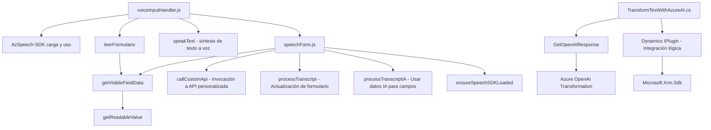

## Breve resumen técnico
Este repositorio combina una solución de **frontend** y un **plugin backend** orientado a procesamiento de texto y reconocimiento de voz, integrando tecnologías como Azure Speech SDK y OpenAI en Azure. La funcionalidad principal es interactuar con formularios (Dynamics CRM), actualizando datos vía comandos de voz y reglas de transformación específicas, usando APIs externas y servicios de nube.

---

### Descripción de arquitectura
La solución utiliza un enfoque **modular** y **n capa** en el frontend, dividiendo la lógica en scripts independientes (`readForm.js`, `speechForm.js`) donde cada archivo aborda tareas específicas:
- **Captura y síntesis de voz.**
- **Procesamiento de reconocimiento de voz.**

En el backend, el archivo `TransformTextWithAzureAI.cs` emplea un patrón de **plugin** y lógica encapsulada para interactuar con Dynamics CRM y servicios externos como OpenAI.

A nivel de arquitectura general:
- **Frontend**: Modular, con integración REST y asincrónica con Azure SDK.
- **Backend**: Plugin de Dynamics (monolítico) que actúa como orquestador entre Dynamics CRM y servicios externos.

---

### Tecnologías usadas
#### **Frontend (JavaScript)**:
1. **Azure Speech SDK**: Biblioteca para reconocimiento de voz y síntesis (texto a voz).
2. **APIs personalizadas**: Invocación a servicios externos basados en Azure.
3. **Web SDK de Dynamics CRM**: (utiliza `Xrm.WebApi.online`) para administración de formularios y datos.

#### **Backend (.NET)**:
1. **Microsoft.Xrm.Sdk**: Para implementar un plugin en Dynamics CRM.
2. **Newtonsoft.Json**: Procesamiento eficiente de JSON.
3. **HttpClient (System.Net.Http)**: Para realizar integraciones vía REST con servicios de OpenAI.
4. **OpenAI Services en Azure**: Usado como microservicio para análisis de texto.

---

### Diagrama **Mermaid**

---

### Conclusión final
Este repositorio presenta una solución bien segmentada para la integración entre funcionalidades de voz, reconocimiento de voz, y manejo dinámico de formularios en un contexto empresarial (Dynamics CRM). Se aprovechan dependencias externas, como Azure Speech SDK y OpenAI, para ofrecer una capa lógica robusta y modular en el frontend y un plugin extensible en el backend. La estructura sugiere un diseño orientado a tareas distribuidas a través de diferentes capas de lógica, manteniendo una separación clara entre presentación, procesamiento y servicios externos.