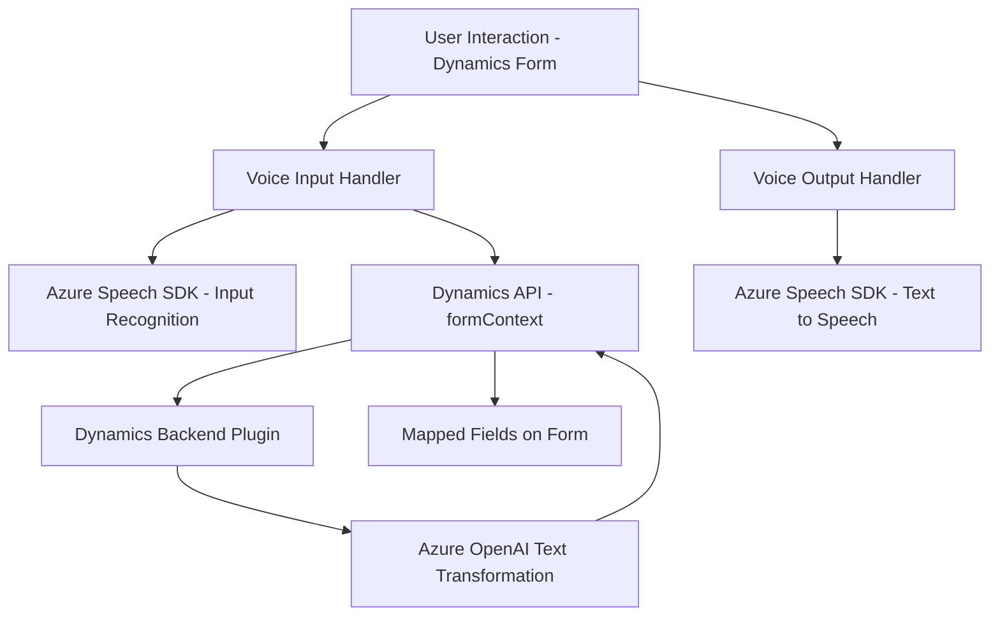

### Breve Resumen Técnico

La solución está orientada a extender funcionalidades de **Dynamics 365** con reconocimiento y síntesis de voz, utilizando **Azure Speech SDK** y procesamiento de texto mediante **Azure OpenAI**. Combina características de interfaz de usuario en JavaScript con extensiones del backend de Dynamics 365 por medio de plugins. Es una integración que mejora la accesibilidad y automatización de tareas en formularios dinámicos.

---

### Descripción de Arquitectura

La arquitectura está organizada como una solución modular con las siguientes capas principales:
1. **Frontend (JavaScript)**: Procesa la entrada y salida de voz, obtiene datos visibles del formulario y los transforma para su uso directo.
2. **Backend (C# Plugin)**: Extiende funcionalidades de Dynamics 365 utilizando un servicio externo (Azure OpenAI) para transformar datos.
3. **Servicios externos (Azure Speech SDK y OpenAI)**: Manejan la conversión de texto a voz y análisis de texto avanzado en un contexto de arquitectura de integración.

El diseño global corresponde a una **arquitectura SOA (Service-Oriented Architecture)** con integración externa y complementariedad entre frontend y backend.

---

### Tecnologías Usadas

1. **Frontend (JavaScript)**:
   - **JavaScript ES6**: Funcionalidades modernas para procesamiento de formularios y ejecución asincrónica.
   - **Azure Speech SDK**: SDK para síntesis y reconocimiento de voz en navegadores.
   - **Dynamics 365 SDK (formContext, Xrm.WebApi)**: Manipulación de formularios y APIs en Dynamics.

2. **Backend (C#)**:
   - **C# (Microsoft Dynamics SDK)**: Implementación de plugins para la plataforma Dynamics CRM.
   - **Azure OpenAI**: Análisis avanzado de texto y transformación según reglas empresariales.
   - **System.Net.Http**: Comunicaciones HTTP externas.
   - **JSON serialization**: Procesamiento de JSON con **System.Text.Json** y **Newtonsoft.Json**.

3. **Externos**:
   - Azure Speech Service y Azure OpenAI para operaciones avanzadas.

---

### Diagrama Mermaid

---

### Conclusión Final

La solución presentada es una integración avanzada que combina **frontend dinámico** dentro de Dynamics 365 con extensiones de backend por medio de plugins en C#. Se aprovechan **servicios externos como Azure Speech y OpenAI** para proporcionar capacidades como transcripción de voz, síntesis de texto y transformación avanzada de datos.

El enfoque demuestra:
- División clara de responsabilidades entre frontend y backend.
- Implementación orientada a servicios.
- Uso adecuado de tecnologías específicas para cada capa de la arquitectura.
- Potencial para integración homogénea en entornos empresariales basados en Dynamics 365.