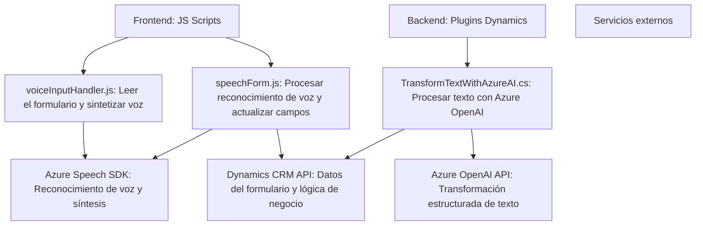

### Breve resumen técnico
El repositorio abarca una solución integral orientada a la interacción entre usuarios y Dynamics CRM mediante funcionalidad avanzada. Utiliza servicios externos como Microsoft Azure Speech SDK y Azure OpenAI para reconocimiento de voz y procesamiento de texto, respectivamente. Está diseñado para escuchar, procesar y sintetizar texto basado en datos del formulario. Además, ciertos componentes amplían la funcionalidad de Dynamics CRM mediante plugins personalizados.

---

### Descripción de la arquitectura
Esta solución tiene una **arquitectura de múltiples capas (multi-layer)**, que incluye las siguientes:
1. **Capa frontend:** Representada por archivos JavaScript (`readForm.js`, `speechForm.js`) que interactúan directamente con el formulario de Dynamics CRM y Azure Speech SDK.
2. **Capa de procesamiento:** El plugin en C# (`TransformTextWithAzureAI.cs`) maneja lógica de negocio específica con Azure OpenAI y la API de Dynamics CRM (SOA).
3. **Capa externa (Servicios):** Se apoya en servicios externos como Azure Speech SDK y Azure OpenAI para reconocimiento de voz y procesamiento estructurado del texto.
   
Al integrarse con Dynamics CRM y utilizar APIs, esta solución está orientada hacia una **arquitectura SOA** (Service-Oriented Architecture), aunque no se implementa estrictamente mediante microservicios ni patrones como la arquitectura hexagonal.

---

### Tecnologías usadas
1. **Frontend:**
   - **JavaScript:** Implementación de módulos para interacción con formularios de Dynamics CRM.
   - **Azure Speech SDK:** Para síntesis y reconocimiento de voz.
   - **Dynamics 365 API:** Para llamadas REST relacionadas con atributos de formularios.
   
2. **Backend (Plugins en Dynamics):**
   - **C#:** Desarrollo de plugins de Dynamics CRM utilizando la interfaz `IPlugin`.
   - **Microsoft.Xrm.Sdk:** Manejo de datos y eventos específicos de CRM.
   - **Azure OpenAI API:** Transformación avanzada de texto.
   - **System.Net.Http / System.Text.Json:** Para comunicación HTTP y procesamiento de datos JSON.

3. **Patrones:**
   - **Facade:** Simplificación de interacciones complejas entre SDK y APIs.
   - **Dynamic Loading:** Carga condicional de dependencias (Azure Speech SDK).
   - **Plugin Pattern:** Extensibilidad de eventos en Dynamics CRM.
   - **Modularización:** Lógica organizada en funciones y clases independientes.

---

### Diagrama Mermaid válido para GitHub

---

### Conclusión final
La solución presentada es una integración multicapa que combina servicios externos y extensiones específicas de Dynamics CRM. Su enfoque orientado a servicios permite manipular datos visibles en formularios, transformar texto en estructuras avanzadas con IA, y ofrecer interacciones de voz más fluidas para el usuario. Aunque se basa en SOA, podría realizar refactorización hacia una arquitectura más robusta como microservicios o hexagonal para escalar su implementación. El diagrama generado refleja la interacción principal entre componentes y servicios.