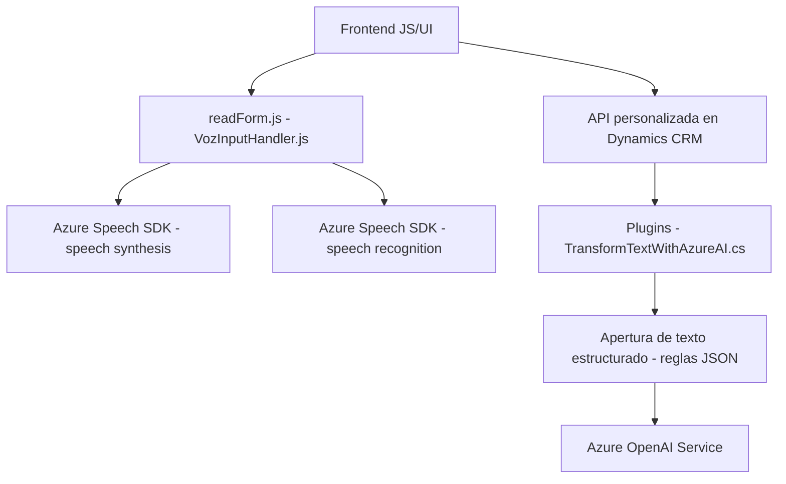

### Breve resumen técnico
La propuesta analiza un proyecto cuyo repositorio contiene tres archivos —dos relacionados con funcionalidades de una interfaz de frontend (basada en JavaScript) y uno que pertenece a un plugin desarrollado en C# para Microsoft Dynamics CRM. El proyecto es una integración entre servicios de Azure, específicamente Azure Speech SDK y Azure OpenAI Service, con el propósito de realizar síntesis de voz, reconocimientos de voz y transformaciones de texto basadas en IA. 

El enfoque arquitectónico se basa en varias abstracciones de capas, creando un sistema orientado a servicios que emplea patrones como carga dinámica de SDK y desacoplamiento funcional.

---

### Descripción de arquitectura
La arquitectura utilizada puede describirse como una híbrida entre **multicapa** y **client-service**:
1. **Multicapa:** La lógica del backend está confinada a un complemento (plugin) en Dynamics CRM que gestiona la comunicación mediante API con Azure OpenAI Service.
2. **Client-Service:** El frontend realiza un procesamiento dinámico de datos y tiene una integración directa con el SDK de Azure Speech para síntesis de voz y reconocimiento de voz. A su vez, se comunica con el backend mediante una API personalizada en Dynamics 365 para la transformación de textos.

Dado el uso de microservicios (Azure OpenAI), el diseño también incorpora características de **arquitectura orientada a servicios** (SOA), aunque el núcleo del sistema se ajusta más a un paradigma de multicapa.

---

### Tecnologías usadas
1. **Frontend (JavaScript):**
   - **Frameworks/librerías:** No se especifica el uso de frameworks como React o Angular, por lo que es razonable asumir que es una aplicación JavaScript Vanilla o un proyecto específico en Dynamics 365.
   - **Azure Speech SDK:** Permite síntesis y reconocimiento de voz.
   - **Microsoft Dynamics 365 APIs:** Manejo de formularios y actualizaciones de datos.

2. **Backend (C# Plugin):**
   - **Microsoft Dynamics SDK:** Para gestionar eventos dentro de CRM y interactuar con datos en formularios.
   - **Azure OpenAI Service:** Procesa textos con modelos GPT mediante solicitudes HTTP REST.
   - **Librerías de serialización/deserialización:** `System.Text.Json`, `Newtonsoft.Json`.

3. **Servicios Externos:**
   - **Azure Speech**: Manipulación de datos de voz para síntesis y reconocimiento.
   - **Azure OpenAI Service**: Conversión de textos con modelos de lenguaje avanzados.

---

### Diagrama Mermaid válido para GitHub

---

### Conclusión final
El repositorio analiza un proyecto que integra servicios avanzados de Microsoft (Dynamics CRM, Azure Speech SDK y Azure OpenAI Service) para la interacción basada en voz con formularios y el procesamiento automatizado de datos estructurados. La arquitectura empleada es híbrida entre multicapa y SOA, con segregación entre capas de frontend y backend que interactúan mediante APIs. Además, el diseño aprovecha patrones importantes como desacoplamiento de funciones y carga dinámica.

El proyecto es robusto y flexible, pero presenta algunos puntos de mejora, como la posibilidad de usar configuraciones dinámicas en el plugin para facilitar despliegues en múltiples entornos.