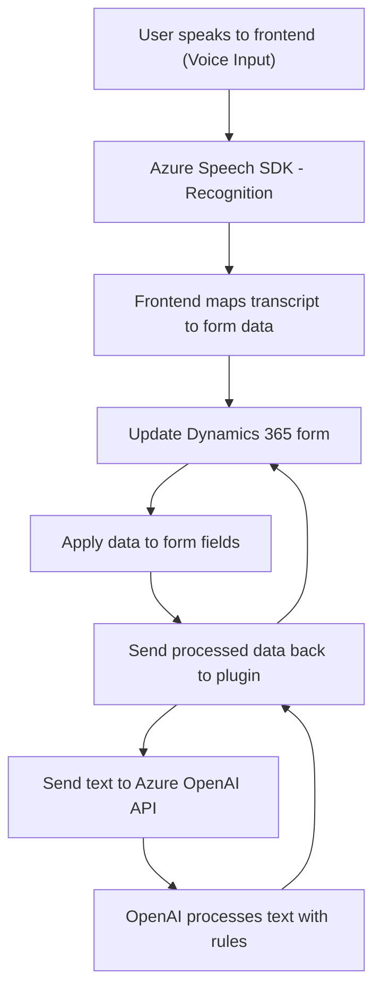

### Breve resumen técnico
El repositorio implementa una funcionalidad relacionada con Microsoft Dynamics 365 utilizando el Azure Speech SDK y Azure OpenAI. La solución incluye un **frontend** basado en JavaScript y un **backend plugin** desarrollado en C#. Los componentes están claramente delimitados para gestionar la entrada y salida de datos de formularios mediante voz y la transformación de texto utilizando modelos IA en Azure.

---

### Descripción de la arquitectura
1. **Tipo de solución**:  
   - Un híbrido entre **API**, **Frontend** y **backend** en el contexto de Microsoft Dynamics CRM.  
   - El **frontend** (JavaScript) interactúa con la usuario y el contexto de Dynamics para realizar tareas de reconocimiento y síntesis de voz, así como procesar y mapear los datos a los campos del formulario.
   - El **plugin backend** se encarga de interactuar con el servicio de Azure OpenAI (GPT) para transformar el texto y enviar los resultados de vuelta al frontend.

2. **Arquitectura**:  
   La arquitectura es una **n capas** con separación de responsabilidades entre el **cliente (frontend)** que orquesta la interacción con el usuario, los **plugins (backend)** de Dynamics, y los servicios externos de Azure para la funcionalidad de IA y voz.  
   Enfasis en la modularidad y la integración con APIs externas, lo que favorece la extensibilidad y el mantenimiento.

3. **Patrones y principios utilizados**:  
   - **Modularidad**: Cada función está separada por responsabilidades específicas en el frontend y backend.
   - **Callback y asincronía**: Uso de funciones de callback y promesas para carga de SDKs y comunicación con APIs.
   - **Facade**: Simplificación de llamadas complejas al Azure Speech SDK y Azure OpenAI mediante funciones accesibles.
   - **Plugin Architecture**: Implementación de lógica personalizada en Dynamics CRM usando plugins.

---

### Tecnologías usadas
1. **Frontend**:  
   - Lenguaje: **JavaScript**  
   - Frameworks/librerías: Integración con **Azure Speech SDK**.  
   - Plataforma: **Microsoft Dynamics CRM Frontend Context**.

2. **Backend**:  
   - Lenguaje: **C#**  
   - Framework: **.NET Framework**  
   - Integración: **Microsoft.XRM.SDK** para el contexto CRM.  
   - Externas: **Azure OpenAI API** para transformación de texto; **Newtonsoft.Json** para manejo JSON.

3. **Servicio externo**:  
   - **Azure Speech SDK**: Sintetización de voz y reconocimiento de voz desde texto/audio.  
   - **Azure OpenAI**: Uso de GPT para transformar texto y generar resultados estructurados como JSON.

---

### Diagrama Mermaid válido para GitHub

---

### Conclusión final
- **Tipo de solución**: La solución es una integración entre un **frontend** (formulario/interfaz de usuario), un **backend plugin**, y servicios externos de **Azure Speech SDK** y **OpenAI**.  
- **Tecnologías empleadas**: El diseño aprovecha frameworks como Microsoft Dynamics CRM y servicios avanzados de Azure para permitir la automatización mediante reconocimiento de voz y transformación de texto.
- **Arquitectura**: Utiliza una **arquitectura de n capas** bien estructurada con roles distribuidos entre componentes, y presenta características de integración con APIs externas, modularidad y asincronía.  
- **Uso práctico**: Orientada a mejorar la interacción y automatización de procesos en entornos de CRM. Sin embargo, depende altamente de la disponibilidad y configuración de servicios de Azure integrados.